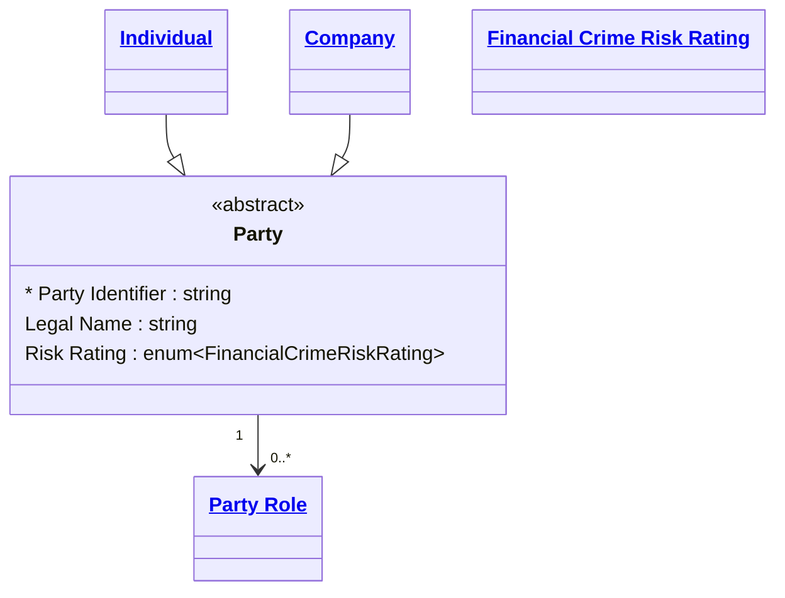

# MD‑DDL Specification (Draft 0.9.2)

## **Entities**

Each file must declare which domain it is part of by starting with a Level 1 heading with the domain name. The domain name should provide a link back to the domain file like:

```markdown
# [My Domain](../domain.md)
```

### **Entity Declaration**

A detail file may contain any combination of ## Entities, ## Enums, and ## Relationships sections. Authors are free to co-locate an entity with its directly originating relationships and any enumerations it references — this is the recommended pattern when a single entity is the clear owner of those concepts.
The Entities section appear under a level‑2 heading:

```markdown
## Entities
```

Each entity is introduced with a **level‑3 heading**:

```markdown
### Customer
```

### **Entity Description**

Free‑text Markdown under the heading describes the entity in more detail than was found in the domain summary.

### **Entity Diagram**

An entity detail file should include a Mermaid `classDiagram` immediately after the entity description and before the YAML definition blocks. It shows the entity's own attributes, its position in the inheritance hierarchy, and its immediate relationships to other entities.

The YAML definition block remains the authoritative source for attributes and types — the diagram is a rendering of it, and the two should stay consistent. The classDiagram is a logical realization of the entity: its associations and labels do not need to mirror the conceptual relationships in the domain file one-for-one. A single conceptual relationship may realize as multiple logical associations, and some logical associations may have no direct conceptual counterpart.

Example:

````markdown

```mermaid
classDiagram
  class Party{
    <<abstract>>
    * Party Identifier : string
    Legal Name : string
    Risk Rating : enum~FinancialCrimeRiskRating~
  }

  Individual --|> Party
  Company --|> Party
  Party "1" --> "0..*" PartyRole

  class Individual["<a href='individual.md'>Individual</a>"]
  class Company["<a href='company.md'>Company</a>"]
  class PartyRole["<a href='party_role.md'>Party Role</a>"]
  class FinancialCrimeRiskRating["<a href='../enums/financial_crime_risk_rating.md'>Financial Crime Risk Rating</a>"]
```
````

Conventions for subject classes, reference classes, enum rendering, inheritance arrows, cardinality, and element ordering are collected in the non-normative [Diagram Style Guide](../guides/diagram-style.md).

### **Entity Definition**

A structured block defines the entity's attributes and logic. MD‑DDL follows a Key-as-Name philosophy to eliminate redundancy and ensure that the human-readable label used in the documentation is the exact same identifier used in the Knowledge Graph.:

````markdown
```yaml
extends: Party Role
mutability: immutable | append_only | slowly_changing | frequently_changing | reference
existence: independent | dependent | associative
temporal:
  tracking: valid_time
  description: Preferences are valid for specific time periods and can be future-dated
attributes:
  Customer Number:
    type: string
    identifier: primary
  Email Address:
    type: string
    pii: true
  Full Name:
    type: string
  Balance:
    type: Decimal
```

```yaml
constraints:
  Valid Date Range:
    check: "End Date > Start Date"
  Positive Liquidity:
    check: "Balance > 0"
```

```yaml
governance:
  pii: true
  classification: Confidential
  retention: 7 years
  access_role:
    - HR_ADMIN
```
````

### Governance Metadata Schema

Governance metadata is declared at the domain level (in the domain file metadata block) and optionally overridden at the entity level (in a `governance:` block within an entity detail file). Entities inherit all governance fields from the domain. Include a `governance:` block in an entity detail file only when specifying an override or stricter requirement than the domain default.

#### Domain-Level Governance Fields

These fields are declared in the domain metadata YAML block. They set the default governance posture for all entities, relationships, and events in the domain.

Field | Type | Required | Description
--- | --- | --- | ---
`classification` | string | Yes | The sensitivity level of the domain's data. Valid values: `Public`, `Internal`, `Confidential`, `Highly Confidential`.
`pii` | boolean | Yes | Whether any entity in the domain contains personally identifiable information.
`regulatory_scope` | string[] | Yes | The regulatory frameworks applicable to this domain (e.g., `GDPR`, `APRA CPS 234`, `FATF`, `HIPAA`).
`default_retention` | string | Yes | The default data retention period applied to all entities unless overridden (e.g., `"7 years"`, `"10 years post relationship end"`).

#### Entity-Level Governance Fields

These fields may appear in an entity's `governance:` YAML block. Only include fields that differ from the domain default.

Field | Type | Required | Description
--- | --- | --- | ---
`pii` | boolean | No | Override the domain's PII flag for this entity.
`pii_fields` | string[] | No | Explicit enumeration of attribute names within this entity that contain PII. Optional — use when an applicable regulatory framework requires an enumerated PII field inventory (e.g., GDPR Article 30 data mapping, HIPAA Safe Harbor de-identification). When present, must list all attributes marked `pii: true` in the entity. When absent, PII is identified by the `pii: true` marker on individual attributes. `pii_fields` is the conventional name for this field — using it consistently lets agents and tooling rely on it across domains.
`classification` | string | No | Override the domain's classification for this entity. Must use the same value set: `Public`, `Internal`, `Confidential`, `Highly Confidential`.
`retention` | string | No | Override the domain's retention period for this entity.
`retention_basis` | string | No | Justification for why this entity's retention differs from or elaborates on the domain default. Include regulatory citation where applicable.
`access_role` | string[] | No | Roles permitted to access this entity's data. An array of role identifiers. When absent, access is governed by broader domain or organisational policy.
`compliance_relevance` | string[] | No | Specific regulatory acts or standards that apply directly to this entity (e.g., `"AUSTRAC AML/CTF Act 2006"`, `"GDPR Article 17"`).
`regulatory_reporting` | string[] | No | Named regulatory reports or submissions that include data from this entity (e.g., `"Suspicious Matter Report (SMR)"`, `"Threshold Transaction Report (TTR)"`).
`description` | string | No | Free-text explanation of the governance posture for this entity — why the override exists and what regulatory obligation drives it.

#### Governance Inheritance Rules

1. **Domain defaults apply everywhere.** Every entity, relationship, and event inherits the domain's `classification`, `pii`, `regulatory_scope`, and `default_retention` unless explicitly overridden.
2. **Override only when stricter or different.** An entity-level `governance:` block must contain only fields that differ from domain defaults. Do not repeat identical values.
3. **Strictness direction.** An entity may declare a higher `classification` or longer `retention` than the domain default. Declaring a weaker posture requires a documented justification in the `description` or `retention_basis` field.
4. **`access_role` is additive context.** It restricts who may access entity data. It does not exist at the domain level — it is entity-specific.
5. **`compliance_relevance` and `regulatory_reporting` are entity-specific.** They document which specific regulations and reports apply to a particular entity. Domain-level `regulatory_scope` declares the applicable frameworks; entity-level fields map those frameworks to specific obligations.

#### Example: Domain-Level Governance (in domain metadata)

```yaml
classification: "Highly Confidential"
pii: true
regulatory_scope:
  - AML (Anti-Money Laundering)
  - KYC (Know Your Customer)
  - FATF Recommendations
default_retention: "10 years post relationship end"
```

#### Example: Entity-Level Override (in entity detail file)

```yaml
governance:
  pii: true
  classification: Highly Confidential
  retention: 10 years
  retention_basis: Minimum 7-year retention from end of business relationship, aligned to AML/CTF record-keeping obligations
  access_role:
    - FINANCIAL_CRIME_ANALYST
    - KYC_OFFICER
    - COMPLIANCE_OFFICER
  compliance_relevance:
    - AUSTRAC AML/CTF Act 2006
    - FATF Recommendations 10, 11, 12
  regulatory_reporting:
    - Suspicious Matter Report (SMR)
    - Threshold Transaction Report (TTR)
```

#### Example: Entity Inheriting Domain Defaults (no override needed)

When an entity's governance posture matches the domain default exactly, no `governance:` block is needed. To document the inheritance explicitly without adding new fields, a minimal `governance:` block with only a `retention_basis` may be included:

```yaml
governance:
  retention_basis: Inherited from domain default retention of 10 years post relationship end
```

---

### Entity Lifecycle Fields

Entities within a domain may have their own lifecycle state independent of the domain. For example, a domain may be `Active` while a newly added entity is still in `Draft`.

#### Lifecycle Properties

Property | Type | Required | Description
--- | --- | --- | ---
`status` | enum | No | Lifecycle state of this entity definition. Uses the same values as domain status: `Draft`, `Review`, `Active`, `Deprecated`, `Retired`. Defaults to the domain status if omitted.
`since` | semver string | No | The domain version in which this entity was introduced (e.g., `"1.2.0"`).
`deprecated_at` | semver string | No | The domain version in which this entity was deprecated (e.g., `"2.0.0"`).
`breaking_in` | semver string | No | The domain version in which a breaking change affecting this entity will take effect. Used as advance notice to consumers.

#### Lifecycle Rules

- When `status` is omitted, the entity inherits the domain's status. An entity's `status` should not be more advanced than its parent domain's status.
- The `since`, `deprecated_at`, and `breaking_in` fields refer to domain semantic versions as defined in [2-Domains.md](./2-Domains.md#domain-version).

Practices for deprecation, migration notice, and lifecycle history are collected in the non-normative [Lifecycle & Versioning Guide](../guides/lifecycle-versioning.md).

#### Example

```yaml
extends: Party Role
status: Active
since: "1.0.0"
existence: independent
mutability: slowly_changing
attributes:
  Customer Number:
    type: string
    identifier: primary
```

#### Example: Deprecated Entity

```yaml
status: Deprecated
since: "1.0.0"
deprecated_at: "2.0.0"
existence: independent
mutability: reference
attributes:
  Legacy Code:
    type: string
    identifier: primary
    description: "Replaced by the new Classification entity introduced in v2.0.0."
```

---

### The "Key-as-Name" Principle

By using the business term (e.g., Positive Liquidity) as the YAML key rather than a nested property (e.g., name: Positive Liquidity), we achieve:

- Semantic Uniqueness: Every constraint and attribute is forced to have a distinct, meaningful identity within its context.
- Reduced Friction: There is no "translation layer" between the documentation and the database schema. What you see in the heading or key is what appears in the Graph node.
- Logical Referencing: Sub-entities that inherit from this entity can specifically override or reference a constraint by its key name, allowing for a cleaner "Logic Lineage."

### Temporal Tracking Types

This optional section defines how temporal tracking is applied to the entity. This is optional and will default to current state tracking if not specified or inherit from parent entities if they have temporal tracking defined.

Type|Description
----|-----------
`valid_time`|Business time - when is this true in the real world? Supports point-in-time queries.
`transaction_time`|System time - when was this recorded? Records are immutable once superseded.
`bitemporal`|Both valid and transaction time - full temporal reconstruction.
`point_in_time`|Event timestamp only. For events - single timestamp, immutable.

### Existence

This optional section defines if this entity can exist independently.

- independent — meaningful on its own; doesn't require another entity to give it purpose (Customer, Product, Location)
- dependent — only meaningful in the context of other entities; its reason for existing is to record a relationship between them (Payment Transaction, Order Line, Enrolment)
- associative — resolves a many-to-many; carries attributes about the relationship itself (Party Agreement, Student Course Enrolment)

### Mutability

This optional section defines how the data changes over time.

- immutable — once written, never changes (event records, ledger entries)
- append_only — new rows added, existing rows never updated (logs, transactions)
- slowly_changing — changes occasionally, history may matter (customer address, product category)
- frequently_changing — changes often, current value is what matters (account balance, inventory level)
- reference — essentially static, managed by a small number of administrators (country codes, currency codes)

Both `existence` and `mutability` are intent signals: they tell generating agents and human readers how the entity behaves, without prescribing a physical structure. How generators map them to physical patterns is a generation-tooling concern, outside this spec.

---

### Attribute Definition

#### Attribute Properties

Property|Required|Description|Example
--------|--------|-----------|-------
`type`|Yes|The data type of the attribute|`string`, `integer`, `decimal`, `boolean`, `date`, `datetime`, `timestamp`, `string[]`, `enum:Loyalty Tier`
`description`|No|Human-readable explanation of the attribute's purpose|"The primary email address for customer communication"
`identifier`|No|Marks this attribute as an identifier (default: `false`). Values: `primary`, `alternate`, `natural`, `surrogate`|`primary`, `alternate`
`unique`|No|Whether values must be unique across all instances (default: `false`)|`true` or `false`
`default`|No|Default value when not explicitly provided|`0`, `"Unknown"`, `false`

#### Type System

Type|Description|Examples
----|-----------|--------
`string`|Text data.|"John Doe", "abc123"
`integer`|Whole numbers without decimals|42, -17, 0
`decimal`|Numeric values with decimal precision|99.99, -0.001, 3.14159
`boolean`|True or false values|`true`, `false`
`date`|Calendar date without time|2024-03-15
`datetime`|Date with time (timezone-aware)|2024-03-15T14:30:00Z
`enum:<Enum Name>`|Reference to a defined enumeration|`enum:Loyalty Tier`, `enum:Country Code`

#### Arrays

All types above support arrays by appending `[]` to the type name. For example, `string[]` or `decimal[]`

Array constraints can be specified in the square brackets. For example, `string[1..5]` means 1 to 5 strings. `decimal[0..*]` means 0 or more decimals. `enum:Country Code[2]` means exactly 2 country codes.

- Valid cardinality syntax: `[n]`, `[n..m]`, `[n..*]`, or `[*]`
- If no cardinality is provided, `[*]` is assumed.

### Constraint Definition

Constraints define validation rules and business logic that span one or more attributes. They appear under a `constraints:` section in the entity or relationship YAML.

#### Constraint Properties

Property|Purpose|Example
--------|-------|-------
`unique`|Enforce uniqueness of one or more attributes|`unique: Email Address` or `unique: [Country, State, Postal Code]`
`not_null`|Require attribute to have a value|`not_null: Email Address` or `not_null: [First Name, Last Name]`
`check`|Boolean expression that must be true|`check: "Age >= 18"`
`derived`|Define computed/calculated attributes|`derived: {attribute: Full Name, expression: "First Name + ' ' + Last Name"}`
`lifecycle_stage`|Enforce completeness at specific lifecycle stages|`lifecycle_stage: [Registration, KYC Complete]`
`description`|Human-readable explanation|"Customer must be 18 or older"

One of unique, not_null, check, or derived must be present.

Example:

```yaml
constraints:
  Contact Information Required:
    not_null: [Email Address, Phone Number]
    lifecycle_stage: Activation
    description: At least one contact method must be provided at activation
```

---

### Rules

**Inheritance:**

- Attribute Inheritance: Customer gets all attributes of Party Role
- Constraint Inheritance: If Party Role has a constraint, Customer must follow it.
- Governance Inheritance: Entities inherit governance/compliance metadata from the domain. Do not repeat identical governance attributes in entity detail files; include a `governance:` block only for overrides.

**Identifiers:**

Every Entity should have at least one attribute marked as an identifier (`identifier: primary` for the primary key). If missing, the Knowledge Graph treats the entity as a "Logic Object" rather than a "Data Object."

**No Relationship Attributes:**

Entity YAML must not declare foreign-key attributes (e.g., a Customer Id inside a Preference entity). The Relationships section defines the link; physical keys are generated from the relationship definition. This prevents "Foreign Key Drift" — an FK attribute in entity YAML would be interpreted as a business attribute and corrupt generation.

**No Source References in Entity Files:**

Entity YAML contains no `source:` keys, no source field names, and no references to source systems. The canonical model defines meaning and governance; source systems define operational reality. This separation is enforced structurally — source mappings are declared under domain-local source folders (for example `sources/salesforce-crm/source.md` and related transform files). See [Section 7 — Sources](./7-Sources.md).

#### **Naming Rules**

- Natural Language Priority: Entity and attribute names must use natural language (e.g., Email Address, not email_addr).
- Case & Spaces: Names are case-sensitive and support spaces.
- No Redundancy: Do not include a name: field inside the YAML block. The Markdown heading serves as the Entity name, and the YAML keys serve as Attribute/Constraint names.
- Machine Normalisation: While the Knowledge Graph preserves these natural labels for navigability, physical artifact generation automatically handles the normalisation (e.g., conversion to snake_case) for target systems.
- Source Field Names are the one place in MD-DDL where non-natural-language identifiers appear. They are declared in source-folder transform files under `sources/<system>/transforms/`, not in entity definitions. They are owned by the source system and are not subject to MD-DDL's naming rules.

---

...next: [Enums](4-Enumerations.md)
