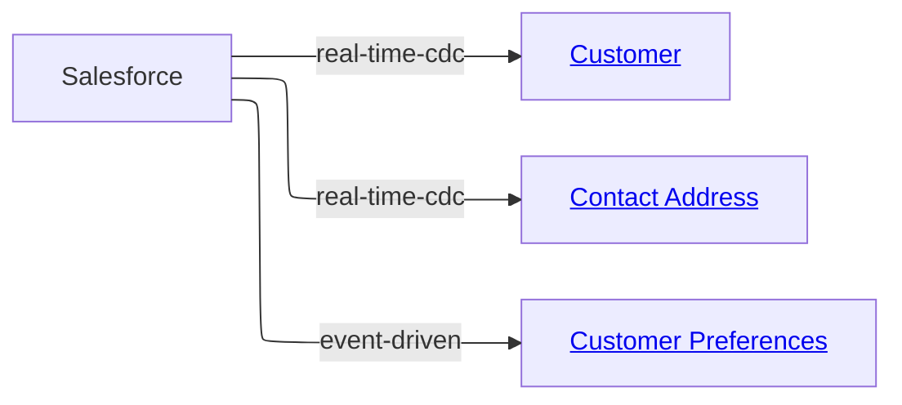

# MD‑DDL Specification — Section 7: Sources

*Part of the MD‑DDL Specification. See [1-Foundation.md](./1-Foundation.md) for core principles and document structure.*

---

## **Sources**

A Source in MD-DDL represents a system that generates operational change — a CRM, a core banking system, a payment platform, an ERP. Sources are not owners of data. They are systems of change whose outputs feed canonical data products.

The canonical domain model defines meaning. Sources define operational reality. The Source Manifest is the contract that translates between them.

This separation is deliberate and load-bearing:

- Domain modellers define canonical entities, attributes, and governance without knowing or caring which source systems produce the underlying data.
- Source system SMEs define field-level mappings and encode source idiosyncrasies without needing to understand the canonical model's governance posture.
- Integration engineers own transform files that connect the two worlds.

**Canonical data products replace the concept of Systems of Record.** There is no attribute in a domain entity that is "owned" by Salesforce or SAP. Those systems generate change events. The canonical model absorbs those changes according to the rules declared in source transform files.

---

### **Source Structure**

Sources follow the same two-layer pattern as Domains.

```text
sources/
  <source-id>/
    manifest.md             ← router: metadata + canonical feed summary
    transforms/
      <entity-name>.md      ← detail: field mappings for one canonical entity
      <entity-name>.md
```

The manifest is the router — it declares what the source system is, how it generates change, and which canonical entities it contributes to. Transform files are the detail layer — they declare the field-level mappings using the transformation types defined in Section 8.

#### File Organisation

A source may split transform definitions across as many files as needed. The natural split is one transform file per canonical entity being populated. For large, complex source systems, transform files may be further subdivided by functional area. The only structural requirement is that every transform file begins with a level-1 heading linking back to the manifest.

```text
sources/
  salesforce/
    manifest.md
    transforms/
      customer.md           ← all Salesforce → Customer mappings
      contact-address.md    ← all Salesforce → Contact Address mappings
  sap/
    manifest.md
    transforms/
      customer.md           ← SAP's distinct contribution to Customer
      account.md
  core-banking/
    manifest.md
    transforms/
      account.md
      transaction.md
      product.md
```

---

### **Source Manifest**

#### Declaration

A source manifest is declared using a level-1 Markdown heading:

```markdown
# Salesforce CRM
```

The heading is the source's display name. The stable machine identifier lives in the metadata block.

#### Description

Free-text Markdown under the H1 and before the first H2 describes the source system's business role — what it does, who operates it, and why it is a source for the canonical model. This is written for domain modellers and data stewards, not for engineers.

#### Metadata

Metadata appears under a level-2 heading:

```markdown
## Metadata
```

```yaml
id: salesforce
owner: crm-platform@bank.com
steward: data.governance@bank.com

# How this system generates change
change_model: real-time-cdc
change_events:
  - Customer Updated
  - Contact Created
  - Account Merged
  - Account Deactivated

# What canonical entities this source feeds
canonical_scope:
  - Customer
  - Contact Address
  - Customer Preferences

# Operational characteristics
update_frequency: real-time
data_quality_tier: 1          # 1 = high trust, 2 = standard, 3 = requires validation
status: Production
version: "2.1.0"

tags:
  - CRM
  - CustomerData
  - Core
```

##### Change Models

The `change_model` field declares how change flows out of the source system.
The compiler uses this to determine the pipeline pattern to generate.

Value | Description | Compiler output
--- | --- | ---
`real-time-cdc` | Change Data Capture — row-level changes streamed in real time | Streaming pipeline
`event-driven` | Source publishes business events (not raw CDC) | Event consumer
`batch-daily` | Full or incremental extract on a daily schedule | Scheduled ETL
`batch-intraday` | Multiple batch extracts within a day | Scheduled ETL with frequency
`api-poll` | Changes retrieved by polling a source API | API ingestion job
`manual` | Data loaded by human intervention; no automated feed | Manual load template

##### Change Events

`change_events` lists the business-level change events this source emits. These are natural-language names that may correspond to Events declared in the canonical domain. The compiler can use these to generate event subscription logic and to link source changes to downstream domain Events.

##### Data Quality Tier

`data_quality_tier` is a governance signal, not a technical score. It tells the canonical model how much trust to extend to values from this source:

Tier | Meaning
--- | ---
`1` | High trust — well-governed source, low null rates, consistent formats
`2` | Standard — typical operational system; some nulls, occasional quirks
`3` | Low trust — legacy system, known quality issues; requires validation rules

The tier does not prevent a source from contributing to canonical entities. It signals to downstream consumers and data quality rules how to treat values originating from this source.

---

#### Canonical Feeds Table

Below the metadata block, the manifest declares which canonical entities this source contributes to, using a summary table under a level-2 heading:

```markdown
## Canonical Feeds
```

Canonical Entity | Transform File | Attributes Contributed | Change Model
--- | --- | --- | ---
[Customer](../../domains/customer/entities/customer.md) | [transforms/customer.md](transforms/customer.md) | Customer Number, Email Address, Full Name, Preferred Language | real-time-cdc
[Contact Address](../../domains/customer/entities/contact-address.md) | [transforms/contact-address.md](transforms/contact-address.md) | Street, City, Postal Code, Country Code | real-time-cdc
[Customer Preferences](../../domains/customer/entities/customer-preferences.md) | [transforms/customer-preferences.md](transforms/customer-preferences.md) | Preferred Channel, Marketing Opt-In | event-driven

**Canonical Feeds table columns:**

Column | Purpose
--- | ---
**Canonical Entity** | Link to the entity in the domain model this source contributes to.
**Transform File** | Link to the transform detail file for this entity.
**Attributes Contributed** | Comma-separated list of the canonical attributes this source populates. Not every attribute needs to come from this source.
**Change Model** | How changes to this entity flow from this source. May differ per entity if the source uses different mechanisms for different record types.

---

#### Source Overview Diagram

A manifest should include a Mermaid diagram showing which canonical entities the source feeds and what kind of change model applies to each.

````markdown
### Source Overview Diagram


````

---

### **Transform Files**

#### Transform Files Declaration

Every transform file begins with a level-1 heading that names the source system and links back to the manifest:

```markdown
# [Salesforce CRM](../manifest.md)
```

#### Structure

Transform files use level-2 headings for each canonical entity being populated:

```markdown
## Customer
```

Each transformation within that entity uses a level-3 heading following the Key-as-Name principle. The heading is the transformation's identity in the Knowledge Graph and must be unique within the source.

#### Source field references

Within a transform file, all field references are scoped to the owning source system. The `system:` key is **not** required — it is implicit. Only the field path within the source is needed:

```yaml
source:
  field: Contact.Email
```

This keeps transform files clean and makes them portable if a source system is renamed. The manifest's `id` field is the authoritative system identifier.

#### Target notation

The `target` field uses `Entity · Attribute` notation to identify the canonical destination unambiguously:

```yaml
target: Customer · Email Address
```

The entity name must match an entity declared in the canonical domain model. The attribute name must match an attribute declared in that entity's YAML block. The compiler validates both.

#### Transformation types

Transform files use the transformation types defined in [Section 8 — Transformations](./8-Transformations.md). All type-specific YAML
syntax is unchanged. The only differences from Section 8's syntax are:

- `system:` is omitted from all `source:` blocks (implicit from file location)
- `target:` uses `Entity · Attribute` notation instead of bare attribute name
- The H3 heading is the transformation identity (Key-as-Name, as elsewhere)

---

#### **Source Idiosyncrasies**

Transform files are the right place to encode source-specific data quality characteristics that the canonical model should never need to know about.

##### Null representations

Many source systems represent null as a non-null value (`"N/A"`, `"0"`, `"UNKNOWN"`). Declare this on the source block so the compiler generates appropriate null normalisation logic:

```yaml
source:
  field: Contact.Email
  null_as: "N/A"
```

##### Quality flags

Attribute-level quality signals that should be carried into the canonical model:

```yaml
source:
  field: Customer.DateOfBirth
  quality: nullable           # may legitimately be absent
  quality_note: "DOB not collected pre-2015; backfill in progress"
```

##### Format normalisation

Source-specific format variations that require standardisation:

```yaml
source:
  field: Customer.PhoneNumber
  normalise: e164             # normalise to E.164 international format
```

```yaml
source:
  field: Account.OpenDate
  format: "DD/MM/YYYY"        # source uses non-ISO date format
  cast: date                  # compiler generates format-aware cast
```

These annotations belong in the transform file, not in the canonical entity definition. The canonical model defines what the attribute means; the transform file handles the operational reality of getting clean data there.

---

### **Complete Example**

#### Manifest

````markdown
# Salesforce CRM

The primary CRM system used by Retail Banking. Salesforce is the operational system for all customer relationship management — onboarding, contact management, preference capture, and relationship history. It generates real-time CDC events for all customer record changes.

## Metadata

```yaml
id: salesforce
owner: crm-platform@bank.com
steward: data.governance@bank.com
change_model: real-time-cdc
change_events:
  - Customer Created
  - Customer Updated
  - Contact Updated
  - Account Deactivated
canonical_scope:
  - Customer
  - Contact Address
  - Customer Preferences
data_quality_tier: 1
status: Production
version: "2.1.0"
tags:
  - CRM
  - CustomerData
  - Core
```

### Source Overview Diagram


## Canonical Feeds

| Canonical Entity | Transform File | Attributes Contributed | Change Model |
|---|---|---|---|
| [Customer](../../domains/customer/entities/customer.md) | [transforms/customer.md](transforms/customer.md) | Customer Number, Email Address, Full Name, Date of Birth | real-time-cdc |
| [Contact Address](../../domains/customer/entities/contact-address.md) | [transforms/contact-address.md](transforms/contact-address.md) | Street, City, Postal Code, Country Code | real-time-cdc |
````

#### Transform file — `transforms/customer.md`

````markdown
# [Salesforce CRM](../manifest.md)

## Customer

Salesforce is the primary contributor to the Customer canonical entity for all contact and identity attributes. Financial attributes (balance, credit limit) are contributed by the Core Banking System.

### Map Customer Number
Direct map from the Salesforce Account identifier.

```yaml
type: direct
target: Customer · Customer Number
source:
  field: Account.AccountNumber
```

### Concatenate Full Name
Salesforce stores given and family name separately. The canonical model uses a single Full Name attribute.

```yaml
type: derived
target: Customer · Full Name
expression: "trim(First Name) + ' ' + trim(Last Name)"
inputs:
  First Name:
    field: Contact.FirstName
  Last Name:
    field: Contact.LastName
```

### Map Email Address
Salesforce uses "N/A" as a null representation for missing email addresses.

```yaml
type: direct
target: Customer · Email Address
source:
  field: Contact.Email
  null_as: "N/A"
  quality: nullable
```

### Resolve Country Code
Salesforce stores legacy two-character country codes. The canonical model uses ISO 3166-1 alpha-3.

```yaml
type: lookup
target: Customer · Country Code
source:
  field: Contact.MailingCountry
lookup:
  reference: Country Code
  match_on: Abbreviation
  return: ISO Code
fallback: null
```

### Map Date of Birth
Salesforce uses DD/MM/YYYY format for dates. The compiler generates a format-aware cast to the canonical date type.

```yaml
type: direct
target: Customer · Date of Birth
source:
  field: Contact.Birthdate
  format: "DD/MM/YYYY"
  cast: date
```
````

---

### **Source Rules**

1. **Source identity is stable.** The `id` in the manifest metadata is a breaking-change identifier. All transform file field references and all domain-level `source_systems` registry entries use it. Renaming requires a coordinated update across all referencing files.

2. **Canonical entities stay pure.** Entity detail files in the domain model contain no source references. The canonical model defines meaning; sources define operational reality. This separation is non-negotiable.

3. **Transform files are source-scoped.** A transform file belongs to exactly one source. Cross-source reconciliation (where multiple sources contribute to the same attribute) is expressed using the `reconciliation` transformation type within a single source's transform file, listing the contributing sources explicitly.

4. **Source idiosyncrasies stay in transform files.** Null representations, format quirks, quality notes, and encoding variations belong in the `source:` block of the relevant transform. They do not propagate into the canonical entity definition.

5. **The Canonical Feeds table is the manifest's authority.** If an attribute is listed in Canonical Feeds but has no corresponding transformation in the transform file, the compiler raises an error. If a transformation exists in a transform file but the entity is not listed in Canonical Feeds, the compiler raises a warning.

6. **Change events may link to domain Events.** When a source's `change_events` list contains an event whose name matches a domain Event, the compiler can generate event subscription logic. This linkage is by name — no explicit reference key is required.
