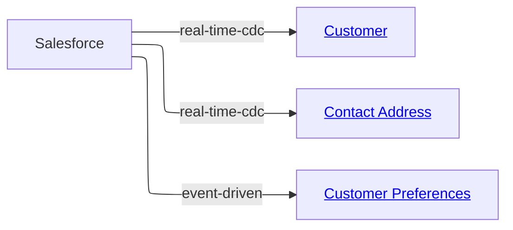

# MD‑DDL Specification (Draft 0.9.2)

*Part of the MD‑DDL Specification. See [1-Foundation.md](./1-Foundation.md) for core principles and document structure.*

---

## **Sources**

A Source in MD-DDL represents a system that generates operational change — a CRM, a core banking system, a payment platform, an ERP. Sources are not owners of data. They are systems of change whose outputs feed canonical data products.

The canonical domain model defines meaning. Sources define operational reality. The source declaration is the contract that translates between them.

This separation is deliberate and load-bearing:

- Domain modellers define canonical entities, attributes, and governance without knowing or caring which source systems produce the underlying data.
- Source system SMEs define field-level mappings and encode source idiosyncrasies without needing to understand the canonical model's governance posture.
- Integration engineers own the transform definitions that connect the two worlds.

**Canonical data products replace the concept of Systems of Record.** There is no attribute in a domain entity that is "owned" by Salesforce or SAP. Those systems generate change events. The canonical model absorbs those changes according to rules declared in the source layer.

---

### **Source Structure**

The source layer belongs to the domain and uses the same two-layer pattern as the rest of MD-DDL:

Level | Heading structure | Contains
--- | --- | ---
**Source summary** | Level‑1 heading naming the source system; level‑2 `## Metadata` and `## <Domain> Feeds` sections | What the source system is, how it generates change, and which canonical entities it feeds
**Transform detail** | Level‑2 heading naming the source table; level‑3 headings for non-direct mapping rules | Field-level mappings using the transformation types defined in Section 8

Transform detail is optional — a source may be declared before any mappings are authored.

#### Splitting Across Files

As elsewhere in MD-DDL, the heading hierarchy is what the standard defines; the file layout is the author's choice. A source may be a single document, or its transform detail may be split across many files — the natural split being one per source table, subdivided further by functional area for large systems. When transform detail is split out, each file repeats the hierarchy with a level‑1 heading linking back to the source summary.

The conventional layout, for illustration:

```text
Financial Crime/
  domain.md
  entities/
  sources/
    salesforce-crm/
      source.md             ← source metadata + domain feed table
      transforms/
        table_account.md    ← Account table mappings for Party/Company/Customer
        table_contact_point.md
    sap-fraud-management/
      source.md
      transforms/
        table_alert_case.md
```

By convention, transform documents are named for the source table — `table_<source-table>.md`, for example `table_account.md` or `table_payment_event.md`. If multiple canonical entities map from the same source table, group them under separate level-2 entity headings in the same place.

---

### **Source Summary**

#### Declaration

A source is declared using a level-1 Markdown heading:

```markdown
# Salesforce CRM
```

The heading is the source's display name. The stable machine identifier lives in the metadata block.

#### Description

Free-text Markdown under the H1 and before the first H2 describes the source system's business role — what it does, who operates it, and why it is a source for the canonical model. This is written for domain modellers and data stewards, not for engineers.

#### Metadata

Metadata appears under a level-2 heading:

```markdown
## Metadata
```

```yaml
id: salesforce
owner: crm-platform@bank.com
steward: data.governance@bank.com

# How this system generates change
change_model: real-time-cdc
change_events:
  - Customer Updated
  - Contact Created
  - Account Merged
  - Account Deactivated

# Operational characteristics
update_frequency: real-time
data_quality_tier: 1          # 1 = high trust, 2 = standard, 3 = requires validation
status: Production
version: "2.1.0"

tags:
  - CRM
  - CustomerData
  - Core
```

##### Change Models

The `change_model` field declares how change flows out of the source system. It is an intent signal — generating tooling uses it to select an appropriate pipeline pattern.

Value | Description
--- | ---
`real-time-cdc` | Change Data Capture — row-level changes streamed in real time
`event-driven` | Source publishes business events (not raw CDC)
`batch-daily` | Full or incremental extract on a daily schedule
`batch-intraday` | Multiple batch extracts within a day
`api-poll` | Changes retrieved by polling a source API
`manual` | Data loaded by human intervention; no automated feed

##### Change Events

`change_events` lists the business-level change events this source emits. These are natural-language names that may correspond to Events declared in the canonical domain. They can be used to generate event subscription logic and to link source changes to downstream domain Events.

##### Data Quality Tier

`data_quality_tier` is a governance signal, not a technical score. It tells the canonical model how much trust to extend to values from this source:

Tier | Meaning
--- | ---
`1` | High trust — well-governed source, low null rates, consistent formats
`2` | Standard — typical operational system; some nulls, occasional quirks
`3` | Low trust — legacy system, known quality issues; requires validation rules

The tier does not prevent a source from contributing to canonical entities. It signals to downstream consumers and data quality rules how to treat values originating from this source.

---

#### Domain Feed Sections

Below the metadata block, the source summary declares the feed table for its owning domain using this heading pattern:

```markdown
## [<Domain Name>](../../domain.md) Feeds
```

Example domain feed section:

```markdown
## [Financial Crime](../../domain.md) Feeds

Canonical Entity | Transform | Attributes Contributed | Change Model
--- | --- | --- | ---
[Party](../../entities/party.md#party) | [table_account](transforms/table_account.md) | Party Identifier, Party Status | real-time-cdc
[Customer](../../entities/customer.md#customer) | [table_account](transforms/table_account.md) | Customer Number, Onboarding Date, Segment | real-time-cdc
```

**Domain feed table columns:**

Column | Purpose
--- | ---
**Canonical Entity** | Link to the entity in the target domain this source contributes to.
**Transform** | Link to the transform detail for this source table, or `TBD` if not yet defined.
**Attributes Contributed** | Comma-separated list of the canonical attributes this source populates. Not every attribute needs to come from this source.
**Change Model** | How changes to this entity flow from this source. May differ per entity if the source uses different mechanisms for different record types.

---

#### Source Overview Diagram

A source summary should include a Mermaid diagram showing which canonical entities the source feeds and what kind of change model applies to each.

````markdown
### Source Overview Diagram


```mermaid
---
config:
  layout: elk
---
graph LR
  Salesforce --> |real-time-cdc| Customer
  Salesforce --> |real-time-cdc| ContactAddress
  Salesforce --> |event-driven| CustomerPreferences

  Customer["<a href='../../domains/customer/entities/customer.md'>Customer</a>"]
  ContactAddress["<a href='../../domains/customer/entities/contact_address.md'>Contact Address</a>"]
  CustomerPreferences["<a href='../../domains/customer/entities/customer_preferences.md'>Customer Preferences</a>"]
```
````

---

### **Transform Detail**

#### Declaration

When transform detail is split into its own file, that file begins with a level-1 heading naming the source system and linking back to the source summary:

```markdown
# [Salesforce CRM](../source.md)
```

#### Structure

Transform detail is organised by source table: a level-2 heading naming the source table (for example `## Account`, `## ContactPoint`) followed by a source schema table.

Required source schema table columns:

Column | Purpose
--- | ---
**Pos** | Column ordinal from the source table.
**Column Name** | Physical source column name.
**Data Type** | Source system type.
**Max Len** | Maximum length for string-like columns.
**Precision** | Numeric precision when applicable.
**Scale** | Numeric scale when applicable.
**Nulls** | Whether source column allows nulls.
**Comment** | Source-system context or business notes.
**Destination** | Canonical destination mapping (`Entity.Attribute`) or a link to a rule section for non-direct mappings.

When mapping is direct, the `Destination` cell is sufficient and no additional YAML rule is required. Use a level-3 rule section only for non-direct mappings such as `conditional`, `derived`, `lookup`, `reconciliation`, or `aggregation`.

Rules are still expressed with level-3 headings and YAML blocks. Rule links in the `Destination` column point to the rule's anchor (for example `[Map Party Status](#map-party-status)`).

Transform detail may cover multiple canonical entities when mappings originate from the same source table.

Example level-2 heading:

```markdown
## Account
```

For non-direct mappings, use a level-3 rule heading following the Key-as-Name principle. The heading is the transformation's identity in the Knowledge Graph and must be unique within the source table's transform detail.

#### Source field references

Within transform detail, all field references are scoped to the owning source system. The `system:` key is **not** required — it is implicit. Only the field path within the source is needed:

```yaml
source:
  field: Contact.Email
```

This keeps transform detail clean and portable if a source system is renamed. The source summary's `id` field is the authoritative system identifier.

#### Target notation

The `target` field uses `Entity · Attribute` notation to identify the canonical destination unambiguously:

```yaml
target: Customer · Email Address
```

The entity name must match an entity declared in the canonical domain model. The attribute name must match an attribute declared in that entity's YAML block. Both are validated during generation.

#### Transformation types

Transform detail uses the transformation types defined in [Section 8 — Transformations](./8-Transformations.md). All type-specific YAML
syntax is unchanged. The only differences from Section 8's syntax are:

- `system:` is omitted from all `source:` blocks (implicit from the owning source)
- `target:` uses `Entity · Attribute` notation instead of bare attribute name
- The H3 heading is the transformation identity (Key-as-Name, as elsewhere)

---

#### **Source Idiosyncrasies**

Transform detail is the right place to encode source-specific data quality characteristics that the canonical model should never need to know about.

##### Null representations

Many source systems represent null as a non-null value (`"N/A"`, `"0"`, `"UNKNOWN"`). Declare this on the source block so that appropriate null normalisation logic is generated:

```yaml
source:
  field: Contact.Email
  null_as: "N/A"
```

##### Quality flags

Attribute-level quality signals that should be carried into the canonical model:

```yaml
source:
  field: Customer.DateOfBirth
  quality: nullable           # may legitimately be absent
  quality_note: "DOB not collected pre-2015; backfill in progress"
```

##### Format normalisation

Source-specific format variations that require standardisation:

```yaml
source:
  field: Customer.PhoneNumber
  normalise: e164             # normalise to E.164 international format
```

```yaml
source:
  field: Account.OpenDate
  format: "DD/MM/YYYY"        # source uses non-ISO date format
  cast: date                  # generates format-aware cast
```

These annotations belong in the transform detail, not in the canonical entity definition. The canonical model defines what the attribute means; the transform handles the operational reality of getting clean data there.

---

### **Complete Example**

#### Source summary

````markdown
# Salesforce CRM

The primary CRM system used by Retail Banking. Salesforce is the operational system for all customer relationship management — onboarding, contact management, preference capture, and relationship history. It generates real-time CDC events for all customer record changes.

## Metadata

```yaml
id: salesforce
owner: crm-platform@bank.com
steward: data.governance@bank.com
change_model: real-time-cdc
change_events:
  - Customer Created
  - Customer Updated
  - Contact Updated
  - Account Deactivated
data_quality_tier: 1
status: Production
version: "2.1.0"
tags:
  - CRM
  - CustomerData
  - Core
```

### Source Overview Diagram


```mermaid
---
config:
  layout: elk
---
graph LR
  Salesforce --> |real-time-cdc| Customer
  Salesforce --> |real-time-cdc| ContactAddress
  Salesforce --> |event-driven| CustomerPreferences

  Customer["<a href='../../domains/customer/entities/customer.md'>Customer</a>"]
  ContactAddress["<a href='../../domains/customer/entities/contact_address.md'>Contact Address</a>"]
  CustomerPreferences["<a href='../../domains/customer/entities/customer_preferences.md'>Customer Preferences</a>"]
```

## [Financial Crime](../../domain.md) Feeds

Canonical Entity | Transform | Attributes Contributed | Change Model
--- | --- | --- | ---
[Party](../../entities/party.md#party) | [table_account](transforms/table_account.md) | Party Identifier, Party Status | real-time-cdc
[Customer](../../entities/customer.md#customer) | [table_account](transforms/table_account.md) | Customer Number, Email Address, Full Name, Date of Birth | real-time-cdc
[Contact Address](../../entities/contact_address.md#contact-address) | [table_contact_point](transforms/table_contact_point.md) | Street, City, Postal Code, Country Code | real-time-cdc
````

#### Transform detail — `sources/salesforce-crm/transforms/table_contact.md`

````markdown
# [Salesforce CRM](../source.md)

## Customer

Salesforce is the primary contributor to the Customer canonical entity for all contact and identity attributes. Financial attributes (balance, credit limit) are contributed by the Core Banking System.

### Map Customer Number
Direct map from the Salesforce Account identifier.

```yaml
type: direct
target: Customer · Customer Number
source:
  field: Account.AccountNumber
```

### Concatenate Full Name
Salesforce stores given and family name separately. The canonical model uses a single Full Name attribute.

```yaml
type: derived
target: Customer · Full Name
expression: "trim(First Name) + ' ' + trim(Last Name)"
inputs:
  First Name:
    field: Contact.FirstName
  Last Name:
    field: Contact.LastName
```

### Map Email Address
Salesforce uses "N/A" as a null representation for missing email addresses.

```yaml
type: direct
target: Customer · Email Address
source:
  field: Contact.Email
  null_as: "N/A"
  quality: nullable
```

### Resolve Country Code
Salesforce stores legacy two-character country codes. The canonical model uses ISO 3166-1 alpha-3.

```yaml
type: lookup
target: Customer · Country Code
source:
  field: Contact.MailingCountry
lookup:
  reference: Country Code
  match_on: Abbreviation
  return: ISO Code
fallback: null
```

### Map Date of Birth
Salesforce uses DD/MM/YYYY format for dates. Generation produces a format-aware cast to the canonical date type.

```yaml
type: direct
target: Customer · Date of Birth
source:
  field: Contact.Birthdate
  format: "DD/MM/YYYY"
  cast: date
```
````

---

### **Brownfield Adoption Note**

When adopting MD-DDL into an existing environment, source declarations may initially reference baseline ETL documentation in `baselines/etl/` to capture the current transformation logic before formalising it as MD-DDL transform definitions. See [Section 10 — Adoption](./10-Adoption.md) for the full adoption workflow and baseline-to-source migration path.

---

### **Source Rules**

1. **Source identity is stable.** The `id` in the source metadata is a breaking-change identifier. Renaming requires a coordinated update across the source layer and its references at the domain level.

2. **Canonical entities stay pure.** Entity definitions contain no source references. The canonical model defines meaning; sources define operational reality. This separation is structural — a source reference in entity YAML would be interpreted as part of the canonical meaning and corrupt generation.

3. **Transform detail is source-scoped.** Transform detail belongs to exactly one source and one domain context. Cross-source reconciliation (where multiple sources contribute to the same attribute) is expressed using the `reconciliation` transformation type, listing the contributing sources explicitly.

4. **Source idiosyncrasies stay in transform detail.** Null representations, format quirks, quality notes, and encoding variations belong in the `source:` block of the relevant transform. They do not propagate into the canonical entity definition.

5. **Domain feed section is authoritative.** If an attribute is listed in a feed table but has no corresponding transformation in the same source folder, this is a validation error. If a transformation exists in the source folder but the entity is not listed in the feed table, this is a warning.

6. **Change events may link to domain Events.** When a source's `change_events` list contains an event whose name matches a domain Event, event subscription logic can be generated. This linkage is by name — no explicit reference key is required.

7. **Sources do not carry governance metadata.** Source declarations do not include a `governance:` block. Sources are governed transitively — the canonical entities they feed carry the governance posture, and data products that expose source-aligned data declare governance at the product level. This is by design: governance belongs to the meaning layer (entities and products), not the operational origin layer (sources).

---

...next: [Transformations](8-Transformations.md)
