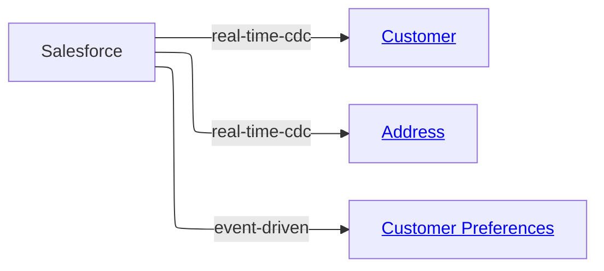

# MD‑DDL Specification (Draft 0.9.2)

*Part of the MD‑DDL Specification. See [1-Foundation.md](./1-Foundation.md) for core principles and document structure.*

---

## **Sources**

A Source in MD-DDL represents a system that generates operational change — a CRM, a core banking system, a payment platform, an ERP. Sources are not owners of data. They are systems of change whose outputs feed canonical data products.

The canonical domain model defines meaning. Sources define operational reality. The source declaration is the contract that translates between them.

This separation is deliberate and load-bearing:

- Domain modellers define canonical entities, attributes, and governance without knowing or caring which source systems produce the underlying data.
- Source system SMEs define field-level mappings and encode source idiosyncrasies without needing to understand the canonical model's governance posture.
- Integration engineers own the transform definitions that connect the two worlds.

**Canonical data products replace the concept of Systems of Record.** There is no attribute in a domain entity that is "owned" by Salesforce or SAP. Those systems generate change events. The canonical model absorbs those changes according to rules declared in the source layer.

---

### **Source Structure**

The source layer belongs to the domain and uses the same two-layer pattern, and the same domain-rooted heading hierarchy, as the rest of MD-DDL. `## Sources` is a domain section like `## Entities` or `## Enums`, and its detail files are rooted at the domain:

Level | Heading | Contains
--- | --- | ---
1 | `# [<Domain>](../domain.md)` | Link back to the domain summary
2 | `## Sources` | The domain section
3 | `### <Source System>` | The source system — its description, metadata, diagram, and feeds
4 | `#### Metadata` / `#### Source Overview Diagram` / `#### Feeds` | Source summary sections
4 | `#### <Source Table>` | Transform detail for one source table
5 | `##### Transform: <Name>` and the fixed sections below | Mapping rules and supporting detail

Transform detail is optional — a source may be declared before any mappings are authored.

#### Splitting Across Files

As elsewhere in MD-DDL, the heading hierarchy is what the standard defines; the file layout is the author's choice. Parsers and linters locate content by heading hierarchy, not by path, so no particular directory structure is required.

The conventional layout, for illustration:

```text
Financial Crime/
  domain.md
  entities/
  sources/
    sources.md                      ← all source summaries for the domain
    salesforce-crm/
      table_ADDRESS.md              ← transform detail, one file per source table
      table_CONTACT.md
```

Source summaries are small. Collect them in a single `sources/sources.md` and split a source out into its own file only once it grows large enough to warrant it. Transform detail is usually split one file per source table from the outset, since a single table's mappings can run to hundreds of lines.

By convention, transform documents are named for the source table — `table_<source-table>.md`. Match the source system's own casing, so a table named `ADDRESS` gives `table_ADDRESS.md`.

Every split-out file repeats the hierarchy from the domain down, so agents can reassemble the model from any arrangement.

---

### **Source Summary**

#### Declaration

A source is declared using a level-3 heading under `## Sources`:

```markdown
### Salesforce CRM
```

The heading is the source's display name. The stable machine identifier lives in the metadata block.

#### Description

Free-text Markdown under the source heading and before the first level-4 heading describes the source system's business role — what it does, who operates it, and why it is a source for the canonical model. This is written for domain modellers and data stewards, not for engineers.

#### Metadata

```markdown
#### Metadata
```

```yaml
id: salesforce
owner: crm-platform@bank.com
steward: data.governance@bank.com

# How this system generates change
change_model: real-time-cdc
change_events:
  - Customer Updated
  - Contact Created
  - Account Merged
  - Account Deactivated

# Operational characteristics
update_frequency: real-time
data_quality_tier: 1          # 1 = high trust, 2 = standard, 3 = requires validation
status: Production
version: "2.1.0"

tags:
  - CRM
  - CustomerData
  - Core
```

##### Change Models

The `change_model` field declares how change flows out of the source system. It is an intent signal — generating tooling uses it to select an appropriate pipeline pattern.

Value | Description
--- | ---
`real-time-cdc` | Change Data Capture — row-level changes streamed in real time
`event-driven` | Source publishes business events (not raw CDC)
`batch-daily` | Full or incremental extract on a daily schedule
`batch-intraday` | Multiple batch extracts within a day
`api-poll` | Changes retrieved by polling a source API
`manual` | Data loaded by human intervention; no automated feed

##### Change Events

`change_events` lists the business-level change events this source emits. These are natural-language names that may correspond to Events declared in the canonical domain. They can be used to generate event subscription logic and to link source changes to downstream domain Events.

##### Data Quality Tier

`data_quality_tier` is a governance signal, not a technical score. It tells the canonical model how much trust to extend to values from this source:

Tier | Meaning
--- | ---
`1` | High trust — well-governed source, low null rates, consistent formats
`2` | Standard — typical operational system; some nulls, occasional quirks
`3` | Low trust — legacy system, known quality issues; requires validation rules

The tier does not prevent a source from contributing to canonical entities. It signals to downstream consumers and data quality rules how to treat values originating from this source.

---

#### Source Overview Diagram

A source summary should include a Mermaid diagram showing which canonical entities the source feeds and what kind of change model applies to each.

````markdown
#### Source Overview Diagram


```mermaid
---
config:
  layout: elk
---
graph LR
  Salesforce --> |real-time-cdc| Customer
  Salesforce --> |real-time-cdc| Address
  Salesforce --> |event-driven| CustomerPreferences

  Customer["<a href='../entities/customer.md'>Customer</a>"]
  Address["<a href='../entities/address.md'>Address</a>"]
  CustomerPreferences["<a href='../entities/customer_preferences.md'>Customer Preferences</a>"]
```
````

---

#### Feeds

Below the metadata and diagram, the source summary declares what it contributes to the domain:

```markdown
#### Feeds

Canonical Entity | Transform | Attributes Contributed | Change Model
--- | --- | --- | ---
[Party](../entities/party.md#party) | [table_ACCOUNT](salesforce-crm/table_ACCOUNT.md#account) | Party Identifier, Party Status | real-time-cdc
[Customer](../entities/customer.md#customer) | [table_ACCOUNT](salesforce-crm/table_ACCOUNT.md#account) | Customer Number, Onboarding Date, Segment | real-time-cdc
```

Because the file is rooted at the domain, the domain name is not repeated in the heading.

**Feed table columns:**

Column | Purpose
--- | ---
**Canonical Entity** | Link to the entity in the target domain this source contributes to.
**Transform** | Link to the transform detail for this source table, or `TBD` if not yet defined.
**Attributes Contributed** | Comma-separated list of the canonical attributes this source populates. Not every attribute needs to come from this source.
**Change Model** | How changes to this entity flow from this source. May differ per entity if the source uses different mechanisms for different record types.

Where a source row produces an abstract entity's concrete subtypes, list the subtypes actually instantiated — not the abstract parent — and note the inherited attributes against each.

---

### **Transform Detail**

#### Declaration

Transform detail is organised by source table under a level-4 heading naming the table. When split into its own file, the file repeats the hierarchy from the domain down, linking the source heading back to the source summary:

```markdown
# [Financial Crime](../../domain.md)

## Sources

### [Salesforce CRM](../sources.md#salesforce-crm)

#### Address
```

#### Structure

Under the source table heading, transform detail uses a fixed set of level-5 sections. All are optional except the source schema table:

Section | Purpose
--- | ---
`##### Entity Fan-Out` | Which canonical instances one source row produces. Required when a row produces more than one entity instance.
`##### Source Schema` | The source column table, including the `Destination` column.
`##### Transform: <Name>` | One non-direct mapping rule. Repeated per rule.
`##### Worked Examples` | Input rows and the exact instances they must produce.
`##### Open Decisions` | Unresolved questions that block deterministic generation.

The `Transform: ` prefix distinguishes mapping rules from the fixed sections. The transformation's identity in the Knowledge Graph is the heading text with the prefix removed.

Transform detail may cover multiple canonical entities when mappings originate from the same source table.

---

#### Entity Fan-Out

A source table whose rows each produce exactly one instance of one entity needs no fan-out declaration. Where a row produces several instances — because the source system combines concepts the domain model separates — the split must be declared explicitly. Without it, the number and identity of output instances is left to the generating agent to infer, and generation is not reproducible.

The `produces:` block declares, for one source row, which canonical instances are emitted:

````markdown
##### Entity Fan-Out

```yaml
produces:
  - entity: Address · Postal Address
    cardinality: 0..1
    deduplicated: true
    identity: Address Uniqueness Merge

  - entity: Location Involvement
    cardinality: 1
    identity: Location Involvement Mapping
    references:
      Address: Address Uniqueness Merge

  - entity: Individual
    cardinality: 0..1
    condition: "OWNER_TYPE_ENUM == 1"
    identity:
      field: ADDRESS.OWNER_ID
      maps_to: Party · Party Identifier
```
````

Key | Purpose
--- | ---
`entity` | The canonical entity produced. Must resolve in the domain model. Use `Parent · Subtype` where the target is a subtype.
`cardinality` | Instances emitted per source row: `1`, `0..1`, or `0..*`.
`condition` | Expression selecting when this instance is produced. Required when two entries are alternatives.
`identity` | The transformation that determines this instance's identifier, or a source field and the attribute it maps to.
`deduplicated` | `true` when instances collapse across source rows. Requires a `deduplication` transformation.
`references` | Which produced instance satisfies a relationship to another produced instance.

A `produces:` block is also what binds a transformation to a concrete instance when its `target` names an attribute declared on an abstract supertype. `target: Party · Legal Name` states which attribute is populated; the fan-out entry whose `condition` matched states which concrete subtype receives it.

Entities listed in `produces:` should appear in the source summary's Feeds table.

---

#### Source Schema

The source column table declares the physical shape of the source table and where each column lands.

Required columns:

Column | Purpose
--- | ---
**Pos** | Column ordinal from the source table.
**Column Name** | Physical source column name.
**Data Type** | Source system type.
**Max Len** | Maximum length for string-like columns.
**Precision** | Numeric precision when applicable.
**Scale** | Numeric scale when applicable.
**Nulls** | Whether source column allows nulls.
**Description** | Source-system context or business notes.
**Destination** | Canonical destination mapping, or a link to a rule section for non-direct mappings.

When mapping is direct, the `Destination` cell is sufficient and no additional YAML rule is required. Use a rule section only for non-direct mappings such as `conditional`, `derived`, `lookup`, `reconciliation`, `deduplication`, or `aggregation`. Rule links point to the rule's anchor, for example `[Transform: Map Party Status](#transform-map-party-status)`.

##### Multiple destinations

A source column may legitimately feed more than one canonical attribute — a type code that determines both a classification and a temporal boundary, for example. The `Destination` cell accepts a comma-separated list of mappings and rule links:

```markdown
5|ADDRESS_TYPE_DID|NUMBER||38|0|YES|The address type|[Transform: Address Purpose Mapping](#transform-address-purpose-mapping), [Transform: Previous Address Closure](#transform-previous-address-closure)
```

The one-mapping-path constraint applies per *target attribute*, not per source column. Two rules may read the same column; two rules must not write the same attribute.

##### Unmapped columns

**A blank `Destination` means the column is deliberately not mapped from this source.** The column is either not required by the domain model or is contributed by another source. A blank cell is a decision, not an omission — agents must not infer a target for it.

Columns whose mapping is genuinely undecided do not belong in a blank cell. Record them under `##### Open Decisions` so the difference between "not needed" and "not yet resolved" is never left to inference.

---

#### Open Decisions

Transform detail is authored against real source systems, and real source systems have undocumented columns, contradictory type declarations, and codes nobody remembers. An unresolved question recorded in prose is invisible to generation; recorded here it is a declared blocker.

```markdown
##### Open Decisions

Ref | Item | Impact
--- | --- | ---
OD-1 | `OWNER_TYPE_ENUM` is typed `NUMBER` but documented with character codes. Actual values unknown. | Subtype routing in Entity Fan-Out cannot be generated.
```

Where a placeholder must appear in YAML pending resolution, mark it inline and reference the decision:

```yaml
condition: "OWNER_TYPE_ENUM == <INDIVIDUAL_CODE>"   # UNRESOLVED — see OD-1
```

Generation against a model with open decisions should surface them rather than guess past them.

---

#### Source field references

Within transform detail, all field references are scoped to the owning source system. The `system:` key is **not** required — it is implicit. Only the field path within the source is needed:

```yaml
source:
  field: Contact.Email
```

This keeps transform detail clean and portable if a source system is renamed. The source summary's `id` field is the authoritative system identifier.

#### Target notation

The `target` field uses `Entity · Attribute` notation to identify the canonical destination unambiguously:

```yaml
target: Customer · Email Address
```

The entity name must match an entity declared in the canonical domain model, spelled as the model spells it. The attribute name must match an attribute declared in that entity's YAML block, or one inherited from its parent. Both are validated during generation.

#### Transformation types

Transform detail uses the transformation types defined in [Section 8 — Transformations](./8-Transformations.md). All type-specific YAML syntax is unchanged. The only differences from Section 8's syntax are:

- `system:` is omitted from all `source:` blocks (implicit from the owning source)
- `target:` uses `Entity · Attribute` notation instead of bare attribute name
- The rule heading is the transformation identity (Key-as-Name, as elsewhere)

---

#### **Source Idiosyncrasies**

Transform detail is the right place to encode source-specific data quality characteristics that the canonical model should never need to know about.

##### Null representations

Many source systems represent null as a non-null value (`"N/A"`, `"0"`, `"UNKNOWN"`). Declare this on the source block so that appropriate null normalisation logic is generated:

```yaml
source:
  field: Contact.Email
  null_as: "N/A"
```

##### Quality flags

Attribute-level quality signals that should be carried into the canonical model:

```yaml
source:
  field: Customer.DateOfBirth
  quality: nullable           # may legitimately be absent
  quality_note: "DOB not collected pre-2015; backfill in progress"
```

##### Format normalisation

Source-specific format variations that require standardisation:

```yaml
source:
  field: Customer.PhoneNumber
  normalise: e164             # normalise to E.164 international format
```

```yaml
source:
  field: Account.OpenDate
  format: "DD/MM/YYYY"        # source uses non-ISO date format
  cast: date                  # generates format-aware cast
```

These annotations belong in the transform detail, not in the canonical entity definition. The canonical model defines what the attribute means; the transform handles the operational reality of getting clean data there.

---

### **Complete Example**

#### Source summary — `sources/sources.md`

````markdown
# [Financial Crime](../domain.md)

## Sources

### Salesforce CRM

The primary CRM system used by Retail Banking. Salesforce is the operational system for all customer relationship management — onboarding, contact management, preference capture, and relationship history. It generates real-time CDC events for all customer record changes.

#### Metadata

```yaml
id: salesforce
owner: crm-platform@bank.com
steward: data.governance@bank.com
change_model: real-time-cdc
change_events:
  - Customer Created
  - Customer Updated
data_quality_tier: 1
status: Production
version: "2.1.0"
tags:
  - CRM
  - Core
```

#### Feeds

Canonical Entity | Transform | Attributes Contributed | Change Model
--- | --- | --- | ---
[Customer](../entities/customer.md#customer) | [table_CONTACT](salesforce-crm/table_CONTACT.md#contact) | Customer Number, Email Address, Full Name, Date of Birth | real-time-cdc
````

#### Transform detail — `sources/salesforce-crm/table_CONTACT.md`

````markdown
# [Financial Crime](../../domain.md)

## Sources

### [Salesforce CRM](../sources.md#salesforce-crm)

#### Contact

##### Source Schema

Pos|Column Name|Data Type|Max Len|Precision|Scale|Nulls|Description|Destination
---|---|---|---|---|---|---|---|---
1|AccountNumber|Text|32|||NO|Salesforce account identifier|Customer.Customer Number
2|FirstName|Text|100|||YES|Given name|[Transform: Concatenate Full Name](#transform-concatenate-full-name)
3|LastName|Text|100|||YES|Family name|[Transform: Concatenate Full Name](#transform-concatenate-full-name)
4|Email|Text|255|||YES|Primary email; "N/A" used for missing|Customer.Email Address
5|MailingCountry|Text|2|||YES|Legacy two-character country code|[Transform: Resolve Country Code](#transform-resolve-country-code)
6|InternalSyncFlag|Boolean||||NO|Salesforce replication marker|

##### Transform: Concatenate Full Name

Salesforce stores given and family name separately. The canonical model uses a single Full Name attribute.

```yaml
type: derived
target: Customer · Full Name
expression: "trim(First Name) + ' ' + trim(Last Name)"
inputs:
  First Name:
    field: Contact.FirstName
  Last Name:
    field: Contact.LastName
```

##### Transform: Resolve Country Code

Salesforce stores legacy two-character country codes. The canonical model uses ISO 3166-1 alpha-3.

```yaml
type: lookup
target: Customer · Country Code
source:
  field: Contact.MailingCountry
  null_as: null
lookup:
  reference: Country Code
  match_on: Abbreviation
  return: ISO Code
fallback: null
```
````

---

### **Brownfield Adoption Note**

When adopting MD-DDL into an existing environment, source declarations may initially reference baseline ETL documentation in `baselines/etl/` to capture the current transformation logic before formalising it as MD-DDL transform definitions. See [Section 10 — Adoption](./10-Adoption.md) for the full adoption workflow and baseline-to-source migration path.

---

### **Source Rules**

1. **Source identity is stable.** The `id` in the source metadata is a breaking-change identifier. Renaming requires a coordinated update across the source layer and its references at the domain level.

2. **Canonical entities stay pure.** Entity definitions contain no source references. The canonical model defines meaning; sources define operational reality. This separation is structural — a source reference in entity YAML would be interpreted as part of the canonical meaning and corrupt generation.

3. **Transform detail is source-scoped.** Transform detail belongs to exactly one source and one domain context. Cross-source reconciliation (where multiple sources contribute to the same attribute) is expressed using the `reconciliation` transformation type, listing the contributing sources explicitly.

4. **Source idiosyncrasies stay in transform detail.** Null representations, format quirks, quality notes, and encoding variations belong in the `source:` block of the relevant transform. They do not propagate into the canonical entity definition.

5. **Feed table is authoritative.** If an attribute is listed in a feed table but has no corresponding transformation for that source, this is a validation error. If a transformation exists for a source but the entity is not listed in its feed table, this is a warning.

6. **Change events may link to domain Events.** When a source's `change_events` list contains an event whose name matches a domain Event, event subscription logic can be generated. This linkage is by name — no explicit reference key is required.

7. **Sources do not carry governance metadata.** Source declarations do not include a `governance:` block. Sources are governed transitively — the canonical entities they feed carry the governance posture, and data products that expose source-aligned data declare governance at the product level. This is by design: governance belongs to the meaning layer (entities and products), not the operational origin layer (sources).

8. **Fan-out is declared, not inferred.** Where one source row produces more than one canonical instance, an `Entity Fan-Out` section must declare what is produced and under what condition. Multi-entity output left implicit is a validation error.

9. **Blank means deliberately unmapped.** A blank `Destination` asserts that the column is not needed from this source. Undecided mappings belong in `Open Decisions`, not in a blank cell.

---

...next: [Transformations](8-Transformations.md)
