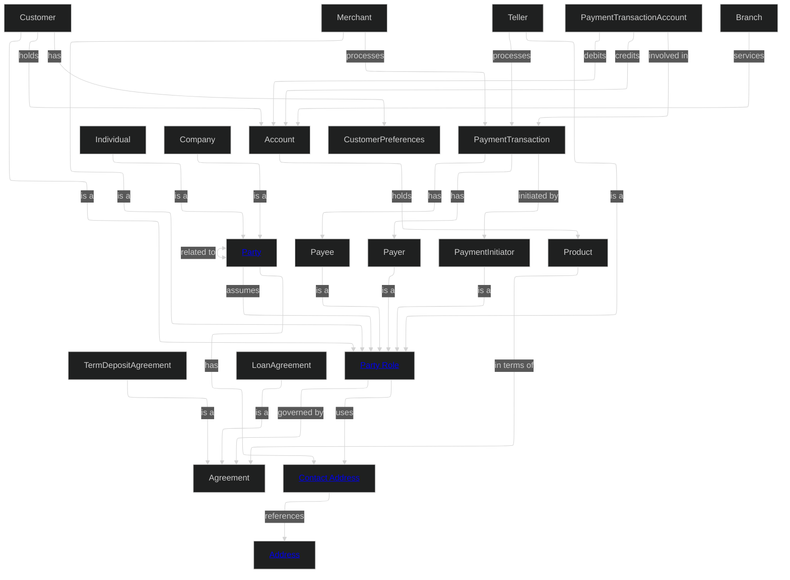
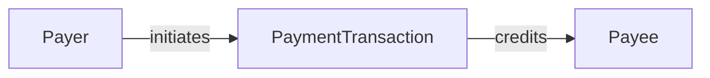
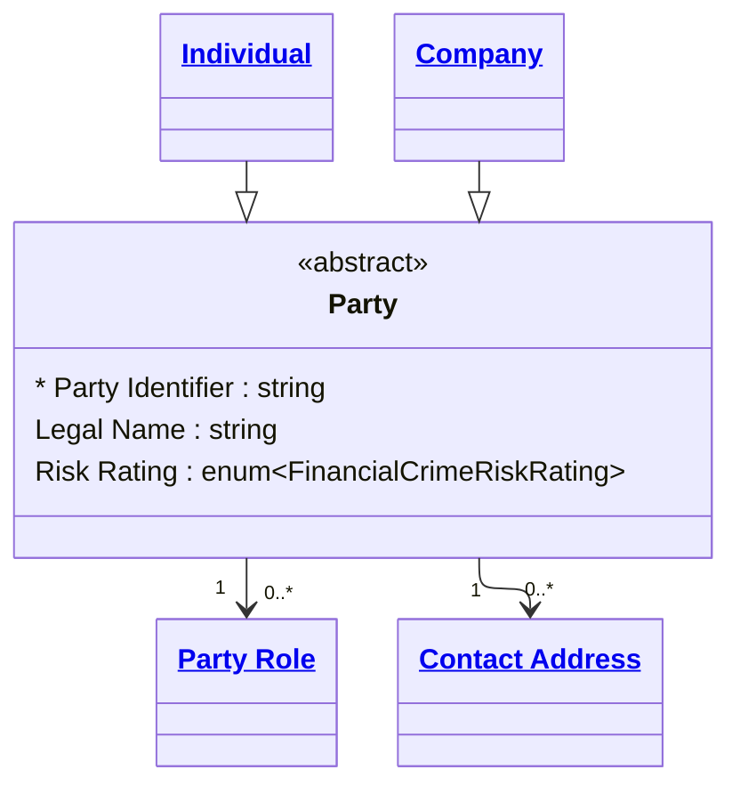

# **MD‑DDL Specification (Draft 0.4)**  
*A Markdown‑native Data Definition Language for human-AI collaboration.*

---

# **Overview**

MD‑DDL is a **Markdown‑first**, **AI‑friendly** standard for defining  domains, entities, attributes, enums, and relationships. It is designed to be readable by humans, generatable by AI, and compilable into:

- Data catalogs
- Knowledge graphs
- Data product definitions
- Schemas and technical artifacts

MD‑DDL uses Markdown structure as its primary syntax, with YAML or JSON blocks for structured definitions and Mermaid or PlantUML for diagramming. Structural consistency is enforced by the compiler and supported by companion AI agents.

---

# **Core Principles**

1. **Single Source of Truth**  
   Every concept is defined once in the domain, in one canonical location. A design choice is weather to follow Domain Driven Design (DDD) and allow domain concepts to be mutually exclusive or not.

2. **Markdown‑Native**  
   Headings define structure; prose defines meaning.

3. **AI‑Friendly**  
   No redundant fields. No manually maintained lists. Minimal boilerplate.

4. **Compiler‑Driven**  
   The compiler infers domain membership, indexes entities, and validates relationships.

5. **Graph‑Powered**  
   The knowledge graph acts as the semantic runtime for reasoning, lineage, and governance.

6. **Natural‑Language Naming**  
   Entities, attributes, and relationships use human‑readable names rather than code‑style casing.

---

# **Document Structure**

MD‑DDL is composed of several logical components: 
- [Domains](#domains)
- [Entities](#entities)
- [Enumerations](#enumerations)
- [Relationships](#relationships)
- [Events](#events)


MD‑DDL uses a **two‑layer structure** for Entities, Enums, Relationships, and Events:

1. A **summary definition** in the domain file  
2. A **detailed definition** in a separate file  

This structure supports both human readability and AI context management.

Example domain layout:

```
domains/customer/domain.md
domains/customer/entities/customer.md
domains/customer/entities/customer-preference.md
domains/customer/relationships/customer-has-preferences.md
domains/customer/diagrams/overview.md
```

---

## **Two‑Layer Structure**

### **AI Context Management**

- The domain file provides a compact summary of all conceptual objects.  
- AI agents load only the summaries initially.  
- When deeper context is needed, they follow the `detail:` link to load the full definition.

This mirrors Anthropic’s "skills" concept but improves on it by:

- Centralising summaries
- Avoiding duplication
- Ensuring humans can browse the domain easily

### **Human Readability**

- The domain file becomes a clean, navigable table of contents.  
- Detail files remain focused, concise, and free from clutter.

### **Compiler Simplicity**

- The compiler knows exactly where to find summaries and details.  
- Both layers are merged into a unified conceptual, logical, and physical model.

### Detail File Flexibility
Detail files are not restricted to a single entity. Authors may organise detail files to suit their modelling style — for example, one entity per file, one file per subdomain cluster, or a file combining an entity with its enumerations and originating relationships. The only structural requirement is that every detail file begins with a level‑1 heading naming the domain (with a link back to the domain file), followed by one or more level‑2 section headings (## Entities, ## Enums, ## Relationships, ## Events) containing the relevant definitions.

---

# **Domains**

In MD-DDL, the Domain file acts as the router for the Knowledge Graph. While detail files provide the DNA (Attributes/Constraints), the Domain file provides the Anatomy (How entities, events, and relationships sit together).

## **Domain Declaration**

A domain is declared using a **level‑1 Markdown heading**:

```markdown
# Customer
```

## **Domain Description**

All free‑text Markdown under the H1 heading and before the next H2 heading is considered the domain description.

## **Domain Metadata**

Metadata is appears under a level‑2 heading:

```markdown
## Metadata
```
Domain Metadata sets the default posture for all contained objects unless overridden. Metadata is:

Category|Metadata Keys|Purpose
--------|-------------|-------
Accountability|owners, stewards, technical_leads|Who is responsible for the business vs. technical health.
Governance & Security|classification, confidentiality, pii|The default security posture for the entire domain.
Compliance|sox_scope, gdpr_relevant, retention_policy|Legal and regulatory frameworks governing this data.
Lifecycle|status (Draft/Live), version, source_systems|The maturity and origin of the data domain.
Discovery|tags|Searchability

### **Metadata Format**

Metadata is expressed as YAML or JSON inside a fenced code block:

````markdown
## Metadata

```yaml
# Accountability
owners:
  - data.customer@example.com
stewards:
  - jane.doe@example.com
technical_leads:
  - architecture.team@example.com

# Governance & Security
classification: "Highly Confidential"
pii: true
regulatory_scope:
  - GDPR
  - CCPA
default_retention: "7 years"

# Lifecycle & Discovery
status: "Production"
version: "2.1.0"
tags:
  - Core
  - MasterData
  - B2C
source_systems:
  - "Salesforce CRM"
  - "SAP ERP"
```
````

### **Diagrams**

Diagrams appear under level‑3 headings inside the Metadata section, after the YAML metadata block. This separates data *about* the domain from visuals *of* the domain.

A domain file should contain at least one **Domain Overview Diagram** that shows the full entity graph for the domain. This diagram is the primary navigational and communicative artefact of the domain file — it must give any reader an immediate understanding of how all concepts relate to each other.

The Domain Overview Diagram uses `graph TD` (top-down) or `graph LR` (left-right) Mermaid syntax with the ELK layout engine for consistent, readable positioning of complex graphs.

#### **What to include in the Domain Overview Diagram**

The diagram must show:

1. **All entities** defined in the domain
2. **Inheritance relationships** using `-->|is a|` notation
3. **All relationships** between entities using labelled edges whose verb matches the relationship name defined in the Relationships section
4. **Hyperlinks** on key navigable entities using `EntityName["<a href='path'>Display Name</a>"]` syntax. Not every node needs a link — prioritise the abstract and most-referenced entities.

The diagram must not show:
- Attributes (these belong in entity detail files)
- Cardinality notation (this belongs in relationship detail files)
- Enumeration values (these belong in enum detail files)

#### **Diagram Syntax Rules**

- Use `graph TD` for domains with deep inheritance hierarchies
- Use the ELK layout engine (`layout: elk`) with `mergeEdges: false` for complex graphs to prevent edge crossings
- Relationship edge labels must use the verb form from the Relationships
  section: `-->|assumes|`, `-->|references|`, `-->|governed by|`
- Inheritance is always expressed as `Child -->|is a|Parent`
- Bidirectional relationships use `<-->|label|`
- Entity hyperlinks use plain anchor tags: `<a href='path'>Display Name</a>`
  with no additional CSS class attributes
- Node identifiers in the graph use PascalCase for readability
  (e.g., `PartyRole`, `ContactAddress`) but the display label uses
  natural language where a hyperlink is defined

#### **Example: Financial Crime Domain Overview Diagram**

````markdown
### Domain Overview Diagram


````

#### **Why the Domain Overview Diagram matters**

The domain diagram is the first artefact an AI agent or a new team member loads when working with a domain. It establishes:

- **Scope**: what concepts are owned by this domain
- **Structure**: how inheritance hierarchies are organised
- **Connectivity**: which entities are central vs peripheral
- **Navigation**: hyperlinks on key entities provide one-click access to detail files from the diagram itself

A well-maintained domain diagram makes the two-layer structure of MD‑DDL work in practice — the domain file is the map, and the diagram is the visual index of that map.

#### **Additional Diagrams**

Beyond the overview, a domain file may contain additional level‑3 diagrams focusing on a specific sub-area. For example:

````markdown
### Transaction Flow Diagram
Shows how payment transactions move through party roles.


````

Additional diagrams are optional. The Domain Overview Diagram is required.

### Conceptual vs Logical Diagrams

MD-DDL uses two distinct diagram types for different purposes:
|Diagram|Location|Purpose|Relationship Labels|
|-------|--------|-------|-------------------|
|`graph TD/LR`|Domain file|Conceptual model — business meaning and named relationships|Required — must match Relationships section|
`classDiagram`|Entity detail file|Logical model — structural realization of the entity|Optional — structural intent only

The classDiagram is not required to mirror the domain graph one-for-one. Modellers have freedom to realize conceptual relationships as they see fit at the logical level.

---
## **Domain Structure**

Below the metadata section there are several sections, each with a level‑2 heading. The sections are: 

```markdown
## Entities

### <entity name>
Conceptual definition.
- detail: [<entity name>](link to details)
- specializes: [<entity name>](link to parent entity details)
- references: 
    - [<external reference1>](reference url1)
    - [<external reference2>](reference url2)

## Enums
...
## Relationships
...
## Events
...
```

The order of these sections is not important. See the specification details of each for more information.

### Sample Structure

- Recommended: Entity-Centric Detail Files
- A common and encouraged pattern is to define, in a single file, one entity alongside all relationships that originate from it. This keeps ownership clear and reduces cross-file navigation. Example layout:

```
entities/party.md        ← Party entity + Party Has Role + Party Has Contact Address
entities/party-role.md   ← Party Role entity + Party Role Uses Contact Address
entities/address.md      ← Address entity (no outbound relationships)
```

Below is an example of how a domain file is structured.

```markdown
# Domain Name

Domain description...

## Metadata
Formal JSON/YAML block and diagrams...

### Domain Overview Diagram
- [Domain Overview](diagrams/overview.md)

## Entities

### Customer
The primary representation of a customer in the organisation.
- detail: [Customer](entities/customer.md)

### Customer Preference
Represents customer‑specific settings and preferences.
- detail [Customer Preference](entities/customer-preference.md) 

## Enums

### Loyalty Tier
A structured level within a loyalty program that offers different benefits and rewards based on engagement or spending.
- detail: [Loyalty Tier](enums/loyalty-tier.md) 

## Relationships

### Customer Has Preferences
A customer can have 0 to many preferences which are used for interactions with our business.
- detail: [Customer Has Preferences](relationships/customer-has-preferences.md) 

## Events

### Customer Preference Updated
Emited when any system updates a field which is used to configure customer interactions.
- detail: [Customer Preference Updated](events/customer-preference-updated.md) 

```

## Rules for Summary Definitions

- The summary must include a short natural‑language description.
- The summary must include a detail: link to the full definition file. Where multiple concepts share a detail file, each concept's summary links to the same file. The compiler resolves each concept by its level‑3 heading within that file.
- If the entity specializes another entity, include a `specializes:` link to the parent entity before the detail link.
- The summary should not include YAML or formal attributes. It is a conceptual definition.
- The summary must be below the entity's level‑3 heading.
- The summary is authoritative but high level for the entity name.
- The summary is intentionally brief, designed for AI agents to load upfront and humans to scan quickly.

This allows the domain file to act as a semantic index of the domain.

### Specialization in Summaries

When an entity specializes (inherits from) another entity, declare this in the summary with a link to the parent:
```markdown
### Individual
A natural person who participates in financial activities.
- specializes: [Party](entities/party.md)
- detail: [Individual](entities/individual.md)
```

---

# **Entities**

Each file must declare which domain it is part of by starting with a Level 1 heading with the domain name. The domain name should provide a link back to the domain file like:

```markdown
# [My Domain](../domain.md)
```

## **Entity Declaration**

A detail file may contain any combination of ## Entities, ## Enums, and ## Relationships sections. Authors are free to co-locate an entity with its directly originating relationships and any enumerations it references — this is the recommended pattern when a single entity is the clear owner of those concepts.
The Entities section appear under a level‑2 heading:

```markdown
## Entities
```

Each entity is introduced with a **level‑3 heading**:

```markdown
### Customer
```

## **Entity Description**

Free‑text Markdown under the heading describes the entity in more detail than was found in the domain summary.

## **Entity Diagram**

Every entity detail file must include a `classDiagram` immediately after the entity description and before the YAML definition blocks. The diagram is the visual contract for the entity — it shows the entity's own attributes, its position in the inheritance hierarchy, and all of its immediate relationships to other entities.

### **Diagram Configuration**

All entity diagrams use the ELK layout engine for consistent rendering:

````markdown
```mermaid
---
config:
  layout: elk
---
classDiagram
  ...
```
````

### **The Subject Class**

The entity being defined is the **subject class**. It is always written as a full class block with its attributes listed inside:

```
  class Party{
    <<abstract>>
    * Party Identifier : string
    Legal Name : string
    Party Status : enum~PartyStatus~
  }
```

**Rules for the subject class:**

- The class name uses PascalCase matching the entity heading (e.g., `Party`, `ContactAddress`, `PartyRole`)
- If the entity is abstract — never instantiated directly, only specialised - add `<<abstract>>` as the first line inside the class block
- The primary identifier attribute is prefixed with `*` to mark it as the key
- All attributes defined in the entity's YAML block must appear in the diagram
- Attribute types use the Mermaid classifier syntax:
  - Primitives: `string`, `integer`, `decimal`, `boolean`, `date`, `datetime`
  - Enumerations: `enum~EnumName~` (e.g., `enum~PartyStatus~`, `enum~CountryCode~`)
  - Arrays: append `[]` to the type (e.g., `enum~CountryCode~[]`, `string[]`)
- Inherited attributes from parent entities are **not** repeated in the subject class — only attributes defined in this entity's own YAML block are shown
- Attribute format is `AttributeName : Type` with a space either side of the colon

### **Related Classes**

All other classes that appear in the diagram — parents, children, and related entities — are **reference classes**. They are never defined with attribute blocks. Instead they use the linked class syntax:

```
  class Party["<a href='party.md'>Party</a>"]
```

**Rules for reference classes:**

- Use plain anchor tags: `<a href='path'>Display Name</a>`
- No CSS class attributes on the anchor tag
- The `href` path is relative to the current file's location and uses snake_case filenames (e.g., `party.md`, `party_role.md`, `contact_address.md`)
- Display Name uses natural language with spaces matching the entity heading (e.g., `Party Role`, `Contact Address`)
- All reference class definitions are grouped at the bottom of the diagram, after all relationship lines
- If a specialisation child has no detail file yet, it may appear as a bare unlinked class: `class Customer` — without a block or link

### **Inheritance**

Inheritance uses the Mermaid `--|>` arrow with the child on the left:

```
  Individual --|> Party
  Company --|> Party
```

This reads as "Individual is a specialisation of Party." The direction matches the domain overview diagram convention of `Child -->|is a|Parent`.

When an entity **is** a specialisation, show the parent as a reference class:

```
  Individual --|> Party
  class Party["<a href='party.md'>Party</a>"]
```

When an entity **has** specialisations, show each child as a reference class (or bare class if not yet defined):

```
  Individual --|> Party
  Company --|> Party
  class Individual["<a href='individual.md'>Individual</a>"]
  class Company["<a href='company.md'>Company</a>"]
```

### **Relationships**

All immediate relationships to and from the entity are shown with labelled arrows and cardinality. The classDiagram is a logical realization of the entity — relationship labels here describe the structural link (e.g., has, references) and do not need to match the conceptual relationship names defined in the domain Relationships section. A single conceptual relationship may realize as multiple logical associations, and some logical associations may have no direct conceptual counterpart.

```
  Party "1" --> "0..*" PartyRole
  PartyRole "0..*" --> "0..*" ContactAddress
  ContactAddress "0..*" --> "1" Address
```

Relationship labels on classDiagram arrows are optional. When included, they describe the structural navigation intent, not the conceptual relationship name.

**Rules for relationships:**

- Cardinality is always shown on both ends using quoted strings: `"1"`, `"0..1"`, `"0..*"`, `"1..*"`
- The relationship label after `:` uses the verb from the domain Relationships section — it must match exactly
- The arrow direction reflects the ownership or navigational direction: the entity that *holds the reference* is the source (`-->`)
- Bidirectional relationships use `<-->`
- Every entity in a relationship line must have a corresponding reference class definition at the bottom of the diagram

### **Ordering Within the Diagram**

To keep diagrams readable and consistent, follow this ordering:

1. The subject class block (with attributes)
2. Specialisation child classes (bare or linked, one per line)
3. Inheritance arrows (`--|>`)
4. Relationship lines (`-->` with cardinality and label)
5. All reference class definitions (`class Foo["<a href='...'>...</a>"]`)

### **Example**

**Abstract entity with specialisations and outbound relationships (Party):**

````markdown

````

## **Entity Definition**

A structured block defines the entity's attributes and logic. MD‑DDL follows a Key-as-Name philosophy to eliminate redundancy and ensure that the human-readable label used in the documentation is the exact same identifier used in the Knowledge Graph.:

````markdown
```yaml
extends: Party Role
temporal:
  tracking: valid_time
  description: Preferences are valid for specific time periods and can be future-dated
attributes:
  Customer Number:
    type: string
    identifier: true
  Email Address:
    type: string
    pii: true
  Balance:
    type: Decimal
```

```yaml
constraints:
  Valid Date Range:
    check: "End Date > Start Date"
  Positive Liquidity:
    check: "Balance > 0"
```

```yaml
governance:
  pii: true
  retention: 7 years
  access_role: HR_ADMIN
  classification: Confidential
```
````

**The "Key-as-Name" Principle**

By using the business term (e.g., Positive Liquidity) as the YAML key rather than a nested property (e.g., name: Positive Liquidity), we achieve:

- Semantic Uniqueness: Every constraint and attribute is forced to have a distinct, meaningful identity within its context.
- Reduced Friction: There is no "translation layer" between the documentation and the database schema. What you see in the heading or key is what appears in the Graph node.
- Logical Referencing: Sub-entities that inherit from this entity can specifically override or reference a constraint by its key name, allowing for a cleaner "Logic Lineage."

## Temporal Tracking Types

This optional section defines how temporal tracking is applied to the entity. This is optional and will default to current state tracking if not specified or inherit from parent entities if they have temporal tracking defined. 

Type|Description|Compiler Behavior
----|-----------|------------------
`valid_time`|Business time - when is this true in the real world?|Adds effective/expiration date columns, supports point-in-time queries
`transaction_time`|System time - when was this recorded?|Adds created/superseded timestamps, immutable records
`bitemporal`|Both valid and transaction time|Adds both sets of columns, full temporal reconstruction
`point_in_time`|Event timestamp only|For events - single timestamp, immutable

---

## Attribute Definition

### Attribute Properties

Property|Required|Description|Example
--------|--------|-----------|-------
`type`|Yes|The data type of the attribute|`string`, `integer`, `decimal`, `boolean`, `date`, `datetime`, `timestamp`, `string[]`, `enum:Loyalty Tier`
`description`|No|Human-readable explanation of the attribute's purpose|"The primary email address for customer communication"
`identifier`|No|Marks this attribute as an identifier (default: `false`). Values: `primary`, `alternate`, `natural`, `surrogate`|`primary`, `alternate`
`unique`|No|Whether values must be unique across all instances (default: `false`)|`true` or `false`
`default`|No|Default value when not explicitly provided|`0`, `"Unknown"`, `false`

### Type System

Type|Description|Examples
----|-----------|--------
`string`|Text data.|"John Doe", "abc123"
`integer`|Whole numbers without decimals|42, -17, 0
`decimal`|Numeric values with decimal precision|99.99, -0.001, 3.14159
`boolean`|True or false values|`true`, `false`
`date`|Calendar date without time|2024-03-15
`datetime`|Date with time (timezone-aware)|2024-03-15T14:30:00Z
`enum:<Enum Name>`|Reference to a defined enumeration|`enum:Loyalty Tier`, `enum:Country Code`

### Arrays

All types above support arrays by appending `[]` to the type name. For example, `string[]` or `decimal[]`

Array constraints can be specified in the square brackets. For example, `string[1..5]` means 1 to 5 strings. `decimal[0..*]` means 0 or more decimals. `enum:Country Code[2]` means exactly 2 country codes.

- Valid cardinality syntax: `[n]`, `[n..m]`, `[n..*]`, or `[*]`
- If no carditality is provided, `[*]` is assumed.

## Constraint Definition

Constraints define validation rules and business logic that span one or more attributes. They appear under a `constraints:` section in the entity or relationship YAML.

### Constraint Properties

Property|Purpose|Example
--------|-------|-------
`unique`|Enforce uniqueness of one or more attributes|`unique: Email Address` or `unique: [Country, State, Postal Code]`
`not_null`|Require attribute to have a value|`not_null: Email Address` or `not_null: [First Name, Last Name]`
`check`|Boolean expression that must be true|`check: "Age >= 18"`
`derived`|Define computed/calculated attributes|`derived: {attribute: Full Name, expression: "First Name + ' ' + Last Name"}`
`lifecycle_stage`: Enforce completeness at specific lifecycle stages|`lifecycle_stage: [Registration, KYC Complete]`
`description`|Human-readable explanation|"Customer must be 18 or older"

One of unique, not_null, check, or derived must be present.

Example:
```yaml
constraints:
  Contact Information Required:
    not_null: [Email Address, Phone Number]
    lifecycle_stage: Activation
    description: At least one contact method must be provided at activation
```

---

## Rules

**Inheritance:**
- Attribute Inheritance: Customer gets all attributes of Party Role
- Constraint Inheritance: If Party Role has a constraint, Customer must follow it.

**Identifiers:**

Every Entity should have at least one attribute marked identifier: true. If missing, the Knowledge Graph treats the entity as a "Logic Object" rather than a "Data Object."

**Parser:**

The parser will merge all YAML/JSON blocks found under a single L3 heading into a single Entity node.

**No Relationship Attributes:**

Explicitly forbid Customer Id appearing inside a Preference entity YAML. Instead, the Relationships section handles the link. This prevents "Foreign Key Drift."

### **Naming Rules**

- Natural Language Priority: Entity and attribute names must use natural language (e.g., Email Address, not email_addr).
- Case & Spaces: Names are case-sensitive and support spaces.
- No Redundancy: Do not include a name: field inside the YAML block. The Markdown heading serves as the Entity name, and the YAML keys serve as Attribute/Constraint names.
- Machine Normalisation: While the Knowledge Graph preserves these natural labels for navigability, the MD‑DDL compiler automatically handles the normalisation (e.g., conversion to snake_case) for physical system generation.

---

# **Enumerations**
Each file must declare which domain it is part of by starting with a Level 1 heading with the domain name. 

## **Enum Declaration**

Enums appear under:

```markdown
## Enums
```

Enums can be defined as a simple list of values or a dictionary if the values require additional metadata.

Simple Format:

```yaml
values:
  - Bronze
  - Silver
  - Gold
```

Each enum uses a level‑3 heading with metadata:

````markdown
### Loyalty Tier
Categorizes customers by their annual spend and engagement levels.

```yaml
values:
  Bronze:
    description: Entry level tier
    score: 1
  Silver:
    description: Standard tier
    score: 2
  Gold:
    description: Premium tier
    score: 3
```
````

## Naming Rules

- Natural Language: Values should use business-friendly names (e.g., Part Time, not PT).
- Normalization: The compiler will handle the translation of these values into machine-readable codes (e.g., PART_TIME) if required by the target physical system.
- Global Reference: Once defined in a Domain, an Enum can be referenced by any Entity or Event using the enum:Enum Name type syntax.

---

# **Relationships**
Each file must declare which domain it is part of by starting with a Level 1 heading with the domain name. 

Relationships are **first‑class citizens**.

## **Relationship Declaration**

```markdown
## Relationships
```

Each relationship uses a level‑3 heading:

```markdown
### Customer Has Preferences
```

### **Relationship Description**

Free‑text Markdown describes the semantics.

## **Relationship Definition**
Relationships define the semantic and structural connection between two entities.

````markdown
```yaml
source: Customer
type: owns
target: Customer Preference
cardinality: one-to-many
ownership: Customer
```
```yaml
constraints:
  Active Customer Preference Only:
    check: "Customer.Status == 'Active' OR Customer Preference.EffectiveStatus == 'Inactive'"
    description: "A customer cannot have active preferences if their account is not active."
```
````

## Relationship Types

- `owns`: Strongest link. The target entity's life is bound to the source. Example: Customer owns Account. (If the customer is deleted, the account must be too).
- `has` / `associates_with`: A loose connection where both entities can exist independently. Example: Contact has Location.
- `references`: Used when one entity points to another for lookup purposes. Example: Transaction references Currency.
- `assigned_to`: Denotes a functional link or responsibility. Example: Claim assigned_to Adjuster.
- `triggers`: Used when one entity or event initiates another. Example: Application Submitted triggers Credit Check.
- `produces` / `results_in`: Describes the outcome of a process. Example: Assessment produces Risk Score.
- `supersedes` / `replaces`: Versioning or correction logic. Example: New Policy supersedes Old Policy.
- `governs`: A set of rules or a domain controlling an entity. Example: GDPR Policy governs Customer PII.
- `masks` / `protects`: Security-specific relationships. Example: Vault Service masks Credit Card Number.

## Relationship Rules

- First-Class Identity: Every relationship is a distinct node in the graph. It can hold its own metadata, constraints, and versioning.
- Directional Logic: The source is the origin of the relationship, and the target is the destination.
- Inverse Inference: The compiler automatically generates the inverse (e.g., if "Customer Has Preferences," it infers "Preferences Belong To Customer").
- Constraint Awareness: Constraints in a relationship can reference attributes from both the source and the target entities using the Entity.Attribute syntax.

**Naming Rules**

- Action-Oriented: Use natural language that describes the interaction (e.g., Account Holds Balance or Customer Places Order).
- Avoid Key Redundancy: Do not define Foreign Keys (e.g., Customer ID) inside the Entity attributes. The Relationship definition handles this link automatically.

---

# **Events**
Each file must declare which domain it is part of by starting with a Level 1 heading with the domain name. 

Events represent meaningful business-level changes in state. They describe *what happened* in the domain, independent of how the underlying data systems record or transport those changes. Events allow MD‑DDL to map technical change (CDC, ETL deltas, logs) to **semantic business events**, ensuring that business processes react to meaning rather than database mechanics.

---

## **Event Declaration**

An event is declared using a **level‑3 Markdown heading** under the `## Events` section:

```markdown
## Events

### Customer Preference Updated
```

The heading is the authoritative name of the event.  
Event names use **natural language**, not camelCase, PascalCase, or snake_case.

---

## **Event Description**

Free‑text Markdown immediately following the heading provides a human‑readable description of the event. This describes the business meaning, not the technical implementation.

Example:

```markdown
Triggered when a customer changes one or more preferences.
```

The description may include:

- the business context  
- why the event matters  
- how it is used  
- any relevant domain rules  

---

## **Event Definition**

A structured YAML or JSON block defines the event's formal properties:

````markdown
### Customer Preference Updated

Emitted when a customer modifies their communication or interaction preferences.
```yaml
actor: Customer
entity: Customer Preference
emitted_on: 
  - create
  - update
business_meaning: Customer has expressed a change in how they wish to interact with the business
downstream_impact:
  - Marketing campaigns must respect updated preferences
  - Communication systems must apply new settings
  - Compliance audit trail is maintained

constraints:
  Ownership Validation:
    check: "Customer.ID == Customer Preference.Customer ID"
    description: Preference change must be for the acting customer
  
  Active Customer Only:
    check: "Customer.Status == 'Active'"
    description: Only active customers can update preferences

governance:
  retention: 7 years
  access_role: CUSTOMER_SERVICE
  classification: Confidential
  pii: true
  compliance_relevance:
    - GDPR Right to Object
    - CCPA Opt-Out
```
````

---

## **Event Rules**

1. **Natural‑language naming**  
   Event names must be written in natural language (e.g., “Customer Preference Updated”).

2. **No duplication**  
   The event name appears only in the heading, not inside the YAML block.

3. **Events are first‑class citizens**  
   Events are not embedded inside entities or relationships; they live in their own section.

4. **Events describe business meaning, not technical mechanics**  
   Events should not reference CDC, SQL operations, or ETL logic.

5. **Events may appear in any file**  
   As long as the file begins with the domain's level‑1 heading, the compiler will assemble them.

6. **Events may be linked to entities and relationships**  
   Through `actor`, `entity`, and optional `relationships`.

7. **Events are optional**  
   Domains may define zero, one, or many events.

8. **Contextual Payloads**

   The attributes block should focus on the delta (what changed) and the context (why it changed), rather than a full copy of the entity.

9: **Temporal Priority** 
   Every event MUST have a timestamp or a sequence attribute to ensure the Knowledge Graph can reconstruct the timeline of an entity's life.

---

## **Example Event**

````markdown
### Customer Preference Updated
Triggered when a customer changes one or more preferences.

```yaml
actor: Customer
entity: Customer Preference
attributes:
  - updated fields:
      type: array
  - timestamp:
      type: datetime
```
````

---
