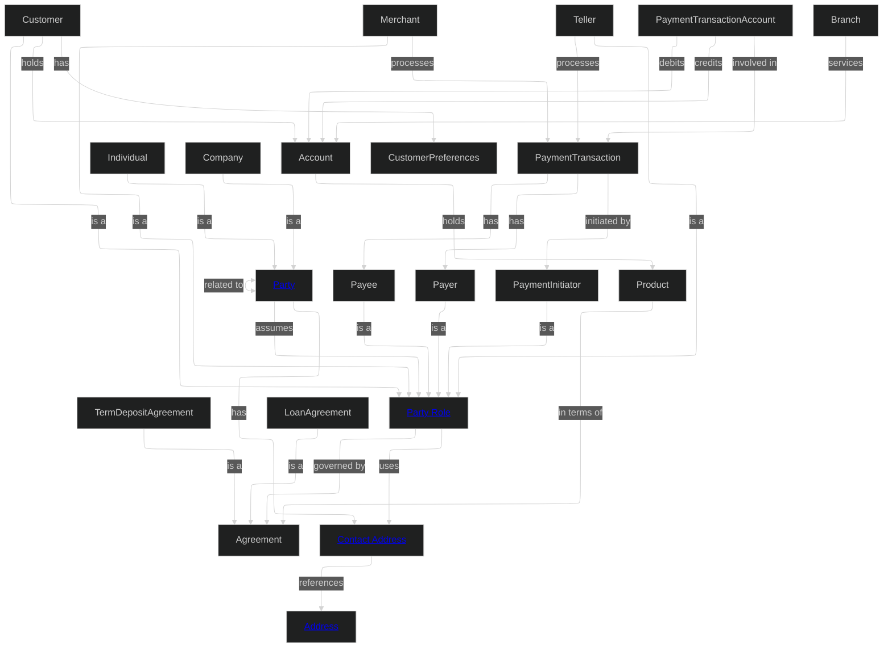
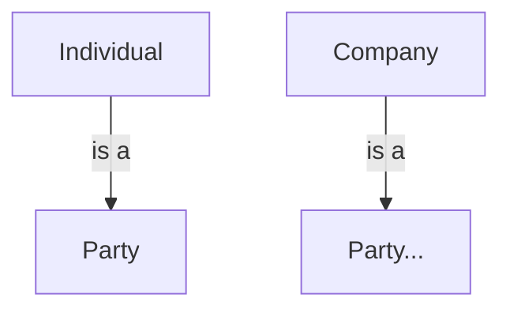
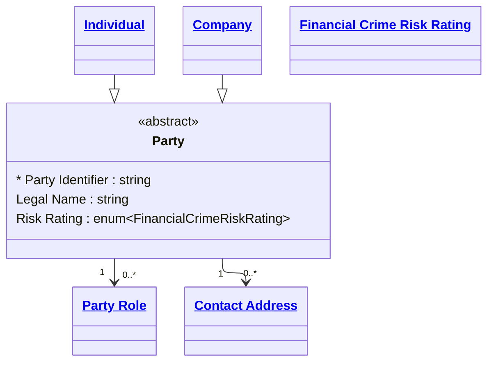
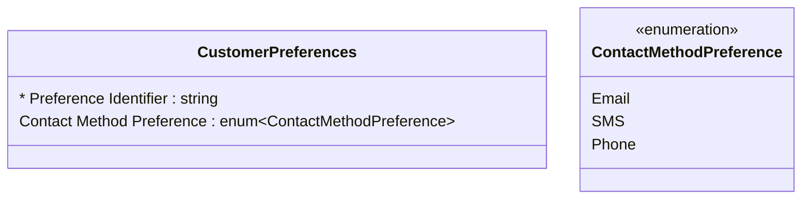
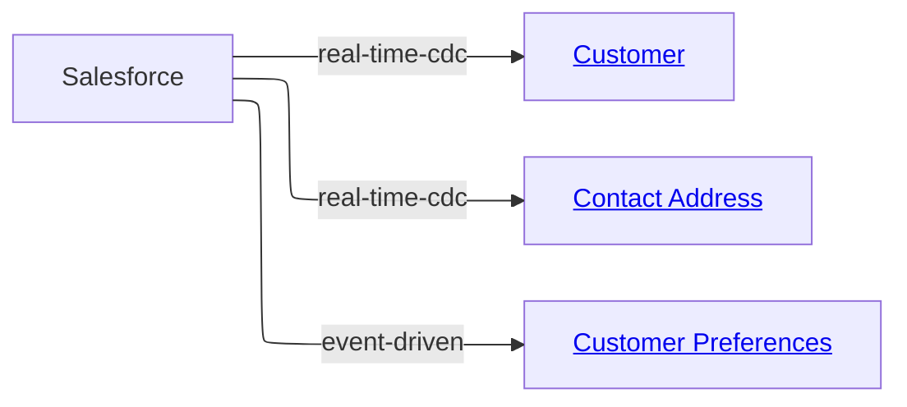

# MD‑DDL Specification (Draft 0.9.1)

*A Markdown‑native Data Definition Language for human-AI collaboration.*

---

## **Overview**

MD‑DDL is a **Markdown‑first**, **AI‑friendly** standard for defining domains, entities, attributes, enums, relationships, events, source mappings, and data products. It is designed to be readable by humans, generatable by AI, and transformable into:

- Data catalogs
- Knowledge graphs
- Data product definitions
- Schemas and technical artifacts (DDL, JSON Schema, Parquet contracts)
- ETL/ELT logic and source-to-domain lineage

MD‑DDL uses Markdown structure as its primary syntax, with YAML or JSON blocks for structured definitions and Mermaid or PlantUML for diagramming. Structural consistency is enforced by AI agents that validate, generate, and maintain model artifacts.

---

## **Core Principles**

1. **Source of Truth**  
   Every concept is defined once in the domain, in one canonical location. A design choice is whether to follow Domain Driven Design (DDD) and allow domain concepts to be mutually exclusive or not.

   This principle extends to source mappings. Source definitions and transform files are self-contained within each domain under `sources/<system>/`. Canonical entities contain no source references — they define meaning, not origin. Canonical data products replace the concept of Systems of Record: source systems are systems of change whose outputs are governed by the canonical model.

2. **Markdown‑Native**  
   Headings define structure; prose defines meaning.

3. **AI‑Friendly**  
   No redundant fields. No manually maintained lists. Minimal boilerplate.

4. **Agent‑Driven**  
   AI agents infer domain membership, index entities, validate relationships, and generate physical artifacts from the model.

5. **Graph‑Powered**  
   The knowledge graph acts as the semantic runtime for reasoning, lineage, and governance.

6. **Natural‑Language Naming**
   Entities, attributes, and relationships use human‑readable names rather than code‑style casing.

7. **Adoption is Incremental**
   MD-DDL supports incremental adoption. Organisations can begin by documenting their existing data landscape — dimensional models, canonical models, ETL pipelines, governance metadata — and progressively evolve toward declarative, AI-generated artifacts. The `baselines/` folder captures existing state; the adoption maturity model tracks the journey; the canonical model is the destination. See [Section 10 — Adoption](./10-Adoption.md) for the full maturity model and adoption workflow.

---

## **Document Structure**

MD‑DDL is composed of several logical components:

- [Domains](./2-Domains.md)
- [Entities](./3-Entities.md)
- [Enumerations](./4-Enumerations.md)
- [Relationships](./5-Relationships.md)
- [Events](./6-Events.md)
- [Sources](./7-Sources.md)
- [Transformations](./8-Transformations.md)
- [Data Products](./9-Data-Products.md)
- [Adoption](./10-Adoption.md)

MD‑DDL uses a **two‑layer structure** for Entities, Enums, Relationships, Events, and Data Products:

1. A **summary definition** in the domain file
2. A **detailed definition** in a separate file

During adoption (see [Section 10](./10-Adoption.md)), a transitional layer may also exist:

- **Layer 0 — Baselines** (existing state documentation) — transitional; captured in `baselines/` subfolders within the domain

Baselines document what exists today. They are not part of the canonical model and are never used for generation. They are superseded as the domain advances through adoption maturity levels.

This structure supports both human readability and AI context management.

Example domain layout:

```shell
domains/customer/domain.md
domains/customer/entities/customer.md
domains/customer/entities/customer-preference.md
domains/customer/relationships/customer-has-preferences.md
domains/customer/products/analytics.md
domains/customer/diagrams/overview.md
```

Example source layout:

```shell
Financial Crime/sources/salesforce-crm/source.md
Financial Crime/sources/salesforce-crm/transforms/table_account.md
Financial Crime/sources/salesforce-crm/transforms/table_contact_point.md
Financial Crime/sources/sap-fraud-management/source.md
Financial Crime/sources/temenos-payment/source.md
```

Domain files and source files are co-located at the domain level. Domain files define meaning. Source folders define operational origin and mapping logic for that specific domain context.

---

### **Two‑Layer Structure**

#### **AI Context Management**

- The domain file provides a compact summary of all conceptual objects.  
- AI agents load only the summaries initially.  
- When deeper context is needed, they follow the `detail:` link to load the full definition.

This mirrors Anthropic’s "skills" concept but improves on it by:

- Centralising summaries
- Avoiding duplication
- Ensuring humans can browse the domain easily

#### **Human Readability**

- The domain file becomes a clean, navigable table of contents.  
- Detail files remain focused, concise, and free from clutter.

#### **Structural Predictability**

- AI agents know exactly where to find summaries and details.  
- Both layers are merged into a unified conceptual, logical, and physical model.

#### Detail File Flexibility

Detail files are not restricted to a single entity. Authors may organise detail files to suit their modelling style — for example, one entity per file, one file per subdomain cluster, or a file combining an entity with its enumerations and originating relationships.
The only structural requirement is that every detail file begins with a level‑1 heading naming the domain (with a link back to the domain file), followed by one or more level‑2 section headings (## Entities, ## Enums, ## Relationships, ## Events, ## Data Products) containing the relevant definitions.

Source transform files follow the same two-layer pattern but are scoped to a source system within a domain context. They begin with a level-1 heading linking back to `./source.md` in the same source folder, followed by a level-2 heading for the source table and optional level-3 rule sections for non-direct mappings.

### Include Directive

Agent prompt files and skill reference stubs use an `{{INCLUDE: <path>}}` directive to inject content from other files at prompt-load time. This is processed by the AI platform (e.g. VS Code Copilot custom agents, Claude Code) before the prompt reaches the model — it is not part of the MD-DDL modelling language itself.

The directive appears on its own line and takes a file-relative path:

```text
{{INCLUDE: ../../../md-ddl-specification/3-Entities.md}}
```

Paths must be relative to the file containing the directive. Do not use workspace-root paths, as MD-DDL repositories are commonly consumed as submodules where absolute paths break.

This mechanism enables the spec reference stub pattern: skill reference files contain a brief description and an `{{INCLUDE}}` pointing to the canonical spec section, so that spec updates propagate automatically without duplicating content across agent files.

---

## **Validation Model**

MD-DDL uses a two-tier validation model: **mechanical pre-flight checks** and **agent-driven quality review**. These tiers are deliberately separate because different categories of problem require different kinds of intelligence to detect.

### Why Not a Traditional Linter

MD-DDL is an AI-native standard. The primary consumer of an MD-DDL model is an AI agent that already understands intent, domain context, and organisational conventions — capabilities that no rule-based linter can match. Applying rigid pass/fail enforcement above the syntax level would:

- Reject legitimate organisational vocabulary differences (e.g., `phi` instead of `pii`) that agents understand and can work with
- Suppress feedback that drives spec evolution — when organisations adapt MD-DDL to their context, that signal is valuable
- Produce false positives for intentional exceptions (governance inheritance, minimal reference domains) that require domain context to evaluate correctly

Traditional linters assume the checker is smarter than the thing being checked. For MD-DDL, the inverse is true.

### Validation Levels

Five categories of check exist across the MD-DDL model. Only Level 1 benefits from mechanical tooling:

Level | Category | Example | Mechanically checked?
--- | --- | --- | ---
1 | Syntax | YAML parses, Mermaid renders, markdown links resolve | Yes — broken syntax silently corrupts agent interpretation with no wiggle room
2 | Structure | Required sections present, required YAML keys present | Partially — legitimate exceptions exist; structural checks need domain context to avoid false positives
3 | Convention | Naming patterns, column order, heading hierarchy | No — organisational vocabulary differences are signal, not errors
4 | Quality | Governance completeness, relationship coverage, event payloads | No — this is judgment; agents handle it through domain-review and compliance-audit
5 | Domain fitness | Is this the right model for the business? | Never — requires human domain expertise by definition

**The split:** Level 1 gets mechanical pre-flight checks. Levels 2–5 stay with agents and humans, where context and judgment live.

### Pre-Flight Check Scope

The following checks are the complete set of mechanical validation that MD-DDL endorses. No additional checks should be added without a spec version bump.

Check | What it validates | Why it is mechanical
--- | --- | ---
YAML syntax | All YAML code blocks parse without syntax errors | A YAML parse error silently corrupts agent interpretation of every attribute in the block
Mermaid syntax | All Mermaid code blocks use valid diagram syntax | A Mermaid syntax error breaks every rendering of the domain or entity diagram
Internal link integrity | All markdown links (`[text](path)`) resolve to existing files or headings | Dead links break navigation for both humans and agents
Entity reference consistency | Entity names in relationships, events, products, and source mappings match an entity defined in the domain | A typo in an entity name creates a silent reference to nothing
Domain version field | The `version:` key exists in domain metadata | Versionless domains cannot participate in maturity tracking or change management

**What is explicitly not checked mechanically:**

- Presence or absence of optional YAML keys (mutability, temporal, governance fields)
- Naming conventions or vocabulary choices
- Governance metadata completeness or correctness
- Relationship granularity or cardinality appropriateness
- Event payload structure completeness
- Standards alignment accuracy
- Any modelling judgment

### Pre-Flight Check Tool Interface

Any tool implementing pre-flight checks must conform to this interface:

- **Input:** a domain folder path
- **Output:** a list of findings, each with file path, line number, check name, and message
- **Exit behaviour:** report all findings; do not stop on first error
- **Severity:** all findings are a single severity ("pre-flight failure") — there is no warning/error distinction because all checks are binary
- **Configuration:** none — the checks are fixed and minimal; there are no rules to enable or disable

### Agent-Driven Quality Review

Everything above Level 1 is the responsibility of agents. Agent Ontology's domain-review skill, Agent Governance's compliance-audit skill, and the structured review prompts in `.github/` handle structural, convention, quality, and domain-fitness concerns. They understand context and intent. They flag deviations as observations, not errors.

When an agent encounters an organisational vocabulary deviation — a field named `phi` instead of `pii`, `data_class` instead of `classification` — the correct response is to note it as a **potential spec vocabulary gap** and work with it, not reject the file.

## **Domains**

In MD-DDL, the Domain file acts as the router for the Knowledge Graph. While detail files provide the DNA (Attributes/Constraints), the Domain file provides the Anatomy (How entities, events, and relationships sit together).

### **Domain Declaration**

A domain is declared using a **level‑1 Markdown heading**:

```markdown
# Customer
```

### **Domain Description**

All free‑text Markdown under the H1 heading and before the next H2 heading is considered the domain description.

### **Domain Metadata**

Metadata appears under a level‑2 heading:

```markdown
## Metadata
```

Domain Metadata sets the default posture for all contained objects unless overridden. Metadata is:

Governance and compliance metadata declared at the domain level is inherited by all contained entities, relationships, and events. Detail files should not repeat governance attributes when values are unchanged from the domain defaults.

Include a `governance:` block in detail files only when specifying an exception or stricter requirement than the domain default.

Category|Metadata Keys|Purpose
--------|-------------|-------
Accountability|owners, stewards, technical_leads|Who is responsible for the business vs. technical health.
Governance & Security|classification, pii|The default security posture for the entire domain.
Compliance|regulatory_scope, default_retention|Legal and regulatory frameworks governing this data and its retention obligations.
Lifecycle|status, version|The lifecycle state and semantic version of the domain definition. See [Domain Lifecycle](#domain-lifecycle) below.
Discovery|tags|Searchability
Adoption|adoption (maturity, adoption_started, target_maturity, target_date, progress, notes)|Brownfield adoption tracking. Required when `baselines/` exists. See [Section 10 — Adoption](./10-Adoption.md).
Platform|platform (posture, technologies, product_scope, notes)|How data products relate to infrastructure. See [Section 9 — Data Products](./9-Data-Products.md#platform-posture).

#### **Metadata Format**

Metadata is expressed as YAML or JSON inside a fenced code block:

````markdown
## Metadata

```yaml
# Accountability
owners:
  - data.customer@example.com
stewards:
  - jane.doe@example.com
technical_leads:
  - architecture.team@example.com

# Governance & Security
classification: "Highly Confidential"
pii: true
regulatory_scope:
  - GDPR
  - CCPA
default_retention: "7 years"

# Lifecycle & Discovery
status: "Active"
version: "2.1.0"
tags:
  - Core
  - MasterData
  - B2C
```
````

### **Source Systems**

Source systems are first-class domain summary objects and must be declared under a level‑2 heading immediately after `## Metadata`.

Use a Markdown table with the following columns:

Column | Purpose
--- | ---
**Business Application** | Source application or product name, expressed as a Markdown link to the source markdown file.
**Platform** | Technology platform or deployment model.
**Capability Domain** | Business capability or functional area served by the source.

Example:

````markdown
## Source Systems

Business Application | Platform | Capability Domain
--- | --- | ---
[Temenos Payment](sources/temenos-payment/source.md) | Temenos SaaS | Payment Execution
[SAP Fraud Management](sources/sap-fraud-management/source.md) | SAP | Fraud
````

#### **Diagrams**

Diagrams appear under level‑3 headings inside the Metadata section, after the YAML metadata block. This separates data *about* the domain from visuals *of* the domain.

A domain file should contain at least one **Domain Overview Diagram** that shows the full entity graph for the domain. This diagram is the primary navigational and communicative artefact of the domain file — it must give any reader an immediate understanding of how all concepts relate to each other.

The Domain Overview Diagram uses `graph TD` (top-down) or `graph LR` (left-right) Mermaid syntax with the ELK layout engine for consistent, readable positioning of complex graphs.

##### **What to include in the Domain Overview Diagram**

The diagram must show:

1. **All entities** defined in the domain
2. **Inheritance relationships** using `-->|is a|` notation
3. **All relationships** between entities using labelled edges whose verb matches the relationship name defined in the Relationships section
4. **Hyperlinks** on key navigable entities using `EntityName["<a href='path'>Display Name</a>"]` syntax. Not every node needs a link — prioritise the abstract and most-referenced entities.

The diagram must not show:

- Attributes (these belong in entity detail files)
- Cardinality notation (this belongs in relationship detail files)
- Enumeration values (these belong in enum detail files)

##### **Diagram Syntax Rules**

- Use `graph TD` for domains with deep inheritance hierarchies
- Use the ELK layout engine (`layout: elk`) with `mergeEdges: false` for complex graphs to prevent edge crossings
- Relationship edge labels must use the verb form from the Relationships
  section: `-->|assumes|`, `-->|references|`, `-->|governed by|`
- Inheritance is always expressed as `Child -->|is a|Parent`
- Bidirectional relationships use `<-->|label|`
- Entity hyperlinks use plain anchor tags: `<a href='path'>Display Name</a>`
  with no additional CSS class attributes
- Node identifiers in the graph use PascalCase for readability
  (e.g., `PartyRole`, `ContactAddress`) but the display label uses
  natural language where a hyperlink is defined

##### **Example: Financial Crime Domain Overview Diagram**

````markdown
### Domain Overview Diagram


```mermaid
---
config:
  layout: elk
  elk:
    mergeEdges: false
    nodePlacementStrategy: LINEAR_SEGMENTS
  look: classic
  theme: dark
---
graph TD

  Individual --> |is a|Party
  Company --> |is a|Party
  TermDepositAgreement --> |is a|Agreement
  LoanAgreement --> |is a|Agreement

  Party <--> |related to|Party
  Party --> |assumes|PartyRole

  Customer --> |is a|PartyRole
  Merchant --> |is a|PartyRole
  Payee --> |is a|PartyRole
  Payer --> |is a|PartyRole
  Teller --> |is a|PartyRole
  PaymentInitiator --> |is a|PartyRole

  Party --> |has|ContactAddress
  PartyRole --> |uses|ContactAddress
  ContactAddress --> |references|Address

  Customer --> |holds|Account
  Customer --> |has|CustomerPreferences
  PartyRole --> |governed by|Agreement
  PaymentTransaction --> |has|Payer
  PaymentTransaction --> |has|Payee
  PaymentTransaction --> |initiated by|PaymentInitiator
  PaymentTransactionAccount --> |involved in|PaymentTransaction
  PaymentTransactionAccount --> |debits|Account
  PaymentTransactionAccount --> |credits|Account
  Teller --> |processes|PaymentTransaction
  Merchant --> |processes|PaymentTransaction

  Account --> |holds|Product
  Branch --> |services|Account
  Product --> |in terms of|Agreement

  Party["<a href='entities/party.md'>Party</a>"]
  PartyRole["<a href='entities/party_role.md'>Party Role</a>"]
  ContactAddress["<a href='entities/contact_address.md'>Contact Address</a>"]
  Address["<a href='entities/address.md'>Address</a>"]
```
````

##### **Why the Domain Overview Diagram matters**

The domain diagram is the first artefact an AI agent or a new team member loads when working with a domain. It establishes:

- **Scope**: what concepts are owned by this domain
- **Structure**: how inheritance hierarchies are organised
- **Connectivity**: which entities are central vs peripheral
- **Navigation**: hyperlinks on key entities provide one-click access to detail files from the diagram itself

A well-maintained domain diagram makes the two-layer structure of MD‑DDL work in practice — the domain file is the map, and the diagram is the visual index of that map.

##### **Additional Diagrams**

Beyond the overview, a domain file may contain additional level‑3 diagrams focusing on a specific sub-area. For example:

````markdown
### Transaction Flow Diagram
Shows how payment transactions move through party roles.


```mermaid
graph LR
  Payer --> |initiates|PaymentTransaction
  PaymentTransaction --> |credits|Payee
```
````

Additional diagrams are optional. The Domain Overview Diagram is required.

#### Conceptual vs Logical Diagrams

MD-DDL uses two distinct diagram types for different purposes:

Diagram|Location|Purpose|Relationship Labels
-------|--------|-------|-------------------
`graph TD/LR`|Domain file|Conceptual model — business meaning and named relationships|Required — must match Relationships section
`classDiagram`|Entity detail file|Logical model — structural realization of the entity|Optional — structural intent only

The classDiagram is not required to mirror the domain graph one-for-one. Modellers have freedom to realize conceptual relationships as they see fit at the logical level.

---

### **Domain Structure**

Below the metadata section, the Domain file organizes concepts into six primary sections using level‑2 headings: `## Source Systems`, `## Entities`, `## Enums`, `## Relationships`, `## Events`, and `## Data Products`.

In the Domain file, these sections **must use Markdown tables** for high-level summaries. This ensures the domain file acts as a compact "Router" for the knowledge graph.

#### Sample File Structure

```shell
domain.md
entities/party.md        ← Party entity + Party Has Role + Party Has Contact Address
entities/party-role.md   ← Party Role entity + Party Role Uses Contact Address
entities/address.md      ← Address entity (no outbound relationships)
products/analytics.md    ← Consumer-aligned data products
products/canonical.md    ← Domain-aligned data products
sources/temenos-payment/source.md
sources/sap-fraud-management/source.md
```

#### **Source Systems Table**

Summarizes operational source applications relevant to the domain.

Column | Purpose
--- | ---
**Application** | Markdown link to the source markdown file.
**Platform** | Technology platform or deployment model.
**Capability Domain** | Business capability or functional area served by the source.

---

#### **Entities Table**

The Entities table summarizes the core concepts of the domain.

 Column | Purpose
 --- | ---
**Name** | The natural language name of the entity, linked to its anchor in a detail file.
**Specializes** | If applicable, a link to the parent entity being specialized.
**Description** | A brief conceptual definition (1–2 sentences).
**Reference** | Optional URL to external industry standards (e.g., BIAN, FIBO, ISO).

---

#### **Enums Table**

Summarizes the discrete value sets used within the domain. Enums should be named as a plural - E.g. Customer Types.

Column | Purpose
--- | ---
**Name** | The name of the enumeration, linked to the detail file.
**Description** | What this set of values represents.
**Reference** | Optional external reference for standardized codes.

---

#### **Relationships Table**

Summarizes the semantic connections between entities.

Column | Purpose
--- | ---
**Name** | The action-oriented name (e.g., Customer Has Preferences), linked to details.
**Description** | The business meaning of the connection.
**Reference** | Optional link to relationship patterns or external schemas.

---

#### **Events Table**

Summarizes the meaningful business changes that occur within the domain.

Column | Purpose
--- | ---
**Name** | The natural language name of the event, linked to details.
**Actor** | The primary entity or role that initiates the event.
**Entity** | The primary entity affected by the event.
**Description** | The business trigger for this event.

---

#### **Data Products Table**

Summarizes the data products published by the domain.

Column | Purpose
--- | ---
**Name** | The product name, linked to its detail definition.
**Class** | `source-aligned`, `domain-aligned`, or `consumer-aligned`.
**Consumers** | Primary consumers of this product.
**Status** | Lifecycle state: `Draft`, `Active`, `Deprecated`, `Retired`.

---

### **Rules for Summary Definitions**

- **Tabular Authority:** The Domain file summary **must** use the table formats defined above. H3 headings are reserved for **Detail Files**.
- **Linking Strategy:** The `Name` column must contain a Markdown link pointing to the specific H3 anchor in the detail file (e.g., `[Entity Name](./path/to/file.md#entity-name)`).
- **AI Scoping:** AI agents should ingest these tables first to understand the "Anatomy" of the domain before requesting the "DNA" (YAML blocks) from the detail files.
- **No Boilerplate:** If a column like `Specializes` or `Reference` is empty for all entries in a section, it may be omitted from the table, but the `Name` and `Description` columns are mandatory.
- The description must include a short natural‑language description. A longer description will be included in the detail file.

This allows the domain file to act as a semantic index of the domain.

---

### **Domain Lifecycle**

Every domain definition has a lifecycle — it moves from initial authoring through validation to production use, and eventually to deprecation and retirement. The `status` and `version` fields in domain metadata track this progression.

#### Domain Status

The `status` field declares the current lifecycle state of the domain definition. Valid values:

Value | Description
--- | ---
`Draft` | Under active development. Not yet validated. Do not consume.
`Review` | Under structured review (Layer 1/2/3 process). Stable enough for early feedback; breaking changes possible.
`Active` | Validated and available for consumption. Stability guaranteed within major version.
`Deprecated` | Retained for reference and migration support. Consumers should migrate to the superseding definition. No new consumers should onboard.
`Retired` | No longer maintained. Historical record only.

**Transition rules:**

- A domain may only move forward through lifecycle states: `Draft` → `Review` → `Active` → `Deprecated` → `Retired`.
- Reverting from `Active` to `Draft` or `Review` is permitted only when a major version bump accompanies the change (the previous active version is effectively superseded).
- `Deprecated` domains should declare a `superseded_by` field in metadata pointing to the replacement domain (if one exists).
- `Retired` domains are immutable records. They remain in the repository for lineage and audit purposes.

#### Domain Version

The `version` field uses semantic versioning (`MAJOR.MINOR.PATCH`) to track the evolution of the domain definition. See [Domain Evolution](#domain-evolution) for version bump rules.

**Lifecycle and version interaction:**

- A domain in `Draft` status may use version `0.x.y` to signal pre-release instability. The `0.x` convention indicates that breaking changes may occur without a major bump.
- A domain in `Active` status must have version `1.0.0` or higher. Stability guarantees apply from the first major release.
- When a domain transitions from `Review` to `Active` for the first time, its version should be set to `1.0.0`.

---

### **Domain Evolution**

Domains are living artifacts. They evolve as business understanding deepens, new source systems are integrated, regulatory requirements change, and consumer needs shift. The `version` field in domain metadata tracks this evolution using semantic versioning.

#### Version Bump Rules

Change Type | Version Impact | Examples
--- | --- | ---
**Breaking** — changes meaning or removes concepts | Major bump | Removing an entity; renaming an entity; changing a relationship's cardinality, granularity, or direction; removing an attribute that downstream products consume
**Additive** — extends the model without altering existing meaning | Minor bump | Adding a new entity, enum, relationship, or event; adding attributes to existing entities; declaring a new source system or data product
**Corrective** — fixes errors without changing intended meaning | Patch bump | Fixing a typo in a description; correcting a broken link; updating a `# TODO:` with the resolved value; adjusting formatting

#### Breaking vs Non-Breaking Changes

A change is **breaking** if a correctly-authored downstream consumer (data product, physical artifact, or integration) would produce different or incorrect output after the change is applied. Specifically:

- Removing or renaming an entity or enum is always breaking.
- Changing relationship cardinality (e.g., `1:N` to `M:N`) is breaking — physical schemas may need restructuring.
- Changing relationship granularity (`atomic` to `period`) is breaking — it alters the semantics of the join.
- Removing an attribute is breaking if any data product includes that entity.
- Changing an attribute's type or constraints is breaking if it narrows the valid domain.

A change is **non-breaking** if existing consumers continue to produce correct output without modification.

#### Evolution Workflow

When modifying an existing domain:

1. Identify the change and classify it as breaking, additive, or corrective.
2. Bump the `version` field in metadata according to the rules above.
3. If breaking: review all data products that reference the affected entities and update them accordingly.
4. If additive: update the relevant summary tables and create/update detail files.
5. If corrective: fix the error in place.

#### Change Log Convention

A domain may include a `CHANGELOG.md` file adjacent to `domain.md`. This file is optional but recommended for domains at `Active` status or higher.

The changelog follows [Keep a Changelog](https://keepachangelog.com/) conventions:

````markdown
# Changelog

All notable changes to the Financial Crime domain are documented here.

## [1.1.0] - 2026-03-14

### Added
- Exchange Rate entity for multi-currency transaction analysis
- Currency entity as reference data

### Changed
- Transaction entity: added `Exchange Rate` attribute

## [1.0.0] - 2025-11-01

### Added
- Initial domain release with Party, Account, Transaction, and Agreement entity families
````

**Rules:**

- Each version entry must correspond to the `version` field in domain metadata.
- Use `Added`, `Changed`, `Deprecated`, `Removed`, `Fixed` as section headings within each version entry.
- Agents should offer to generate or update the changelog when the domain version is bumped.
- The changelog is informational — it aids human understanding and is not consumed by physical artifact generation.

---

#### **Domain Structure Example**

Below is an example of how a domain file is structured.

````markdown
# Domain Name

Domain description...

## Metadata
Formal JSON/YAML block and diagrams...

## Source Systems

Business Application | Platform | Capability Domain
--- | --- | ---
[Customer CRM](sources/salesforce-crm/source.md) | Salesforce SaaS | Customer Relationship Management

### Domain Overview Diagram


```mermaid
graph TD

  Individual --> |is a|Party
  Company --> |is a|Party...
```

## Entities

Name | Specializes | Description | Reference
--- | --- | --- | ---
[Customer](./details.md#customer) | [Party Role](./details.md#party-role) | An individual or legal entity that has a relationship with the organization. | [BIAN: Party Role](https://...) |
[Individual](./details.md#individual) | [Party](./details.md#party) | A natural person as opposed to a legal entity. | |

When an entity specializes (inherits from) another entity, declare this in the specializes column with a link to the parent.

## Enums

Name | Description | Reference
--- | --- | ---
[Loyalty Tier](./details.md#loyalty-tier) | Categorizes customers by annual spend and engagement. | |

## Relationships

Name | Description | Reference
--- | --- | ---
[Customer Has Preferences](./details.md#customer-has-preferences) | Maps a customer to their specific interaction settings. |

## Events

Name | Actor | Entity | Description
--- | --- | --- | ---
[Preference Updated](./details.md#preference-updated) | Customer | Customer Preference | Emitted when interaction settings are modified.

## Data Products

Name | Class | Consumers | Status
--- | --- | --- | ---
[Customer 360 Profile](products/analytics.md#customer-360-profile) | consumer-aligned | Retail Analytics Team | Active

````

## **Entities**

Each file must declare which domain it is part of by starting with a Level 1 heading with the domain name. The domain name should provide a link back to the domain file like:

```markdown
# [My Domain](../domain.md)
```

### **Entity Declaration**

A detail file may contain any combination of ## Entities, ## Enums, and ## Relationships sections. Authors are free to co-locate an entity with its directly originating relationships and any enumerations it references — this is the recommended pattern when a single entity is the clear owner of those concepts.
The Entities section appear under a level‑2 heading:

```markdown
## Entities
```

Each entity is introduced with a **level‑3 heading**:

```markdown
### Customer
```

### **Entity Description**

Free‑text Markdown under the heading describes the entity in more detail than was found in the domain summary.

### **Entity Diagram**

Every entity detail file must include a `classDiagram` immediately after the entity description and before the YAML definition blocks. The diagram is the visual contract for the entity — it shows the entity's own attributes, its position in the inheritance hierarchy, and all of its immediate relationships to other entities.

#### **Diagram Configuration**

All entity diagrams use the ELK layout engine for consistent rendering:

````markdown
```mermaid
---
config:
  layout: elk
---
classDiagram
  ...
```
````

#### **The Subject Class**

The entity being defined is the **subject class**. It is always written as a full class block with its attributes listed inside:

```text
  class Party{
    <<abstract>>
    * Party Identifier : string
    Legal Name : string
    Party Status : enum~PartyStatus~
  }
```

**Rules for the subject class:**

- The class name uses PascalCase matching the entity heading (e.g., `Party`, `ContactAddress`, `PartyRole`)
- If the entity is abstract — never instantiated directly, only specialised - add `<<abstract>>` as the first line inside the class block
- The primary identifier attribute is prefixed with `*` to mark it as the key
- All attributes defined in the entity's YAML block must appear in the diagram
- Attribute types use the Mermaid classifier syntax:
  - Primitives: `string`, `integer`, `decimal`, `boolean`, `date`, `datetime`
  - Enumerations: `enum~EnumName~` (e.g., `enum~PartyStatus~`, `enum~CountryCode~`)
  - Arrays: append `[]` to the type (e.g., `enum~CountryCode~[]`, `string[]`)
- Inherited attributes from parent entities are **not** repeated in the subject class — only attributes defined in this entity's own YAML block are shown
- Attribute format is `AttributeName : Type` with a space either side of the colon

#### **Related Classes**

All other classes that appear in the diagram — parents, children, related entities, and referenced enums — are **reference classes** unless they are enums detailed in the same file. Reference classes are never defined with attribute blocks. Instead they use the linked class syntax:

```text
  class Party["<a href='party.md'>Party</a>"]
```

**Rules for reference classes:**

- Use plain anchor tags: `<a href='path'>Display Name</a>`
- No CSS class attributes on the anchor tag
- The `href` path is relative to the current file's location and uses snake_case filenames (e.g., `party.md`, `party_role.md`, `contact_address.md`)
- Display Name uses natural language with spaces matching the entity heading (e.g., `Party Role`, `Contact Address`)
- All reference class definitions are grouped at the bottom of the diagram, after all relationship lines
- If a specialisation child has no detail file yet, it may appear as a bare unlinked class: `class Customer` — without a block or link

#### **Enum Classes in Entity Diagrams**

Any enum used by the subject class attributes must appear in the class diagram.

Use one of two patterns:

1. **Referenced enum (detail in another file)** — show as a linked reference class:

```text
  class PartyStatus["<a href='../enums/party_status.md'>Party Status</a>"]
```

1. **Co-located enum (detail in the same file)** — show as an expanded enum class with values:

```text
  class PartyStatus{
    <<enumeration>>
    Active
    Inactive
    Under Review
  }
```

**Rules for enum classes:**

- Every enum type referenced in the subject class (for example `enum~PartyStatus~`) must appear exactly once in the diagram
- If the enum is defined in the same detail file under `## Enums`, render it as an expanded enum class with its values and include `<<enumeration>>`
- If the enum is defined elsewhere, render it as a linked reference class to its enum detail file and include only the `<<enumeration>>` tag in the class detail.
- Use PascalCase class names for enum class identifiers (for example `PartyStatus`, `CountryCode`)
- Display names in links use natural language (for example `Party Status`, `Country Code`)

#### **Inheritance**

Inheritance uses the Mermaid `--|>` arrow with the child on the left:

```text
  Individual --|> Party
  Company --|> Party
```

This reads as "Individual is a specialisation of Party." The direction matches the domain overview diagram convention of `Child -->|is a|Parent`.

When an entity **is** a specialisation, show the parent as a reference class:

```text
  Individual --|> Party
  class Party["<a href='party.md'>Party</a>"]
```

When an entity **has** specialisations, show each child as a reference class (or bare class if not yet defined):

```text
  Individual --|> Party
  Company --|> Party
  class Individual["<a href='individual.md'>Individual</a>"]
  class Company["<a href='company.md'>Company</a>"]
```

#### **Entity Relationships**

All immediate relationships to and from the entity are shown with labelled arrows and cardinality. The classDiagram is a logical realization of the entity — relationship labels here describe the structural link (e.g., has, references) and do not need to match the conceptual relationship names defined in the domain Relationships section. A single conceptual relationship may realize as multiple logical associations, and some logical associations may have no direct conceptual counterpart.

```text
  Party "1" --> "0..*" PartyRole
  PartyRole "0..*" --> "0..*" ContactAddress
  ContactAddress "0..*" --> "1" Address
```

Relationship labels on classDiagram arrows are optional. When included, they describe the structural navigation intent, not the conceptual relationship name.

**Rules for relationships:**

- Cardinality is always shown on both ends using quoted strings: `"1"`, `"0..1"`, `"0..*"`, `"1..*"`
- In class diagrams the relationship label is optional. We are realizing the concepts from the domain in a logical model so there may not be a direct relationship.
- The arrow direction reflects the ownership or navigational direction: the entity that *holds the reference* is the source (`-->`)
- Bidirectional relationships use `<-->`
- Every entity in a relationship line must have a corresponding reference class definition at the bottom of the diagram

#### **Ordering Within the Diagram**

To keep diagrams readable and consistent, follow this ordering:

1. The subject class block (with attributes)
2. Specialisation child classes (bare or linked, one per line)
3. Inheritance arrows (`--|>`)
4. Relationship lines (`-->` with cardinality and label)
5. Enum classes (expanded if co-located; linked reference if external)
6. All remaining reference class definitions (`class Foo["<a href='...'>...</a>"]`)

#### **Example**

**Abstract entity with specialisations and outbound relationships (Party):**

````markdown

```mermaid
---
config:
  layout: elk
---
classDiagram
  class Party{
    <<abstract>>
    * Party Identifier : string
    Legal Name : string
    Risk Rating : enum~FinancialCrimeRiskRating~
  }

  Individual --|> Party
  Company --|> Party
  Party "1" --> "0..*" PartyRole
  Party "1" --> "0..*" ContactAddress

  class FinancialCrimeRiskRating["<a href='../enums/financial_crime_risk_rating.md'>Financial Crime Risk Rating</a>"]

  class Individual["<a href='individual.md'>Individual</a>"]
  class Company["<a href='company.md'>Company</a>"]
  class PartyRole["<a href='party_role.md'>Party Role</a>"]
  class ContactAddress["<a href='contact_address.md'>Contact Address</a>"]
```
````

**Entity with co-located enum values (example):**

````markdown

```mermaid
---
config:
  layout: elk
---
classDiagram
  class CustomerPreferences{
    * Preference Identifier : string
    Contact Method Preference : enum~ContactMethodPreference~
  }

  class ContactMethodPreference{
    <<enumeration>>
    Email
    SMS
    Phone
  }
```
````

### **Entity Definition**

A structured block defines the entity's attributes and logic. MD‑DDL follows a Key-as-Name philosophy to eliminate redundancy and ensure that the human-readable label used in the documentation is the exact same identifier used in the Knowledge Graph.:

````markdown
```yaml
extends: Party Role
mutability: immutable | append_only | slowly_changing | frequently_changing | reference
existence: independent | dependent | associative
temporal:
  tracking: valid_time
  description: Preferences are valid for specific time periods and can be future-dated
attributes:
  Customer Number:
    type: string
    identifier: true
  Email Address:
    type: string
    pii: true
  Full Name:
    type: string
  Balance:
    type: Decimal
```

```yaml
constraints:
  Valid Date Range:
    check: "End Date > Start Date"
  Positive Liquidity:
    check: "Balance > 0"
```

```yaml
governance:
  pii: true
  classification: Confidential
  retention: 7 years
  access_role:
    - HR_ADMIN
```
````

### Governance Metadata Schema

Governance metadata is declared at the domain level (in the domain file metadata block) and optionally overridden at the entity level (in a `governance:` block within an entity detail file). Entities inherit all governance fields from the domain. Include a `governance:` block in an entity detail file only when specifying an override or stricter requirement than the domain default.

#### Domain-Level Governance Fields

These fields are declared in the domain metadata YAML block. They set the default governance posture for all entities, relationships, and events in the domain.

Field | Type | Required | Description
--- | --- | --- | ---
`classification` | string | Yes | The sensitivity level of the domain's data. Valid values: `Public`, `Internal`, `Confidential`, `Highly Confidential`.
`pii` | boolean | Yes | Whether any entity in the domain contains personally identifiable information.
`regulatory_scope` | string[] | Yes | The regulatory frameworks applicable to this domain (e.g., `GDPR`, `APRA CPS 234`, `FATF`, `HIPAA`).
`default_retention` | string | Yes | The default data retention period applied to all entities unless overridden (e.g., `"7 years"`, `"10 years post relationship end"`).

#### Entity-Level Governance Fields

These fields may appear in an entity's `governance:` YAML block. Only include fields that differ from the domain default.

Field | Type | Required | Description
--- | --- | --- | ---
`pii` | boolean | No | Override the domain's PII flag for this entity.
`pii_fields` | string[] | No | Explicit enumeration of attribute names within this entity that contain PII. Optional — use when an applicable regulatory framework requires an enumerated PII field inventory (e.g., GDPR Article 30 data mapping, HIPAA Safe Harbor de-identification). When present, must list all attributes marked `pii: true` in the entity. When absent, PII is identified by the `pii: true` marker on individual attributes. This field name is standardised — do not use alternatives such as `pii_attributes` or `personal_data_fields`.
`classification` | string | No | Override the domain's classification for this entity. Must use the same value set: `Public`, `Internal`, `Confidential`, `Highly Confidential`.
`retention` | string | No | Override the domain's retention period for this entity.
`retention_basis` | string | No | Justification for why this entity's retention differs from or elaborates on the domain default. Include regulatory citation where applicable.
`access_role` | string[] | No | Roles permitted to access this entity's data. An array of role identifiers. When absent, access is governed by broader domain or organisational policy.
`compliance_relevance` | string[] | No | Specific regulatory acts or standards that apply directly to this entity (e.g., `"AUSTRAC AML/CTF Act 2006"`, `"GDPR Article 17"`).
`regulatory_reporting` | string[] | No | Named regulatory reports or submissions that include data from this entity (e.g., `"Suspicious Matter Report (SMR)"`, `"Threshold Transaction Report (TTR)"`).
`description` | string | No | Free-text explanation of the governance posture for this entity — why the override exists and what regulatory obligation drives it.

#### Governance Inheritance Rules

1. **Domain defaults apply everywhere.** Every entity, relationship, and event inherits the domain's `classification`, `pii`, `regulatory_scope`, and `default_retention` unless explicitly overridden.
2. **Override only when stricter or different.** An entity-level `governance:` block must contain only fields that differ from domain defaults. Do not repeat identical values.
3. **Strictness direction.** An entity may declare a higher `classification` or longer `retention` than the domain default. Declaring a weaker posture requires a documented justification in the `description` or `retention_basis` field.
4. **`access_role` is additive context.** It restricts who may access entity data. It does not exist at the domain level — it is entity-specific.
5. **`compliance_relevance` and `regulatory_reporting` are entity-specific.** They document which specific regulations and reports apply to a particular entity. Domain-level `regulatory_scope` declares the applicable frameworks; entity-level fields map those frameworks to specific obligations.

#### Example: Domain-Level Governance (in domain metadata)

```yaml
classification: "Highly Confidential"
pii: true
regulatory_scope:
  - AML (Anti-Money Laundering)
  - KYC (Know Your Customer)
  - FATF Recommendations
default_retention: "10 years post relationship end"
```

#### Example: Entity-Level Override (in entity detail file)

```yaml
governance:
  pii: true
  classification: Highly Confidential
  retention: 10 years
  retention_basis: Minimum 7-year retention from end of business relationship, aligned to AML/CTF record-keeping obligations
  access_role:
    - FINANCIAL_CRIME_ANALYST
    - KYC_OFFICER
    - COMPLIANCE_OFFICER
  compliance_relevance:
    - AUSTRAC AML/CTF Act 2006
    - FATF Recommendations 10, 11, 12
  regulatory_reporting:
    - Suspicious Matter Report (SMR)
    - Threshold Transaction Report (TTR)
```

#### Example: Entity Inheriting Domain Defaults (no override needed)

When an entity's governance posture matches the domain default exactly, no `governance:` block is needed. To document the inheritance explicitly without adding new fields, a minimal `governance:` block with only a `retention_basis` may be included:

```yaml
governance:
  retention_basis: Inherited from domain default retention of 10 years post relationship end
```

---

### Entity Lifecycle Fields

Entities within a domain may have their own lifecycle state independent of the domain. For example, a domain may be `Active` while a newly added entity is still in `Draft`.

#### Lifecycle Properties

Property | Type | Required | Description
--- | --- | --- | ---
`status` | enum | No | Lifecycle state of this entity definition. Uses the same values as domain status: `Draft`, `Review`, `Active`, `Deprecated`, `Retired`. Defaults to the domain status if omitted.
`since` | semver string | No | The domain version in which this entity was introduced (e.g., `"1.2.0"`).
`deprecated_at` | semver string | No | The domain version in which this entity was deprecated (e.g., `"2.0.0"`).
`breaking_in` | semver string | No | The domain version in which a breaking change affecting this entity will take effect. Used as advance notice to consumers.

#### Lifecycle Rules

- An entity's `status` must not be more advanced than its parent domain's status. An entity cannot be `Active` in a `Draft` domain.
- When `status` is omitted, the entity inherits the domain's status.
- The `since` field is informational — it records provenance and aids changelog generation.
- The `deprecated_at` field signals to consumers that this entity should no longer be relied upon. Deprecated entities should include a description noting the replacement or migration path.
- The `breaking_in` field provides advance notice of an upcoming breaking change. Agents and consumers can use this to plan migrations before the change takes effect.

#### Example

```yaml
extends: Party Role
status: Active
since: "1.0.0"
existence: independent
mutability: slowly_changing
attributes:
  Customer Number:
    type: string
    identifier: primary
```

#### Example: Deprecated Entity

```yaml
status: Deprecated
since: "1.0.0"
deprecated_at: "2.0.0"
existence: independent
mutability: reference
attributes:
  Legacy Code:
    type: string
    identifier: primary
    description: "Replaced by the new Classification entity introduced in v2.0.0."
```

---

### The "Key-as-Name" Principle

By using the business term (e.g., Positive Liquidity) as the YAML key rather than a nested property (e.g., name: Positive Liquidity), we achieve:

- Semantic Uniqueness: Every constraint and attribute is forced to have a distinct, meaningful identity within its context.
- Reduced Friction: There is no "translation layer" between the documentation and the database schema. What you see in the heading or key is what appears in the Graph node.
- Logical Referencing: Sub-entities that inherit from this entity can specifically override or reference a constraint by its key name, allowing for a cleaner "Logic Lineage."

### Temporal Tracking Types

This optional section defines how temporal tracking is applied to the entity. This is optional and will default to current state tracking if not specified or inherit from parent entities if they have temporal tracking defined.

Type|Description|Generation Guidance
----|-----------|-------------------
`valid_time`|Business time - when is this true in the real world?|Adds effective/expiration date columns, supports point-in-time queries
`transaction_time`|System time - when was this recorded?|Adds created/superseded timestamps, immutable records
`bitemporal`|Both valid and transaction time|Adds both sets of columns, full temporal reconstruction
`point_in_time`|Event timestamp only|For events - single timestamp, immutable

### Existence

This optional section defines if this entity can exist independently.

- independent — meaningful on its own; doesn't require another entity to give it purpose (Customer, Product, Location)
- dependent — only meaningful in the context of other entities; its reason for existing is to record a relationship between them (Payment Transaction, Order Line, Enrolment)
- associative — resolves a many-to-many; carries attributes about the relationship itself (Party Agreement, Student Course Enrolment)

The generating agent uses this to decide whether to create a candidate dimension or candidate fact. Associative signals a bridge in dimensional models.

### Mutability

This optional section defines how the data changes over time.

- immutable — once written, never changes (event records, ledger entries)
- append_only — new rows added, existing rows never updated (logs, transactions)
- slowly_changing — changes occasionally, history may matter (customer address, product category)
- frequently_changing — changes often, current value is what matters (account balance, inventory level)
- reference — essentially static, managed by a small number of administrators (country codes, currency codes)

The generating agent sees immutable or append_only and knows this belongs at the centre of a star. It sees slowly_changing and knows to apply SCD logic. It sees reference and knows to generate a small lookup table.

---

### Attribute Definition

#### Attribute Properties

Property|Required|Description|Example
--------|--------|-----------|-------
`type`|Yes|The data type of the attribute|`string`, `integer`, `decimal`, `boolean`, `date`, `datetime`, `timestamp`, `string[]`, `enum:Loyalty Tier`
`description`|No|Human-readable explanation of the attribute's purpose|"The primary email address for customer communication"
`identifier`|No|Marks this attribute as an identifier (default: `false`). Values: `primary`, `alternate`, `natural`, `surrogate`|`primary`, `alternate`
`unique`|No|Whether values must be unique across all instances (default: `false`)|`true` or `false`
`default`|No|Default value when not explicitly provided|`0`, `"Unknown"`, `false`

#### Type System

Type|Description|Examples
----|-----------|--------
`string`|Text data.|"John Doe", "abc123"
`integer`|Whole numbers without decimals|42, -17, 0
`decimal`|Numeric values with decimal precision|99.99, -0.001, 3.14159
`boolean`|True or false values|`true`, `false`
`date`|Calendar date without time|2024-03-15
`datetime`|Date with time (timezone-aware)|2024-03-15T14:30:00Z
`enum:<Enum Name>`|Reference to a defined enumeration|`enum:Loyalty Tier`, `enum:Country Code`

#### Arrays

All types above support arrays by appending `[]` to the type name. For example, `string[]` or `decimal[]`

Array constraints can be specified in the square brackets. For example, `string[1..5]` means 1 to 5 strings. `decimal[0..*]` means 0 or more decimals. `enum:Country Code[2]` means exactly 2 country codes.

- Valid cardinality syntax: `[n]`, `[n..m]`, `[n..*]`, or `[*]`
- If no cardinality is provided, `[*]` is assumed.

### Constraint Definition

Constraints define validation rules and business logic that span one or more attributes. They appear under a `constraints:` section in the entity or relationship YAML.

#### Constraint Properties

Property|Purpose|Example
--------|-------|-------
`unique`|Enforce uniqueness of one or more attributes|`unique: Email Address` or `unique: [Country, State, Postal Code]`
`not_null`|Require attribute to have a value|`not_null: Email Address` or `not_null: [First Name, Last Name]`
`check`|Boolean expression that must be true|`check: "Age >= 18"`
`derived`|Define computed/calculated attributes|`derived: {attribute: Full Name, expression: "First Name + ' ' + Last Name"}`
`lifecycle_stage`|Enforce completeness at specific lifecycle stages|`lifecycle_stage: [Registration, KYC Complete]`
`description`|Human-readable explanation|"Customer must be 18 or older"

One of unique, not_null, check, or derived must be present.

Example:

```yaml
constraints:
  Contact Information Required:
    not_null: [Email Address, Phone Number]
    lifecycle_stage: Activation
    description: At least one contact method must be provided at activation
```

---

### Rules

**Inheritance:**

- Attribute Inheritance: Customer gets all attributes of Party Role
- Constraint Inheritance: If Party Role has a constraint, Customer must follow it.
- Governance Inheritance: Entities inherit governance/compliance metadata from the domain. Do not repeat identical governance attributes in entity detail files; include a `governance:` block only for overrides.

**Identifiers:**

Every Entity should have at least one attribute marked identifier: true. If missing, the Knowledge Graph treats the entity as a "Logic Object" rather than a "Data Object."

**No Relationship Attributes:**

Explicitly forbid Customer Id appearing inside a Preference entity YAML. Instead, the Relationships section handles the link. This prevents "Foreign Key Drift."

**No Source References in Entity Files:**

Entity YAML contains no `source:` keys, no source field names, and no references to source systems. The canonical model defines meaning and governance; source systems define operational reality. This separation is enforced structurally — source mappings are declared under domain-local source folders (for example `sources/salesforce-crm/source.md` and related transform files). See [Section 7 — Sources](./7-Sources.md).

#### **Naming Rules**

- Natural Language Priority: Entity and attribute names must use natural language (e.g., Email Address, not email_addr).
- Case & Spaces: Names are case-sensitive and support spaces.
- No Redundancy: Do not include a name: field inside the YAML block. The Markdown heading serves as the Entity name, and the YAML keys serve as Attribute/Constraint names.
- Machine Normalisation: While the Knowledge Graph preserves these natural labels for navigability, physical artifact generation automatically handles the normalisation (e.g., conversion to snake_case) for target systems.
- Source Field Names are the one place in MD-DDL where non-natural-language identifiers appear. They are declared in source-folder transform files under `sources/<system>/transforms/`, not in entity definitions. They are owned by the source system and are not subject to MD-DDL's naming rules.

## **Enumerations**

Each file must declare which domain it is part of by starting with a Level 1 heading with the domain name.

### **Enum Declaration**

Enums appear under:

```markdown
## Enums
```

Enums can be defined as a simple list of values or a dictionary if the values require additional metadata. Enums should be named as a plural - E.g. Customer Types.

Simple Format:

```yaml
values:
  - Bronze
  - Silver
  - Gold
```

Each enum uses a level‑3 heading with metadata:

````markdown
### Loyalty Tier
Categorizes customers by their annual spend and engagement levels.

```yaml
values:
  Bronze:
    description: Entry level tier
    score: 1
  Silver:
    description: Standard tier
    score: 2
  Gold:
    description: Premium tier
    score: 3
```
````

### Naming Rules

- Natural Language: Values should use business-friendly names (e.g., Part Time, not PT).
- Normalization: Physical artifact generation handles the translation of these values into machine-readable codes (e.g., PART_TIME) if required by the target system.
- Global Reference: Once defined in a Domain, an Enum can be referenced by any Entity or Event using the enum:Enum Name type syntax.

### External Standard Enumerations

When an enum's values are defined by an external standard (for example ISO 4217
currencies, HL7 FHIR value sets, or BIAN enumerations), include a representative
subset of 5 to 15 values sufficient to demonstrate the pattern. Reference the
authoritative source using a `standard` metadata field.

```yaml
values:
  AUD:
    description: Australian Dollar
  USD:
    description: United States Dollar
  EUR:
    description: Euro
standard:
  name: ISO 4217
  version: "2024"
  url: https://www.iso.org/iso-4217-currency-codes.html
  note: Representative subset - full standard defines 180+ active currency codes
```

Physical artifact generation should support loading the full external value set
when the representative subset is insufficient for the target use case.

## **Relationships**

Each file must declare which domain it is part of by starting with a Level 1 heading with the domain name.

Relationships are **first‑class citizens**.

### **Relationship Declaration**

```markdown
## Relationships
```

Each relationship uses a level‑3 heading:

```markdown
### Customer Has Preferences
```

#### **Relationship Description**

Free‑text Markdown describes the semantics.

### **Relationship Definition**

Relationships define the semantic and structural connection between two entities.

````markdown
```yaml
source: Customer
type: owns
target: Customer Preference
cardinality: one-to-many
granularity: atomic | group | period
ownership: Customer
```
```yaml
constraints:
  Active Customer Preference Only:
    check: "Customer.Status == 'Active' OR Customer Preference.EffectiveStatus == 'Inactive'"
    description: "A customer cannot have active preferences if their account is not active."
```

```yaml
# Optional governance override (include only when different from domain defaults)
governance:
  classification: Confidential
```
````

### Relationship Types

- `owns`: Strongest link. The target entity's life is bound to the source. Example: Customer owns Account. (If the customer is deleted, the account must be too).
- `has` / `associates_with`: A loose connection where both entities can exist independently. Example: Contact has Location.
- `references`: Used when one entity points to another for lookup purposes. Example: Transaction references Currency.
- `related_to`: A symmetric or near-symmetric association where neither entity owns or depends on the other. Used for peer-level connections and self-referential networks (e.g., Party related to Party for ownership structures, Account related to Account for parent/sub-account hierarchies). Most commonly paired with `self_referential: true`.
- `assigned_to`: Denotes a functional link or responsibility. Example: Claim assigned_to Adjuster.
- `triggers`: Used when one entity or event initiates another. Example: Application Submitted triggers Credit Check.
- `produces` / `results_in`: Describes the outcome of a process. Example: Assessment produces Risk Score.
- `supersedes` / `replaces`: Versioning or correction logic. Example: New Policy supersedes Old Policy.
- `governs`: A set of rules or a domain controlling an entity. Example: GDPR Policy governs Customer PII.
- `masks` / `protects`: Security-specific relationships. Example: Vault Service masks Credit Card Number.

### Granularity

Describes the resolution at which a relationship operates relative to the entities it connects.

Type|Description|Generation Guidance
----|-----------|--------------------
atomic|The relationship holds at the finest level of detail — one instance on each side participates individually.|Treated as a direct join at full grain.
group|the related entity represents a collection or summary of instances on the other side (e.g. a monthly budget linked to individual daily transactions).|Generates aggregation logic to bridge the difference.
period|the relationship captures the state of one entity as it stood at a specific point in time rather than recording an event|Emits snapshot or point-in-time join logic accordingly.

If not specified, the default is atomic.

### Self-Referential Relationships

A self-referential relationship connects instances of the same entity type to each other — `source` and `target` both name the same entity. Use this pattern for ownership networks, hierarchies, family or social ties, and any associative structure within a single entity population.

#### Declaration

Set `self_referential: true` in the relationship YAML:

```yaml
source: Party
type: related_to
target: Party
cardinality: many-to-many
granularity: atomic
ownership: Party
self_referential: true
```

#### Edge Attributes

When the relationship instance itself carries attributes — not the entities it connects — declare them under `relationship_attributes`. These become columns on the bridge table in physical generation:

```yaml
self_referential: true
relationship_attributes:
  - Association Type
  - Association Start Date
  - Association End Date
  - Verified
```

`relationship_attributes` names follow standard MD-DDL attribute naming (natural language, title case). They are attributes of the association instance, not of either participant entity.

#### Source and Target Semantics

When `self_referential: true`, directionality is preserved in the physical model by generating two FK columns pointing to the same entity table:

- `source_[entity_identifier]` — FK referencing the source instance
- `target_[entity_identifier]` — FK referencing the target instance

For a Party with identifier `Party Identifier`, the bridge table would contain `source_party_identifier` and `target_party_identifier`. For bidirectional relationships where direction is not meaningful (e.g., "sibling of"), the generating agent should document that either column may be treated as the source.

The `ownership` field names the entity that owns the relationship definition — typically the entity the relationship most naturally describes from. For self-referential relationships this is always the same entity as `source` and `target`.

#### Generation Guidance

Self-referential relationships always generate a bridge/association table — even at one-to-many cardinality — to avoid a self-referencing FK on the entity's own primary key column:

Cardinality | Physical pattern
--- | ---
`many-to-many` | Bridge table with `source_[pk]`, `target_[pk]`, and `relationship_attributes` columns
`one-to-many` (hierarchy) | Bridge table preferred; adjacency list (parent FK on entity) is acceptable for shallow hierarchies where generation skill supports it explicitly
Any | Unbounded recursion depth is the default; document when depth is bounded and recommend recursive CTE query patterns in platform-specific notes

### Relationship Rules

- First-Class Identity: Every relationship is a distinct node in the graph. It can hold its own metadata, constraints, and versioning.
- Directional Logic: The source is the origin of the relationship, and the target is the destination.
- Inverse Inference: The generating agent automatically produces the inverse (e.g., if "Customer Has Preferences," it infers "Preferences Belong To Customer").
- Constraint Awareness: Constraints in a relationship can reference attributes from both the source and the target entities using the Entity.Attribute syntax.
- Governance Inheritance: Relationships inherit governance/compliance metadata from the domain. Include `governance:` only when overriding inherited values.

#### **Relationship Naming Rules**

- Action-Oriented: Use natural language that describes the interaction (e.g., Account Holds Balance or Customer Places Order).
- Avoid Key Redundancy: Do not define Foreign Keys (e.g., Customer ID) inside the Entity attributes. The Relationship definition handles this link automatically.

## **Events**

Each file must declare which domain it is part of by starting with a Level 1 heading with the domain name.

Events represent meaningful business-level changes in state. They describe *what happened* in the domain, independent of how the underlying data systems record or transport those changes. Events allow MD‑DDL to map technical change (CDC, ETL deltas, logs) to **semantic business events**, ensuring that business processes react to meaning rather than database mechanics.

---

### **Event Declaration**

An event is declared using a **level‑3 Markdown heading** under the `## Events` section:

```markdown
## Events

### Customer Preference Updated
```

The heading is the authoritative name of the event.  
Event names use **natural language**, not camelCase, PascalCase, or snake_case.

---

### **Event Description**

Free‑text Markdown immediately following the heading provides a human‑readable description of the event. This describes the business meaning, not the technical implementation.

Example:

```markdown
Triggered when a customer changes one or more preferences.
```

The description may include:

- the business context  
- why the event matters  
- how it is used  
- any relevant domain rules  

---

### **Event Definition**

A structured YAML or JSON block defines the event's formal properties:

````markdown
### Customer Preference Updated

Emitted when a customer modifies their communication or interaction preferences.
```yaml
actor: Customer
entity: Customer Preference
emitted_on: 
  - create
  - update
business_meaning: Customer has expressed a change in how they wish to interact with the business
downstream_impact:
  - Marketing campaigns must respect updated preferences
  - Communication systems must apply new settings
  - Compliance audit trail is maintained

constraints:
  Active Customer Only:
    check: "Customer.Status == 'Active'"
    description: Only active customers can update preferences

  Preference Must Be Active:
    check: "Customer Preference.Status == 'Active'"
    description: >
      The preference record must be in an active state before it can be
      updated. Ownership of the preference by the acting Customer is
      structural — enforced by the Customer Has Preferences relationship,
      not by an attribute check. Do not write FK-style checks such as
      Customer.ID == Customer Preference.Customer ID; FK attributes do
      not exist in canonical MD-DDL entities and are handled by
      relationship definitions.

governance:
   classification: Confidential
```
````

---

### **Event Rules**

1. **Natural‑language naming**  
   Event names must be written in natural language (e.g., “Customer Preference Updated”).

2. **No duplication**  
   The event name appears only in the heading, not inside the YAML block.

3. **Events are first‑class citizens**  
   Events are not embedded inside entities or relationships; they live in their own section.

4. **Events describe business meaning, not technical mechanics**  
   Events should not reference CDC, SQL operations, or ETL logic.

5. **Events may appear in any file**  
   As long as the file begins with the domain's level‑1 heading, they will be discovered and assembled.

6. **Events may be linked to entities and relationships**  
   Through `actor`, `entity`, and optional `relationships`.

7. **Events are optional**  
   Domains may define zero, one, or many events.

8. **Contextual Payloads**

   The attributes block should focus on the delta (what changed) and the context (why it changed), rather than a full copy of the entity.

   Event payload attributes use the same dictionary format as entity attributes.
   Use key-value entries under `attributes:` rather than list-of-single-key maps.

9. **Temporal Priority**
   Every event MUST have a timestamp or a sequence attribute to ensure the Knowledge Graph can reconstruct the timeline of an entity's life.

10. **Governance Inheritance**
   Events inherit governance/compliance metadata from the domain. Include a `governance:` block only when an event requires an override.

---

### **Example Event**

````markdown
### Customer Preference Updated
Triggered when a customer changes one or more preferences.

```yaml
actor: Customer
entity: Customer Preference
attributes:
   updated_fields:
      type: array
   timestamp:
      type: datetime
```
````

*Part of the MD‑DDL Specification. See [1-Foundation.md](./1-Foundation.md) for core principles and document structure.*

---

## **Sources**

A Source in MD-DDL represents a system that generates operational change — a CRM, a core banking system, a payment platform, an ERP. Sources are not owners of data. They are systems of change whose outputs feed canonical data products.

The canonical domain model defines meaning. Sources define operational reality. The Source File is the contract that translates between them.

This separation is deliberate and load-bearing:

- Domain modellers define canonical entities, attributes, and governance without knowing or caring which source systems produce the underlying data.
- Source system SMEs define field-level mappings and encode source idiosyncrasies without needing to understand the canonical model's governance posture.
- Integration engineers own transform files that connect the two worlds.

**Canonical data products replace the concept of Systems of Record.** There is no attribute in a domain entity that is "owned" by Salesforce or SAP. Those systems generate change events. The canonical model absorbs those changes according to rules declared in source-folder transform files.

---

### **Source Structure**

Sources are self-contained within each domain. Each source system has a folder under `sources/` containing a `source.md` router file and a `transforms/` subfolder for optional transform detail files.

```text
Financial Crime/
  domain.md
  entities/
  sources/
    salesforce-crm/
      source.md             ← source metadata + domain feed table
      transforms/
        table_account.md
        table_contact_point.md
    sap-fraud-management/
      source.md
      transforms/
        table_alert_case.md
    temenos-payment/
      source.md
      transforms/
        table_account_ref.md
```

The source file is the router — it declares what the source system is, how it generates change, and how it contributes to the current domain. Transform files remain the optional detail layer for field-level mappings using the transformation types defined in Section 8.

Transform file names are based on the source table and must follow this pattern:

`table_<source-table>.md`

Examples: `table_account.md`, `table_contact_point.md`, `table_payment_event.md`.

If multiple canonical entities map from the same source table, they should be grouped in the same transform file under separate level-2 entity headings.

#### File Organisation

A source may split transform definitions across as many files as needed. The natural split is one transform file per source table. For large, complex source systems, transform files may be further subdivided by functional area. If used, transform files are stored under the source folder's `transforms/` subfolder and every transform file must begin with a level-1 heading linking back to `../source.md`.

```text
Financial Crime/
  sources/
    salesforce-crm/
      source.md
      transforms/
        table_account.md       ← Account table mappings for Party/Company/Customer
        table_contact_point.md
    sap-fraud-management/
      source.md
      transforms/
        table_alert_case.md
```

---

### **Source File**

#### Declaration

A source file is declared using a level-1 Markdown heading:

```markdown
# Salesforce CRM
```

The heading is the source's display name. The stable machine identifier lives in the metadata block.

#### Description

Free-text Markdown under the H1 and before the first H2 describes the source system's business role — what it does, who operates it, and why it is a source for the canonical model. This is written for domain modellers and data stewards, not for engineers.

#### Metadata

Metadata appears under a level-2 heading:

```markdown
## Metadata
```

```yaml
id: salesforce
owner: crm-platform@bank.com
steward: data.governance@bank.com

# How this system generates change
change_model: real-time-cdc
change_events:
  - Customer Updated
  - Contact Created
  - Account Merged
  - Account Deactivated

# Operational characteristics
update_frequency: real-time
data_quality_tier: 1          # 1 = high trust, 2 = standard, 3 = requires validation
status: Production
version: "2.1.0"

tags:
  - CRM
  - CustomerData
  - Core
```

##### Change Models

The `change_model` field declares how change flows out of the source system.
This guides the pipeline pattern to generate.

Value | Description | Generated pipeline pattern
--- | --- | ---
`real-time-cdc` | Change Data Capture — row-level changes streamed in real time | Streaming pipeline
`event-driven` | Source publishes business events (not raw CDC) | Event consumer
`batch-daily` | Full or incremental extract on a daily schedule | Scheduled ETL
`batch-intraday` | Multiple batch extracts within a day | Scheduled ETL with frequency
`api-poll` | Changes retrieved by polling a source API | API ingestion job
`manual` | Data loaded by human intervention; no automated feed | Manual load template

##### Change Events

`change_events` lists the business-level change events this source emits. These are natural-language names that may correspond to Events declared in the canonical domain. They can be used to generate event subscription logic and to link source changes to downstream domain Events.

##### Data Quality Tier

`data_quality_tier` is a governance signal, not a technical score. It tells the canonical model how much trust to extend to values from this source:

Tier | Meaning
--- | ---
`1` | High trust — well-governed source, low null rates, consistent formats
`2` | Standard — typical operational system; some nulls, occasional quirks
`3` | Low trust — legacy system, known quality issues; requires validation rules

The tier does not prevent a source from contributing to canonical entities. It signals to downstream consumers and data quality rules how to treat values originating from this source.

---

#### Domain Feed Sections

Below the metadata block, a source file declares the feed table for its owning domain using this heading pattern:

```markdown
## [<Domain Name>](../../domain.md) Feeds
```

Example domain feed section:

```markdown
## [Financial Crime](../../domain.md) Feeds

Canonical Entity | Transform File | Attributes Contributed | Change Model
--- | --- | --- | ---
[Party](../../entities/party.md#party) | [table_account](transforms/table_account.md) | Party Identifier, Party Status | real-time-cdc
[Customer](../../entities/customer.md#customer) | [table_account](transforms/table_account.md) | Customer Number, Onboarding Date, Segment | real-time-cdc
```

**Domain feed table columns:**

Column | Purpose
--- | ---
**Canonical Entity** | Link to the entity in the target domain this source contributes to.
**Transform File** | Link to a `transforms/table_<source-table>.md` transform file in the same source folder, or `TBD` if not yet defined.
**Attributes Contributed** | Comma-separated list of the canonical attributes this source populates. Not every attribute needs to come from this source.
**Change Model** | How changes to this entity flow from this source. May differ per entity if the source uses different mechanisms for different record types.

---

#### Source Overview Diagram

A source file should include a Mermaid diagram showing which canonical entities the source feeds and what kind of change model applies to each.

````markdown
### Source Overview Diagram


```mermaid
---
config:
  layout: elk
---
graph LR
  Salesforce --> |real-time-cdc| Customer
  Salesforce --> |real-time-cdc| ContactAddress
  Salesforce --> |event-driven| CustomerPreferences

  Customer["<a href='../../domains/customer/entities/customer.md'>Customer</a>"]
  ContactAddress["<a href='../../domains/customer/entities/contact_address.md'>Contact Address</a>"]
  CustomerPreferences["<a href='../../domains/customer/entities/customer_preferences.md'>Customer Preferences</a>"]
```
````

---

### **Transform Files**

#### Transform Files Declaration

Every transform file begins with a level-1 heading that names the source system and links back to `../source.md`:

```markdown
# [Salesforce CRM](../source.md)
```

#### Structure

Transform files are source-table documents. Each file begins with a level-2 heading naming the source table (for example `## Account`, `## ContactPoint`) followed by a source schema table.

Required source schema table columns:

Column | Purpose
--- | ---
**Pos** | Column ordinal from the source table.
**Column Name** | Physical source column name.
**Data Type** | Source system type.
**Max Len** | Maximum length for string-like columns.
**Precision** | Numeric precision when applicable.
**Scale** | Numeric scale when applicable.
**Nulls** | Whether source column allows nulls.
**Comment** | Source-system context or business notes.
**Destination** | Canonical destination mapping (`Entity.Attribute`) or a same-file link to a rule section for non-direct mappings.

When mapping is direct, the `Destination` cell is sufficient and no additional YAML rule is required. Use a level-3 rule section only for non-direct mappings such as `conditional`, `derived`, `lookup`, `reconciliation`, or `aggregation`.

Rules are still expressed with level-3 headings and YAML blocks. Rule links in the `Destination` column must point to anchors in the same file (for example `[Map Party Status](#map-party-status)`).

Transform files may include multiple canonical entities when mappings originate from the same source table.

Example level-2 heading:

```markdown
## Account
```

For non-direct mappings, use a level-3 rule heading following the Key-as-Name principle. The heading is the transformation's identity in the Knowledge Graph and must be unique within the transform file.

#### Source field references

Within a transform file, all field references are scoped to the owning source system. The `system:` key is **not** required — it is implicit. Only the field path within the source is needed:

```yaml
source:
  field: Contact.Email
```

This keeps transform files clean and makes them portable if a source system is renamed. The source file's `id` field is the authoritative system identifier.

#### Target notation

The `target` field uses `Entity · Attribute` notation to identify the canonical destination unambiguously:

```yaml
target: Customer · Email Address
```

The entity name must match an entity declared in the canonical domain model. The attribute name must match an attribute declared in that entity's YAML block. Both are validated during generation.

#### Transformation types

Transform files use the transformation types defined in [Section 8 — Transformations](./8-Transformations.md). All type-specific YAML
syntax is unchanged. The only differences from Section 8's syntax are:

- `system:` is omitted from all `source:` blocks (implicit from file location)
- `target:` uses `Entity · Attribute` notation instead of bare attribute name
- The H3 heading is the transformation identity (Key-as-Name, as elsewhere)

---

#### **Source Idiosyncrasies**

Transform files are the right place to encode source-specific data quality characteristics that the canonical model should never need to know about.

##### Null representations

Many source systems represent null as a non-null value (`"N/A"`, `"0"`, `"UNKNOWN"`). Declare this on the source block so that appropriate null normalisation logic is generated:

```yaml
source:
  field: Contact.Email
  null_as: "N/A"
```

##### Quality flags

Attribute-level quality signals that should be carried into the canonical model:

```yaml
source:
  field: Customer.DateOfBirth
  quality: nullable           # may legitimately be absent
  quality_note: "DOB not collected pre-2015; backfill in progress"
```

##### Format normalisation

Source-specific format variations that require standardisation:

```yaml
source:
  field: Customer.PhoneNumber
  normalise: e164             # normalise to E.164 international format
```

```yaml
source:
  field: Account.OpenDate
  format: "DD/MM/YYYY"        # source uses non-ISO date format
  cast: date                  # generates format-aware cast
```

These annotations belong in the transform file, not in the canonical entity definition. The canonical model defines what the attribute means; the transform file handles the operational reality of getting clean data there.

---

### **Complete Example**

#### Source file

````markdown
# Salesforce CRM

The primary CRM system used by Retail Banking. Salesforce is the operational system for all customer relationship management — onboarding, contact management, preference capture, and relationship history. It generates real-time CDC events for all customer record changes.

## Metadata

```yaml
id: salesforce
owner: crm-platform@bank.com
steward: data.governance@bank.com
change_model: real-time-cdc
change_events:
  - Customer Created
  - Customer Updated
  - Contact Updated
  - Account Deactivated
data_quality_tier: 1
status: Production
version: "2.1.0"
tags:
  - CRM
  - CustomerData
  - Core
```

### Source Overview Diagram


```mermaid
---
config:
  layout: elk
---
graph LR
  Salesforce --> |real-time-cdc| Customer
  Salesforce --> |real-time-cdc| ContactAddress
  Salesforce --> |event-driven| CustomerPreferences

  Customer["<a href='../../domains/customer/entities/customer.md'>Customer</a>"]
  ContactAddress["<a href='../../domains/customer/entities/contact_address.md'>Contact Address</a>"]
  CustomerPreferences["<a href='../../domains/customer/entities/customer_preferences.md'>Customer Preferences</a>"]
```

## [Financial Crime](../../domain.md) Feeds

Canonical Entity | Transform File | Attributes Contributed | Change Model
--- | --- | --- | ---
[Party](../../entities/party.md#party) | [table_account](transforms/table_account.md) | Party Identifier, Party Status | real-time-cdc
[Customer](../../entities/customer.md#customer) | [table_account](transforms/table_account.md) | Customer Number, Email Address, Full Name, Date of Birth | real-time-cdc
[Contact Address](../../entities/contact_address.md#contact-address) | [table_contact_point](transforms/table_contact_point.md) | Street, City, Postal Code, Country Code | real-time-cdc
````

#### Transform file — `sources/salesforce-crm/transforms/table_contact.md`

````markdown
# [Salesforce CRM](../source.md)

## Customer

Salesforce is the primary contributor to the Customer canonical entity for all contact and identity attributes. Financial attributes (balance, credit limit) are contributed by the Core Banking System.

### Map Customer Number
Direct map from the Salesforce Account identifier.

```yaml
type: direct
target: Customer · Customer Number
source:
  field: Account.AccountNumber
```

### Concatenate Full Name
Salesforce stores given and family name separately. The canonical model uses a single Full Name attribute.

```yaml
type: derived
target: Customer · Full Name
expression: "trim(First Name) + ' ' + trim(Last Name)"
inputs:
  First Name:
    field: Contact.FirstName
  Last Name:
    field: Contact.LastName
```

### Map Email Address
Salesforce uses "N/A" as a null representation for missing email addresses.

```yaml
type: direct
target: Customer · Email Address
source:
  field: Contact.Email
  null_as: "N/A"
  quality: nullable
```

### Resolve Country Code
Salesforce stores legacy two-character country codes. The canonical model uses ISO 3166-1 alpha-3.

```yaml
type: lookup
target: Customer · Country Code
source:
  field: Contact.MailingCountry
lookup:
  reference: Country Code
  match_on: Abbreviation
  return: ISO Code
fallback: null
```

### Map Date of Birth
Salesforce uses DD/MM/YYYY format for dates. Generation produces a format-aware cast to the canonical date type.

```yaml
type: direct
target: Customer · Date of Birth
source:
  field: Contact.Birthdate
  format: "DD/MM/YYYY"
  cast: date
```
````

---

### **Brownfield Adoption Note**

When adopting MD-DDL into an existing environment, source declarations may initially reference baseline ETL documentation in `baselines/etl/` to capture the current transformation logic before formalising it as MD-DDL transform files. See [Section 10 — Adoption](./10-Adoption.md) for the full adoption workflow and baseline-to-source migration path.

---

### **Source Rules**

1. **Source identity is stable.** The `id` in `source.md` metadata is a breaking-change identifier. Renaming requires a coordinated update across the source folder and references in the domain file.

2. **Canonical entities stay pure.** Entity detail files in the domain model contain no source references. The canonical model defines meaning; sources define operational reality. This separation is non-negotiable.

3. **Transform files are source-folder scoped.** A transform file belongs to exactly one source folder and one domain context. Cross-source reconciliation (where multiple sources contribute to the same attribute) is expressed using the `reconciliation` transformation type within a transform file, listing the contributing sources explicitly.

4. **Source idiosyncrasies stay in transform files.** Null representations, format quirks, quality notes, and encoding variations belong in the `source:` block of the relevant transform. They do not propagate into the canonical entity definition.

5. **Domain feed section is authoritative.** If an attribute is listed in a feed table but has no corresponding transformation in the same source folder, this is a validation error. If a transformation exists in the source folder but the entity is not listed in the feed table, this is a warning.

6. **Change events may link to domain Events.** When a source's `change_events` list contains an event whose name matches a domain Event, event subscription logic can be generated. This linkage is by name — no explicit reference key is required.

7. **Sources do not carry governance metadata.** Source files do not declare a `governance:` block. Sources are governed transitively — the canonical entities they feed carry the governance posture, and data products that expose source-aligned data declare governance at the product level. This is by design: governance belongs to the meaning layer (entities and products), not the operational origin layer (sources).

*Part of the MD‑DDL Specification. See [1-Foundation.md](./1-Foundation.md) for core principles and document structure.*

---

## **Transformations**

Each file must declare which domain it is part of by starting with a Level 1 heading with the domain name.

Transformations define how source system data is shaped and mapped into domain entities. They make the lineage from raw source field to governed domain attribute explicit, human-readable, and actionable by AI agents.

Transformations are **first-class citizens** of the Source layer. They are declared in source folders under `sources/<system>/transforms/` (see [Section 7 — Sources](./7-Sources.md)), not in domain entity files. The canonical domain model contains no source references — it defines meaning, not origin.

**This section defines the transformation type vocabulary** — the available types, their YAML syntax, and the expression language. Where transformations are declared and how they are organised is defined in Section 7.

---

### **What Transformations are not**

- **Not constraints.** A constraint defines what valid data looks like once it arrives in the domain. A transformation defines how data gets there. Keep them separate.
- **Not orchestration.** When a transformation runs, in what order, triggered by which event — that is a pipeline concern. MD-DDL declares the logic; the generating agent produces the pipeline artefact.
- **Not documentation of existing pipelines.** Transformations define the *intended* mapping as the source of truth. Existing pipelines should be aligned to the model, not the other way around.

---

### **Transformation Declaration**

Transformations are declared in source-table transform files. Each file uses a level-2 heading for the source table and a source schema table that maps columns to destinations:

```markdown
## Account

Pos | Column Name | Data Type | Max Len | Precision | Scale | Nulls | Comment | Destination
--- | --- | --- | --- | --- | --- | --- | --- | ---
1 | ExternalPartyId | Text | 40 | | | no | Account-scoped party id | Party.Party Identifier
2 | RecordStatus | Text | 20 | | | yes | Record lifecycle status | [Map Party Status](#map-party-status)
```

Each non-direct transformation in that file uses a **level-3 heading** following the Key-as-Name principle — the heading is the transformation's identity in the Knowledge Graph:

```markdown
### Concatenate Name Parts
```

A short prose description of the business intent follows the heading, before the YAML block. See [Section 7 — Sources](./7-Sources.md) for the full transform file structure.

Transform files must be named for the source table using the `table_<source-table>.md` pattern. If multiple canonical entities are mapped from the same source table, they can coexist in one file.

The `Destination` column controls rule verbosity:

- Direct mapping: use `Entity.Attribute` directly in the `Destination` cell.
- Non-direct mapping: link to a same-file rule section (for example `[Map Party Status](#map-party-status)`) and define the YAML rule under that heading.

---

### **Transformation Definition**

All transformations share a common envelope:

```yaml
type: <transformation type>
target: Entity · Attribute
```

`type` and `target` are always required. Everything else depends on the type.

`target` uses `Entity · Attribute` notation. The entity name must match an entity in the canonical domain model. The attribute name must match an attribute declared in that entity's YAML block. Both are validated during generation.

Within a transform file, `source.system` is **omitted** — it is implicit from the file's location under `sources/<system>/transforms/`. Only the field path within the source system is declared:

```yaml
source:
  field: Contact.Email
```

See [Section 7 — Sources](./7-Sources.md) for the source idiosyncrasy annotations (`null_as`, `quality`, `format`, `normalise`) available on `source:` blocks.

---

### **Transformation Types**

#### `direct`

A one-to-one field map with an optional type cast. Use when the source field and domain attribute are semantically identical but may differ in name or type.

````yaml
### Account Number
Maps the legacy account identifier from the core banking system.

```yaml
type: direct
target: Account Number
source:
  system: cbs
  field: ACCT_MASTER.ACCT_NO
  cast: string
```
````

---

`cast` is optional. Valid values match the MD-DDL type system:
`string`, `integer`, `decimal`, `boolean`, `date`, `datetime`.

---

#### `derived`

Computes a domain attribute from one or more source fields using an expression.
Inputs are named and declared separately from the expression so they can be
individually traced.

````markdown
### Full Name
Combines given and family names from CRM into a single display name.

```yaml
type: derived
target: Full Name
expression: "trim(First Name) + ' ' + trim(Last Name)"
inputs:
  First Name:
    system: salesforce
    field: Contact.FirstName
  Last Name:
    system: salesforce
    field: Contact.LastName
```
````

**Expression syntax** uses natural-language input names as operands, matching
the keys declared in `inputs:`. Supported operations:

Operation | Syntax | Example
--- | --- | ---
Concatenation | `+` | `"First Name + ' ' + Last Name"`
Arithmetic | `+` `-` `*` `/` | `"Amount * Exchange Rate"`
String functions | `trim()`, `uppercase()`, `lowercase()`, `substring(n, m)` | `"trim(Email Address)"`
Date functions | `today()`, `date_diff(a, b, unit)`, `date_add(d, n, unit)` | `"date_diff(End Date, Start Date, 'days')"`
Null handling | `coalesce(a, b)` | `"coalesce(Preferred Name, First Name)"`

The generating agent is responsible for translating these expressions into the target physical syntax (SQL, Spark, dbt). Authors write expressions against domain attribute names, not physical column names.

---

#### `reconciliation`

Resolves a domain attribute when the same data exists in multiple source systems and a priority rule determines which value to use.

````markdown
### Preferred Email Address
CRM is the master for contact data. The ERP value is used only when CRM has no email on record.

```yaml
type: reconciliation
target: Email Address
strategy: priority_non_null
sources:
  - priority: 1
    system: salesforce
    field: Contact.Email
  - priority: 2
    system: sap
    field: Customer.EmailAddress
```
````

**Reconciliation strategies:**

Strategy | Behaviour
--- | ---
`priority_non_null` | Take the highest-priority non-null value
`priority_always` | Always take the highest-priority value, even if null
`most_recent` | Take the value with the most recent timestamp; requires `timestamp_field` on each source
`consensus` | Take a value only when all sources agree; otherwise null

For `most_recent`, declare the timestamp field on each source:

```yaml
sources:
  - priority: 1
    system: salesforce
    field: Contact.Email
    timestamp_field: Contact.LastModifiedDate
```

---

#### `lookup`

Enriches a source value by joining to a domain enum or reference entity.
Use when the source system uses codes, abbreviations, or legacy identifiers
that the domain model has standardised.

````markdown
### Resolve Country Code
Translates two-character legacy country abbreviations from the core banking system into ISO 3166-1 alpha-3 codes used in the domain model.

```yaml
type: lookup
target: Country Code
source:
  system: cbs
  field: Customer.CountryAbbrev
lookup:
  reference: Country Code
  match_on: Abbreviation
  return: ISO Code
fallback: null
```
````

---

`reference` must name a domain Enum or Entity defined in the same model. `match_on` and `return` must be valid attribute or value names within that reference. `fallback` declares what to do when no match is found: `null`, `reject` (fail the record), or a literal default value.

---

#### `conditional`

Maps a source value to domain values using explicit threshold or rule cases.
Each case key is a valid domain attribute value or enum value.

````markdown
### Classify Customer Risk
Derives the domain risk tier from the raw numeric risk score produced by
the transaction monitoring system.

```yaml
type: conditional
target: Risk Rating
source:
  system: tms
  field: Customer.RiskScore
cases:
  Low:        "RiskScore < 30"
  Medium:     "RiskScore >= 30 AND RiskScore < 70"
  High:       "RiskScore >= 70 AND RiskScore < 90"
  Prohibited: "RiskScore >= 90"
fallback: null
```
````

---

Case keys must be valid values of the attribute's declared type. If `target` is an `enum:` type, case keys must be valid enum values. `fallback` behaves identically to the lookup type.

---

#### `aggregation`

Collapses multiple source rows into a single domain attribute value. Use when the source system operates at a finer grain than the domain entity.

````markdown
### Total Outstanding Balance
Sums all active loan disbursement records from the core banking system
to produce the entity-level balance figure.

```yaml
type: aggregation
target: Outstanding Balance
function: sum
source:
  system: cbs
  field: Loan_Disbursements.DisbursedAmount
filter: "Loan_Disbursements.Status == 'Active'"
grain:
  entity: Loan Agreement
  join_on: Loan Agreement Number
```
````

`function` supports: `sum`, `count`, `count_distinct`, `min`, `max`, `average`, `first`, `last`.

`grain` declares which entity this aggregation rolls up to and the join key. The `entity` value must match an entity name in the domain model. The `join_on` value must match an attribute name on that entity.

`filter` is optional. It applies before aggregation.

---

### **Brownfield Adoption Note**

Existing ETL/ELT logic documented in `baselines/etl/` serves as the reference for creating MD-DDL transformation YAML. The transformation spec defines the target state; the baseline documents the current state. Reconciliation between the two is part of the adoption journey. See [Section 10 — Adoption](./10-Adoption.md) for the full adoption workflow.

---

### **Transformation Rules**

1. **Key-as-Name:** The H3 heading is the transformation's identity in the Knowledge Graph. It must be unique within the file and is the authoritative name used in lineage tracing and generated output.

2. **Target must exist:** The entity and attribute in `target` must be declared in the canonical domain model. Both the entity name and the attribute name are validated during generation.

3. **Source system is implicit:** Within a transform file, the source system is not declared on individual transformations — it is inherited from the file's location. Source idiosyncrasies (`null_as`, `quality`, `format`) are declared on the `source:` block within the transformation.

4. **One mapping path per canonical attribute per source table:** Use exactly one `Destination` entry per target attribute from a given source table. If mapping is non-direct, the `Destination` entry must link to a single rule section that defines the logic.

5. **No transformation logic in constraints:** Constraints validate; they do not transform. The transformation defines the inbound mapping; the constraint defines the validation rule on the result.

6. **Expression operands use domain attribute names:** In `derived` expressions, operands match the keys declared in `inputs:`, not raw source field names. This keeps expressions readable and decoupled from physical source schema.

7. **Transformations are optional:** A `source.md` file may exist without additional transform files if the source is declared but mappings have not yet been authored. Transform files are added when integration lineage is needed.

---

### **Generation Behaviour**

AI agents use transformation definitions to generate:

- **ETL / ELT logic** — SQL `SELECT` statements, dbt models, or Spark transformations depending on the target platform
- **Lineage graph edges** — source field → transformation → domain attribute nodes in the Knowledge Graph
- **Data quality test stubs** — one test per transformation, asserting the target attribute is non-null after the transformation runs (override with `quality_check: false` on the transformation if the null case is valid)
- **Source-to-domain mapping documentation** — a human-readable crosswalk table per entity, generated from all inline and named source mappings

---

### **Example — Transform file excerpt**

See [Section 7 — Sources](./7-Sources.md) for the complete transform file example. The following shows the transformation type syntax in context:

````markdown
# [Salesforce CRM](../source.md)

## Customer

### Concatenate Full Name
```yaml
type: derived
target: Customer · Full Name
expression: "trim(First Name) + ' ' + trim(Last Name)"
inputs:
  First Name:
    field: Contact.FirstName
  Last Name:
    field: Contact.LastName
```

### Resolve Country Code
```yaml
type: lookup
target: Customer · Country Code
source:
  field: Contact.MailingCountry
  null_as: null
lookup:
  reference: Country Code
  match_on: Abbreviation
  return: ISO Code
fallback: null
```
````

*Part of the MD‑DDL Specification. See [1-Foundation.md](./1-Foundation.md) for core principles and document structure.*

---

## **Data Products**

A Data Product in MD-DDL is a governed, publishable unit of data that serves a specific audience. Data products are the bridge between the canonical domain model and the consumers of that model — analytics teams, downstream systems, regulatory reports, and operational dashboards.

Data products do not duplicate the domain model. They declare what subset of the model is published, in what shape, for whom, and under what governance. The canonical entities, relationships, and events remain the single source of truth; data products are curated projections of that truth.

---

### **Why Data Products Are First-Class**

Without data products, the gap between a well-modelled domain and a usable output is filled by undocumented views, ad-hoc queries, and shadow pipelines. Data products close that gap by making the publication contract explicit:

- **What** is published (which entities, attributes, relationships)
- **How** it is shaped (normalized, denormalized, aggregated)
- **Who** consumes it (team, system, or regulatory body)
- **Why** it exists (business purpose and SLA)

By declaring data products in the same Markdown-native format as the rest of the model, MD-DDL ensures that publication intent is version-controlled, reviewable, and traceable from source through canonical model to consumer.

---

### **Data Product Classes**

MD-DDL defines three classes of data product, each serving a distinct purpose in the data lifecycle. These classes are not tiers or layers — they are independent publication intents that may coexist within a single domain.

#### Source-Aligned

A source-aligned product publishes raw or lightly cleansed data from a single source system. It preserves the source schema and change model, making operational data available for audit, replay, and debugging without interpretation.

- **Scope:** Single source system within the domain
- **Shape:** Mirrors source structure; no joins across sources
- **Governance:** Inherits domain defaults; typically lower classification than domain-aligned products
- **Consumers:** Data engineers, audit teams, integration debugging
- **Cross-domain dependencies:** None — source-aligned products are self-contained within a domain

Source-aligned products reference a source system declared in the domain's `## Source Systems` section. Their schema corresponds to the source table structure defined in `sources/<system>/source.md`.

#### Domain-Aligned

A domain-aligned product publishes the canonical model itself — governed entities, relationships, and events in their modelled form. It is the standard representation of the domain's truth, ready for consumption by systems that understand the canonical schema.

- **Scope:** One or more canonical entities within the owning domain
- **Shape:** Matches the canonical model structure (normalized or as-modelled)
- **Governance:** Inherits domain defaults; represents the highest-fidelity view
- **Consumers:** Domain services, master data consumers, cross-domain integration
- **Cross-domain dependencies:** None — domain-aligned products publish only concepts owned by the declaring domain

Domain-aligned products reference entities from the domain's `## Entities` section. Their schema corresponds directly to the entity YAML definitions and relationship structure.

#### Consumer-Aligned

A consumer-aligned product reshapes domain data for a specific audience or use case. It may denormalize, aggregate, filter, or combine entities to suit the consumer's query patterns and performance needs.

- **Scope:** One or more canonical entities, potentially from multiple domains
- **Shape:** Tailored to consumer needs — wide tables, star schemas, aggregated summaries
- **Governance:** Inherits domain defaults with possible overrides (e.g., PII masking, restricted retention)
- **Consumers:** Named team, application, report, or regulatory body
- **Cross-domain dependencies:** Permitted — consumer-aligned products may reference entities from other domains when the consumer's use case spans domain boundaries

Consumer-aligned products are the primary trigger for physical artifact generation. The `schema_type` declared on a consumer-aligned product determines which Agent Artifact skill produces the output.

---

### **Platform Posture**

Organisations differ fundamentally in how they relate data products to platforms. This architectural decision shapes which product classes apply, what artifacts get generated, and what infrastructure is assumed. The platform posture must be established before designing data products.

MD-DDL defines three platform postures:

#### Single-Platform

All data products are self-contained on one platform (e.g., Snowflake, Databricks, BigQuery). Source ingestion, transformation, canonical storage, and consumer access all happen within the same platform.

- **Effect on classes:** All three classes (source-aligned, domain-aligned, consumer-aligned) are typically recognised as data products
- **Effect on artifacts:** Agent Artifact generates for one target platform; `schema_type` maps directly to platform-native constructs
- **Effect on infrastructure:** Minimal integration complexity; the platform provides compute, storage, and access control
- **Typical pattern:** Source-aligned = raw/staging schemas; domain-aligned = curated schemas; consumer-aligned = materialized views or denormalized tables

#### Polyglot

Different product classes leverage different platforms and technologies depending on the data's lifecycle stage and access pattern. The organisation accepts that data products span infrastructure boundaries.

- **Effect on classes:** Each class may target a different platform stack:
  - **Source-aligned** — CDC, streaming (Kafka, Flink), operational data stores, event buses
  - **Domain-aligned / foundational** — polyglot persistence (relational + document + graph), analytical and operational interfaces, potentially spanning OLTP and OLAP stores
  - **Consumer-aligned** — purpose-built for the consumer's query engine (data warehouse, API layer, search index, dashboard cache)
- **Effect on artifacts:** Agent Artifact may need to generate for multiple target platforms per domain; `schema_type` maps to platform-appropriate constructs for each product
- **Effect on infrastructure:** Higher integration complexity; requires cross-platform lineage tracking, consistent governance enforcement, and potentially different access control mechanisms per platform

#### Selective Scope

The organisation does not consider all classes as "data products." Some layers are treated as infrastructure or engineering concerns rather than governed, published products.

- **Common pattern:** Source-aligned feeds are infrastructure (CDC pipelines, staging areas) managed by data engineering — not declared as data products. Only domain-aligned and consumer-aligned outputs are governed as products.
- **Alternative pattern:** Only consumer-aligned outputs are products. Domain-aligned canonical models are internal reference architectures, not published products.
- **Effect on MD-DDL:** Product classes that fall outside the org's product scope are still valid as infrastructure concepts but are not declared in `products/`. Source declarations and transforms still exist in `sources/` regardless of whether source-aligned products are declared.

#### Declaring Platform Posture

Platform posture is declared in domain metadata under the `platform` block:

```yaml
platform:
  posture: single-platform | polyglot | selective
  technologies:
    - "Snowflake"
  product_scope:
    - source-aligned
    - domain-aligned
    - consumer-aligned
  notes: "All data products are self-contained in Snowflake."
```

Field | Required | Purpose
--- | --- | ---
`posture` | Yes (when `platform` block exists) | The organisation's platform strategy for this domain
`technologies` | No | List of platforms and technologies used by data products in this domain
`product_scope` | No | Which product classes the organisation recognises as data products. Defaults to all three. If omitted, all classes are in scope.
`notes` | No | Free-text context on platform decisions, constraints, or migration plans

Platform posture is typically an organisation-wide decision, but is declared per domain because different parts of the organisation may be at different stages of platform strategy. When all domains share the same posture, use consistent values across domain files.

---

### **Data Product Declaration**

A data product is declared using a **level-3 Markdown heading** inside a detail file stored in the `products/` subfolder of the domain:

```markdown
### Customer 360 Profile
```

The heading is the product's name — its identity in the Knowledge Graph.

#### Metadata

Product metadata is expressed as YAML inside a fenced code block immediately after the heading:

````markdown
### Customer 360 Profile

A denormalized wide-column view combining customer identity, preferences,
account summary, and risk indicators for the retail analytics team.

```yaml
class: consumer-aligned
schema_type: wide-column
owner: retail.analytics@example.com
consumers:
  - Retail Analytics Team
  - Customer Insights Dashboard
status: Active
version: "1.0.0"

entities:
  - Customer
  - Customer Preferences
  - Account
  - Party

governance:
  classification: Confidential
  pii: true
  retention: "5 years"
  masking:
    - attribute: "Date of Birth"
      strategy: year-only
    - attribute: "Tax Identification Number"
      strategy: hash
```
````

#### Required Metadata Fields

Field | Purpose
--- | ---
`class` | One of `source-aligned`, `domain-aligned`, `consumer-aligned`.
`owner` | The team or individual accountable for this product's correctness and availability.
`consumers` | List of named consumers — teams, systems, reports, or regulatory bodies.
`status` | Lifecycle state: `Draft`, `Active`, `Deprecated`, `Retired`.
`entities` | List of canonical entity names included in this product.

#### Optional Metadata Fields

Field | Purpose
--- | ---
`schema_type` | Physical output style: `normalized`, `dimensional`, `wide-column`, `knowledge-graph`. When declared, this drives Agent Artifact's skill selection for generation.
`version` | Semantic version of the product definition.
`governance` | Governance overrides that differ from domain defaults. Only declare fields that differ.
`masking` | Attribute-level masking rules for sensitive data. Each entry names the canonical attribute and a masking strategy.
`sla` | Service-level attributes (freshness, availability, latency).
`refresh` | Refresh cadence: `real-time`, `hourly`, `daily`, `weekly`, `on-demand`.
`cross_domain` | List of external domain references for consumer-aligned products that span domains. Each entry names the domain and entities consumed.

#### Source-Aligned Metadata

Source-aligned products include a `source` field instead of an `entities` field:

````markdown
### Salesforce CRM Raw Feed

Raw audit feed from Salesforce CRM preserving source schema and change events
for replay and integration debugging.

```yaml
class: source-aligned
source: salesforce-crm
owner: data.engineering@example.com
consumers:
  - Data Engineering
  - Audit & Compliance
status: Active

governance:
  classification: Internal
  retention: "3 years"
```
````

Field | Purpose
--- | ---
`source` | The source system identifier matching a folder under `sources/`. Used instead of `entities` for source-aligned products.

#### Cross-Domain References

Consumer-aligned products that span domain boundaries must declare their external dependencies explicitly using the `cross_domain` field:

````markdown
### Suspicious Activity Report

Combines financial crime transaction data with customer identity from the
Customer domain for SAR filing.

```yaml
class: consumer-aligned
schema_type: normalized
owner: compliance.team@example.com
consumers:
  - Regulatory Reporting System
  - FATF Compliance
status: Active

entities:
  - Transaction
  - Party
  - Party Role

cross_domain:
  - domain: Customer
    entities:
      - Customer
      - Customer Preferences
  - domain: Geography
    entities:
      - Country
      - Jurisdiction

governance:
  classification: Highly Confidential
  pii: true
  retention: "10 years"
```
````

Cross-domain references create edges in the Knowledge Graph linking the data product to entities it does not own. The owning domain retains governance authority over those entities — the consuming product inherits their governance posture unless explicit overrides are declared.

#### Domain Name Resolution

The `cross_domain.domain` value must match the domain name declared in the
referenced domain's `domain.md` level-1 heading.

- Example: `domain: Healthcare` resolves to a domain file headed `# Healthcare`.
- Domain folder names may differ from display names; the level-1 heading is
  authoritative for resolution.

#### Entity Name Resolution

Each name listed under `cross_domain.entities` must match an entity declared in
the referenced domain's `## Entities` summary table. Entity detail file location
is resolved by that domain's own links and conventions.

#### Masking Precedence

For cross-domain products, product-level `masking` declarations are authoritative
for the published output. If contributing domains use different masking strategies
for similar attributes, the consuming product must explicitly declare the strategy
it will publish.

#### SLA Scope

SLA metadata is a product-level publication contract. It does not imply per-entity
freshness or source-level cadence guarantees for each contributing domain.

#### Inverse References

Cross-domain references are unidirectional declarations on the consuming product.
Declaring `cross_domain` in one domain does not modify the referenced domain and
does not create an inverse reference entry automatically.

---

### **Masking Strategies**

When a data product exposes PII or sensitive attributes, `masking` entries define how those attributes are protected in the published output.

Strategy | Behaviour
--- | ---
`hash` | One-way hash of the value; preserves joinability across products using the same salt.
`redact` | Replace with a fixed placeholder (e.g., `***REDACTED***`).
`year-only` | For date attributes: retain the year, zero out month and day.
`truncate` | Retain a prefix of the value (e.g., first 3 characters of a postcode).
`tokenize` | Replace with a reversible token managed by a tokenization service.
`null` | Replace the value with null in the published output.

Masking is declared at the product level, not the entity level. The same entity may appear in multiple products with different masking rules depending on the consumer's access level.

---

### **Product-Driven Generation**

The `schema_type` field on a data product is the entry point for physical artifact generation. When an AI agent encounters a data product with a `schema_type`, it selects the corresponding Agent Artifact skill:

`schema_type` value | Agent Artifact skill | Output
--- | --- | ---
`normalized` | Normalized | DDL, JSON Schema, Parquet contract
`dimensional` | Dimensional | Star schema DDL
`wide-column` | Wide Column | Denormalized table DDL
`knowledge-graph` | Knowledge Graph | Cypher DDL

The product's `entities` list scopes the generation — only the declared entities and their relationships are included in the physical output. The product's `governance` and `masking` metadata are applied as constraints on the generated artifacts.

If no `schema_type` is declared, the product is a logical declaration only. It documents what is published but does not trigger physical generation.

---

### **SLA Declaration**

Products that serve operational consumers may declare service-level attributes:

```yaml
sla:
  freshness: "< 15 minutes"
  availability: "99.9%"
  latency_p99: "< 200ms"
```

SLA fields are informational — they document expectations but do not generate runtime enforcement. Monitoring and alerting are orchestration concerns outside MD-DDL's scope.

---

### **Two-Layer Structure**

Data products follow the same two-layer pattern as entities, relationships, and events:

1. **Summary** — A `## Data Products` table in the domain file listing all products with class, consumers, and status
2. **Detail** — Individual product definitions in `products/` detail files using level-3 headings and YAML blocks

This allows the domain file to act as a complete index of what the domain publishes, while detail files contain the full product specification.

#### Domain File Summary Table

The domain file includes a `## Data Products` section with a summary table:

Column | Purpose
--- | ---
**Name** | The product name, linked to its detail definition.
**Class** | `source-aligned`, `domain-aligned`, or `consumer-aligned`.
**Consumers** | Primary consumers of this product.
**Status** | Lifecycle state.

Example:

```markdown
## Data Products

Name | Class | Consumers | Status
--- | --- | --- | ---
[Customer 360 Profile](products/analytics.md#customer-360-profile) | consumer-aligned | Retail Analytics Team | Active
[Salesforce CRM Raw Feed](products/source-feeds.md#salesforce-crm-raw-feed) | source-aligned | Data Engineering | Active
[Canonical Party](products/canonical.md#canonical-party) | domain-aligned | Cross-domain Integration | Active
```

#### Detail File Structure

Product detail files follow the same structural rules as entity detail files:

- Begin with a level-1 heading naming the domain, linked back to the domain file
- Use level-2 heading `## Data Products`
- Define individual products under level-3 headings with YAML metadata blocks

```markdown
# [Financial Crime](../domain.md)

## Data Products

### Customer 360 Profile
...product definition...

### Transaction Risk Summary
...product definition...
```

---

### **Rules for Data Products**

1. **Class determines scope.** Source-aligned products reference a single source system. Domain-aligned products reference canonical entities within the owning domain. Consumer-aligned products may span domains.

2. **Cross-domain only for consumer-aligned.** Only consumer-aligned products may declare `cross_domain` references. Source-aligned and domain-aligned products are self-contained within their domain.

3. **Entities must exist.** Every entity listed in `entities` must be declared in the domain's `## Entities` table (or in a referenced domain for `cross_domain` entries).

4. **Governance inheritance.** Products inherit governance metadata from the domain by default. Only declare `governance` overrides when the product requires stricter or different controls than the domain default.

5. **Masking is product-scoped.** Masking rules are declared per product, not per entity. The same attribute may be masked differently in different products.

6. **Schema type drives generation.** When `schema_type` is declared, the product definition is the input contract for Agent Artifact. The agent generates physical artifacts scoped to the product's entity list and constrained by its governance and masking rules.

7. **Products do not define structure.** Products reference canonical entities — they do not redefine attributes, types, or constraints. If a consumer needs a derived attribute, it should be modelled as a canonical attribute or transformation first.

8. **Source field for source-aligned.** Source-aligned products use `source` instead of `entities`. The value must match a source system folder under `sources/`.

9. **Two-layer compliance.** Every data product must appear in both the domain file summary table and a detail file. The domain file is the index; the detail file is the contract.

10. **Name uniqueness.** Data product names must be unique within a domain. The level-3 heading is the product's identity in the Knowledge Graph.

---

### **Brownfield Adoption Note**

In brownfield adoption contexts (see [Section 10 — Adoption](./10-Adoption.md)):

- At maturity levels 1–2, data products may reference existing physical artifacts that are not yet MD-DDL-generated
- At maturity level 4+, all data products should be generated from MD-DDL declarations
- Products can begin their lifecycle at `Draft` even when based on existing physical artifacts — the product declaration documents intent while the underlying assets are being migrated to declarative MD-DDL

---

### **Product Lifecycle**

Data products progress through defined lifecycle states. The `status` field declares the current state; optional date fields document transition timing.

#### Lifecycle States

State | Meaning
--- | ---
`Draft` | Product is being designed. Not yet available to consumers. May change without notice.
`Active` | Product is live and governed. Changes follow the domain's version-bump rules.
`Deprecated` | Product is marked for retirement. Consumers should migrate to an alternative. Still available but no longer enhanced.
`Retired` | Product is no longer available. Retained in the domain file for lineage and audit traceability but not published or generated.

#### Transition Rules

- `Draft` → `Active`: Product has passed quality review (all checklist items in Agent Architect's design process).
- `Active` → `Deprecated`: A `deprecated_date` field must be added to the product metadata. A `successor` field should name the replacement product if one exists.
- `Deprecated` → `Retired`: A `sunset_date` field must be added. After this date the product is no longer generated or published. The declaration remains in the detail file for audit purposes.
- `Retired` → any: Not permitted. Retired products are immutable records. If the concept needs to be revived, create a new product with a new name.

#### Lifecycle Metadata Fields

Field | Required | Purpose
--- | --- | ---
`deprecated_date` | When status is `Deprecated` | ISO 8601 date when the product was marked for retirement.
`successor` | Advisory when `Deprecated` | Name of the replacement product (if any), linked to its detail heading.
`sunset_date` | When status is `Retired` | ISO 8601 date after which the product is no longer published.

Example:

```yaml
status: Deprecated
deprecated_date: "2025-03-15"
successor: "Customer 360 Profile v2"
```

---

### **Cross-Domain Governance Conflict Resolution**

When a consumer-aligned data product spans multiple domains via `cross_domain`, governance metadata may conflict between the owning domain and the referenced domains. These conflicts must be resolved explicitly — silent inheritance of weaker controls is not permitted.

#### Conflict Detection

For each `cross_domain` entry, compare the owning domain's governance defaults with the referenced domain's defaults across:

Field | Conflict Exists When
--- | ---
`classification` | Referenced domain has a higher classification than the product declares
`retention` | Domains declare different retention periods
`pii` | Referenced domain declares `pii: true` but the product does not acknowledge it
`regulatory_scope` | Referenced domain is subject to regulatory frameworks not listed in the product's owning domain

#### Resolution Rules

1. **Classification: highest wins.** The product's effective classification is the highest of all contributing domains. If the product declares a lower classification, it must include an explicit `governance.classification` override with a justification comment explaining why the lower classification is appropriate (e.g., masking renders the data non-sensitive).

2. **Retention: longest wins.** The product's effective retention is the longest period required by any contributing domain's regulatory obligations. A shorter retention may be declared only if the product's masking or aggregation removes the retention trigger.

3. **PII: union of obligations.** If any contributing domain declares `pii: true`, the product must either declare `pii: true` with appropriate masking entries, or demonstrate that all PII attributes are masked to a level where PII obligations no longer apply.

4. **Regulatory scope: union of frameworks.** The product is subject to the combined regulatory scope of all contributing domains. The owning domain's `regulatory_scope` does not shield the product from obligations in the referenced domains.

*Part of the MD‑DDL Specification. See [1-Foundation.md](./1-Foundation.md) for core principles and document structure.*

---

## **Adoption**

MD-DDL supports incremental adoption. Organisations can begin by importing existing schemas — DDL, dbt models, catalog exports — and progressively evolve toward declarative, AI-generated artifacts. The `baselines/` folder captures existing state for reference; the adoption maturity model tracks the journey; the canonical model is the destination.

The primary brownfield path is **schema-import**: paste your DDL, answer two or three questions, and receive a draft canonical domain. Baseline capture is an optional secondary path for organisations that need to document existing state before modelling.

Coexistence between baseline documentation and canonical entities is transitional. The goal is always full conversion to declarative MD-DDL, but the timeline may span months or years depending on organisational readiness, domain complexity, and the number of existing systems to absorb.

---

### **Adoption Maturity Model**

Maturity is tracked at the domain level. Individual entities do not carry their own maturity — the domain advances as a whole. Domain maturity equals the lowest level all entities have reached. The `progress` field in domain metadata shows forward momentum within a level as a structured count.

#### Maturity Levels

Level | Name | Description | Characteristics
--- | --- | --- | ---
1 | Documented | Existing state captured as MD-DDL baseline files | `baselines/` folder populated; no canonical entities yet; existing schemas, ETLs, catalog entries recorded as-is
2 | Mapped | Canonical entities defined; mappings derivable from source transforms | `entities/` folder populated; `sources/` with transform files define the lineage from source fields to canonical attributes; baseline-to-canonical mappings are auto-generated from transforms, not manually authored
3 | Governed | Governance metadata complete on all canonical entities | Classification, PII, retention, regulatory scope, compliance relevance all populated; domain review passed
4 | Declarative | MD-DDL is the source of truth; physical artifacts generated and drift-monitored | Agent Artifact generates DDL/schemas from MD-DDL; existing physical artifacts replaced or reconciled; baselines superseded; basic drift detection flags divergence between declarations and deployed state. **Requires external tooling** — drift detection mechanisms (CI/CD hooks, database introspection, scheduled agent runs) must be implemented outside MD-DDL
5 | Automated | CI/CD generates, deploys, and enforces from MD-DDL | Pipeline generates, deploys, and monitors physical artifacts; automated drift detection with remediation triggers; baseline folder can be removed. **Requires external tooling** — CI/CD pipeline integration, automated deployment, and remediation infrastructure must be implemented outside MD-DDL

#### Advancement Criteria

Each level has explicit exit criteria that must be satisfied before advancing. These are structural checks (verifiable by agents) plus SME attestations.

**Level 1 → Level 2:**

- All known existing assets documented as baseline files in `baselines/`
- Each baseline file has the required `baseline:` metadata header
- Domain metadata contains an `adoption` block with `maturity: documented`
- Candidate canonical entities identified (documented in baseline file notes or a separate assessment)

**Level 2 → Level 3:**

- Canonical entity files exist in `entities/` for all business concepts identified from baselines
- Source transform files in `sources/*/transforms/` define mappings from source fields to canonical attributes (see [Section 8 — Transformations](./8-Transformations.md))
- Domain metadata updated to `maturity: mapped`

**Level 3 → Level 4:**

- All canonical entities have complete governance metadata (classification, PII, retention, regulatory scope)
- Domain review passed (Agent Ontology domain-review skill)
- Domain metadata updated to `maturity: governed`

**Level 4 → Level 5:**

- Agent Artifact generates physical artifacts from canonical entities
- Generated artifacts reconciled against existing state — differences are intentional
- Baseline files marked `status: superseded` with `superseded_by:` pointing to canonical entities
- Basic drift detection in place: divergence between MD-DDL declarations and deployed physical state is flagged
- External tooling operational for drift detection
- Domain metadata updated to `maturity: declarative`

**Level 5 exit (Automated):**

- CI/CD pipeline generates, deploys, and monitors physical artifacts from MD-DDL
- Automated drift detection with remediation triggers operational
- Baseline files may be `status: archived` or removed entirely
- External tooling operational for deployment and remediation
- Domain metadata updated to `maturity: automated`

#### Regression Rules

A domain cannot regress to a lower maturity level. If structural changes invalidate a level (e.g., new entities added without governance), the domain stays at its current level but is flagged as "incomplete at current level" until gaps are resolved.

#### Staleness Rule

If a domain's `target_date` has passed and `maturity` has not reached `target_maturity`, agents flag the domain as "adoption stalled." The adoption-planning skill prompts a review: reassess timeline, identify blockers, or adjust target. This prevents Level 1 sprawl where teams document legacy but never progress.

---

### **Baselines**

The `baselines/` folder captures existing state documentation within a domain. Baseline files are reference documentation only — they are never used as inputs for physical artifact generation. Agent Artifact generates exclusively from canonical entities in `entities/`.

**Baselines are agent-generated, not human-authored.** Users provide raw input — DDL, dbt models, catalog exports, pipeline descriptions, natural-language notes — and the agent produces the baseline file. The human effort is providing the raw material; the structuring is the agent's job.

#### Folder Structure

```text
<domain>/
  domain.md
  baselines/                    # Existing state documentation
    dimensional/                # Existing dimensional models
      fact_transaction.md       # Star schema fact table documented
      dim_customer.md           # Dimension table documented
    canonical/                  # Existing enterprise/canonical models
      enterprise_customer.md    # Existing canonical entity documented
    etl/                        # Existing ETL/ELT pipeline inventory
      customer_load.md          # Pipeline documented
    catalog/                    # Governance catalog imports
      customer_governance.md    # Collibra/Purview metadata captured
  entities/
  sources/
  ...
```

#### Baseline File Format

Each baseline file has two parts: a short YAML metadata header and a free-form body. There are no type-specific YAML templates — the body holds whatever content best describes the existing asset.

##### Metadata Header

Every baseline file must include this metadata block:

```yaml
baseline:
  type: dimensional | canonical | etl | catalog
  source_system: "Snowflake DW" | "Informatica" | "Collibra" | etc.
  captured_date: 2024-01-15
  captured_by: "Jane Smith"
  status: active | superseded | archived
  superseded_by: "entities/customer.md"  # populated at Level 4+
```

- `type` identifies the baseline category and determines the subfolder
- `source_system` names the platform or tool where the existing asset lives
- `captured_date` is the date the baseline was documented (ISO 8601)
- `captured_by` identifies who documented the baseline (person or agent)
- `status` tracks the baseline's lifecycle: `active` (in use), `superseded` (replaced by canonical entity), or `archived` (retained for history)
- `superseded_by` links to the canonical entity file that replaced this baseline (populated at Level 4+)

##### Free-Form Body

Below the metadata header, the body may contain any combination of:

- Verbatim DDL in fenced code blocks (CREATE TABLE, ALTER TABLE, etc.)
- dbt model SQL or schema.yml excerpts
- Column listings (as Markdown tables, YAML, or plain text)
- Catalog export data (classification, ownership, quality scores, lineage)
- ETL/pipeline descriptions (schedule, dependencies, transformation logic)
- Known data quality issues
- Business context, historical notes, ERD fragments

The format is deliberately flexible. Agents parse the body to extract structured information when needed — humans should not be required to structure it manually. Paste what you have; the agent handles the rest.

##### What Baselines Do NOT Contain

- **No type-specific YAML templates.** Earlier versions of this spec defined `dimensional:`, `canonical:`, `etl:`, and `catalog:` YAML blocks. These are no longer required. If an agent generates structured YAML from raw input, it appears in the free-form body as documentation — not as a required schema.
- **No mapping blocks.** Baseline-to-canonical mappings are derived from source transforms (see below). Baselines do not carry `mapping:` blocks.

---

### **Mapping: Auto-Generated from Source Transforms**

When a domain advances from Level 1 (Documented) to Level 2 (Mapped), the intellectual translation from existing assets to canonical entities is captured in **source transform files** ([Section 8 — Transformations](./8-Transformations.md)), not in baseline mapping blocks.

This means mappings are derived from operational data flow definitions — the same transforms that will eventually generate ETL/ELT code. There is no separate "mapping" artifact to maintain.

#### How Mappings Are Derived

Source transform files in `sources/*/transforms/` define how source system fields map to canonical entity attributes. Each transform's `target` field points to a canonical attribute; each transform's `source` field points to a source system field. Together, these define the complete lineage from source to canonical model.

For brownfield adoption, agents parse existing ETL logic to **propose** transform files:

Input format | What the agent parses | Output
--- | --- | ---
SQL (SELECT, INSERT, MERGE) | Column aliases, JOIN conditions, WHERE filters, CASE expressions | `direct`, `derived`, `lookup`, `conditional` transforms
dbt models (SQL + schema.yml) | ref() calls, column descriptions, tests, source() macros | Transforms + source declarations
Stored procedures | Parameter mappings, cursor logic, conditional branches | Transforms with `derived` and `conditional` types
Informatica / SSIS mappings | Source-to-target field maps, expression transforms, lookup transforms | Transforms matching the ETL tool's logic
Natural-language descriptions | Entity and field references, business rules | Draft transforms marked with `# INFERRED` comments

The agent produces draft transform files from existing ETL code. The human reviews and refines. This replaces the manual `mapping:` block — the transform file *is* the mapping, and it is also the specification for generating new ETL code.

#### Reconciling Baseline Fields to Canonical Attributes

To understand how a baseline's columns relate to canonical attributes, agents read the transform files and produce a **mapping view** on demand. This is a generated report, not a stored artifact:

```text
Baseline: baselines/dimensional/fact_transaction.md
Canonical Entity: Transaction

Baseline Column     | Transform Type | Canonical Attribute     | Transform File
---                 | ---            | ---                     | ---
transaction_id      | direct         | Transaction Identifier  | sources/cbs/transforms/table_transactions.md
customer_key        | lookup         | Customer                | sources/cbs/transforms/table_transactions.md
amount              | direct         | Amount                  | sources/cbs/transforms/table_transactions.md
risk_score          | conditional    | Risk Rating             | sources/cbs/transforms/table_transactions.md
etl_batch_id        | —              | (unmapped: technical)   | —
dw_load_timestamp   | —              | (unmapped: technical)   | —
```

This view is generated by cross-referencing baseline column names against transform source fields. It is not stored in baseline files — it is computed when needed.

---

### **Adoption Journey Patterns**

Four starting-point patterns cover the most common brownfield scenarios. **Pattern A is the recommended default** — most brownfield adoptions start with existing schemas.

#### Pattern A: Starting from Existing Schemas (Primary Path)

1. Provide existing DDL, dbt models, or schema descriptions to the **schema-import** skill
2. Agent infers canonical entities, relationships, and enums — asks 2-3 clarifying questions
3. Review and refine the draft canonical model
4. Provide existing ETL code (SQL, dbt, stored procedures) — agent generates draft transform files
5. Review transforms; agent produces a mapping view showing baseline-to-canonical coverage
6. Establish governance metadata
7. Use Agent Artifact to generate new physical artifacts from canonical model
8. Reconcile generated vs existing — iterate until equivalent
9. Cut over to MD-DDL-generated artifacts

#### Pattern B: Starting from Existing Canonical/Enterprise Models

1. Document existing canonical model as `baselines/canonical/` files
2. Translate canonical entities to MD-DDL entity files (may be 1:1 or require restructuring)
3. Validate against MD-DDL rules (attribute types, constraints, relationships)
4. Map source systems via transform files
5. Establish governance metadata
6. Generate physical artifacts and reconcile with existing

#### Pattern C: Starting from ETL/ELT Pipelines

1. Document existing pipelines as `baselines/etl/` files
2. Agent parses pipeline logic to extract entity patterns and propose transform files
3. Create canonical entities from the target patterns
4. Review and refine generated transforms
5. Map source systems from pipeline sources
6. Generate physical artifacts from canonical model

#### Pattern D: Starting from Governance Catalog

1. Export governance metadata as `baselines/catalog/` files
2. Use classification, PII, ownership as seed data for domain and entity governance blocks
3. Create canonical entities using catalog entity/table definitions
4. Map source systems using catalog lineage; create transform files
5. Generate physical artifacts from canonical model

---

### **Coexistence and Cutover**

- **Coexistence is transitional** — the goal is always to reach Declarative or Automated maturity
- While at maturity levels 1–3, both baseline files and canonical entities may coexist
- At level 4 (Declarative), baseline files should be marked `status: superseded` with `superseded_by:` pointing to the canonical entity
- At level 5 (Automated), baseline files may be `status: archived` or removed entirely
- **No generation from baselines** — baselines are documentation only; Agent Artifact only generates from canonical entities in `entities/`
- **Reconciliation** — at the level 3→4 transition, generated artifacts must be compared against existing state; differences must be intentional

---

### **Drift Detection**

Drift detection becomes relevant at Level 4 (Declarative) when MD-DDL becomes the source of truth.

#### Level 4 — Basic Drift Detection

At Declarative maturity, the domain must have a mechanism to detect divergence between MD-DDL declarations and deployed physical state. The spec defines *what* drift means; the *mechanism* (CI/CD hooks, database introspection scripts, scheduled agent runs) is left to implementers since MD-DDL has no runtime.

Drift exists when:

- A deployed schema contains columns, tables, or constraints not declared in the MD-DDL model
- The MD-DDL model declares attributes, entities, or constraints not present in the deployed schema
- Data types, nullability, or constraint definitions differ between declaration and deployment

When drift is detected, it should be flagged with:

- The entity or attribute where drift occurred
- The nature of the divergence (added, removed, modified)
- A timestamp of when drift was detected

#### Level 5 — Automated Drift Enforcement

At Automated maturity, drift detection is integrated into CI/CD with remediation triggers:

- Drift detection runs automatically on deployment and on a schedule
- Detected drift blocks deployment or triggers automated remediation
- Drift history is retained for audit

---

### **Domain Adoption Metadata**

Domain metadata (defined in [Section 2 — Domains](./2-Domains.md)) is extended with an `adoption` block when a domain uses the brownfield adoption workflow.

```yaml
adoption:
  maturity: documented | mapped | governed | declarative | automated
  adoption_started: 2024-01-15
  target_maturity: declarative
  target_date: 2025-06-30
  progress:
    at_level: 12
    total: 15
  notes: "Phase 1 captured existing DW star schema. Next: complete governance metadata for Level 3."
```

Field | Required | Purpose
--- | --- | ---
`maturity` | Yes (when any baseline file exists) | Current adoption maturity level
`adoption_started` | Yes | ISO 8601 date when the first baseline was captured
`target_maturity` | No | The maturity level the domain is targeting
`target_date` | No | ISO 8601 date by which the target maturity should be reached
`progress` | No | Structured count of advancement within the current level. `at_level` is the number of entities/assets that have reached the current level's criteria. `total` is the total number of entities/assets in the domain. Agents use `at_level / total` to compute percentage and detect stalls.
`notes` | No | Free-text migration context

The `adoption` block is required once any baseline file exists in the domain. It is optional for greenfield domains that start directly at canonical modelling.

---

### **Portfolio-Level Adoption**

Large enterprises may adopt MD-DDL domain-by-domain over months or years. Each domain tracks its own maturity independently. A portfolio-level adoption view can be assembled by reading all `domain.md` files and aggregating their `adoption` blocks. No portfolio-level metadata structure is defined in this version of the spec — this is deferred to a future version if demand warrants it.

---

### **Adoption Rules**

1. **Maturity is domain-level.** Entities do not individually track maturity. The domain advances as a whole. Domain maturity equals the lowest level all entities have reached.

2. **Baselines are documentation, not generation inputs.** Agent Artifact never generates from baselines. They are reference material for humans and for the reconciliation skill.

3. **Baselines are agent-generated.** Users provide raw input (DDL, dbt models, catalog exports, descriptions). Agents produce the structured baseline file. Humans should not be expected to author YAML templates manually.

4. **Coexistence is transitional.** Baselines exist to be superseded. The goal is always Declarative or Automated. Baseline files progress through `active` → `superseded` → `archived`.

5. **No regression.** A domain cannot move to a lower maturity level. New entities or structural changes that create gaps are flagged as "incomplete at current level."

6. **Mappings are derived from transforms.** Baseline-to-canonical mappings are not manually authored. They are derived from source transform files ([Section 8](./8-Transformations.md)) which define the operational data flow. The transform file *is* the mapping.

7. **Schema-import is the primary brownfield path.** For organisations with existing schemas (DDL, dbt, catalog exports), schema-import produces a draft canonical model directly. Baseline-capture is an optional secondary path for audit, history, or when no schema is available.

8. **Staleness prevents adoption decay.** Domains with a `target_date` that has passed without reaching `target_maturity` are flagged as "adoption stalled."

9. **Drift detection starts at Level 4.** When MD-DDL becomes the source of truth, basic drift detection is required to maintain that status. Level 5 upgrades to automated enforcement.

10. **Levels 4–5 require external tooling.** MD-DDL has no runtime. Drift detection, CI/CD integration, and automated deployment require tooling outside the spec. The spec defines what these levels mean; implementers build the infrastructure.
