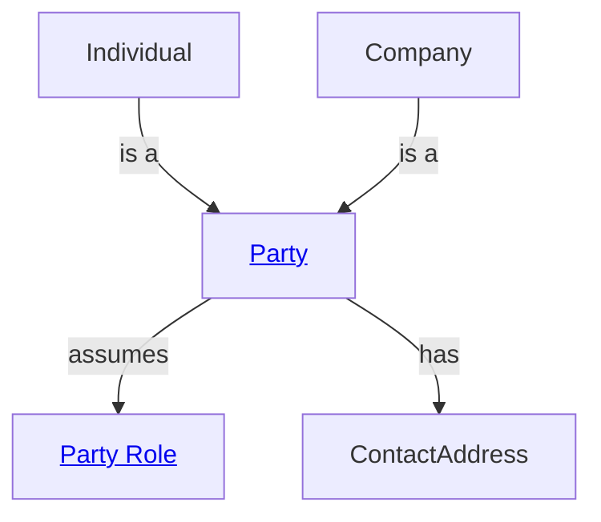
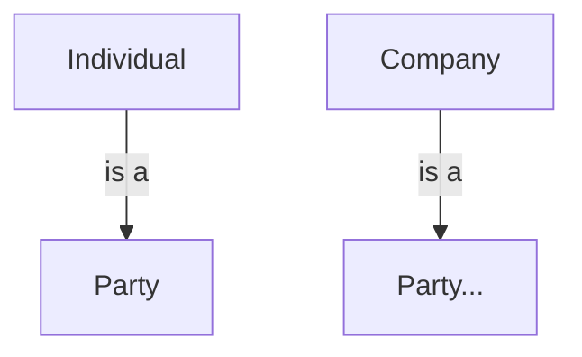
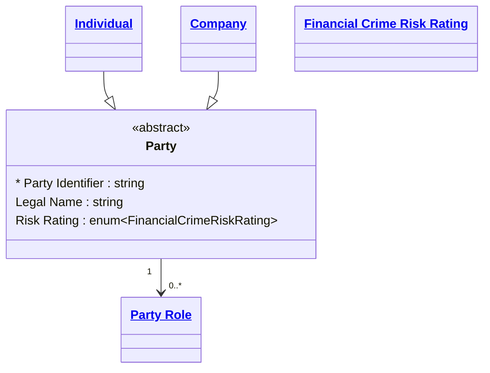
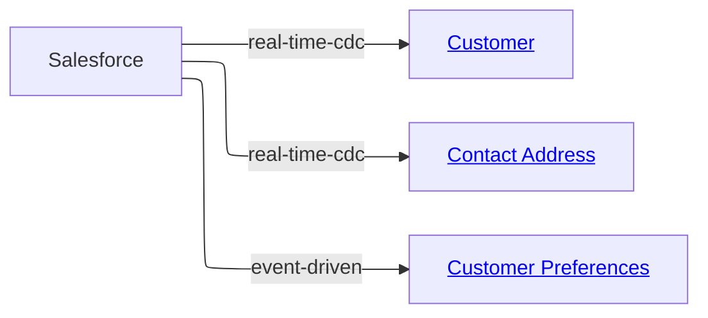

# MD‑DDL Specification (Draft 0.9.2)

*Lightweight layout for domain ontology & semantic data modelling via human-AI collaboration.*

---

## **Overview**

MD‑DDL is a **Markdown‑first**, **AI‑friendly** standard for defining domains, entities, attributes, enums, relationships, events, source mappings, and data products. It is designed to be readable by humans, generatable by AI, and transformable into:

- Data catalogs
- Knowledge graphs
- Data product definitions
- Schemas and technical artifacts (DDL, JSON Schema, Parquet contracts)
- ETL/ELT logic and source-to-domain lineage

MD‑DDL uses Markdown structure as its primary syntax, with YAML or JSON blocks for structured definitions and Mermaid or PlantUML for diagramming. Structural consistency is enforced by AI agents that validate, generate, and maintain model artifacts.

---

## **Core Principles**

1. **Markdown‑Native**  
   Headings define structure; prose defines meaning.

2. **AI‑Friendly**
   No redundant fields. No manually maintained lists. Minimal boilerplate.

3. **Agent‑Driven**  
   AI agents infer domain membership, index entities, validate relationships, and generate physical artifacts from the model.

4. **Natural‑Language Naming**
   Entities, attributes, and relationships use human‑readable names rather than code‑style casing.

5. **Adoption is Incremental**
   MD-DDL supports incremental adoption. Organisations can begin by documenting their existing data landscape — dimensional models, canonical models, ETL pipelines, governance metadata — and progressively evolve toward declarative, AI-generated artifacts. The `baselines/` folder captures existing state; the adoption maturity model tracks the journey; the canonical model is the destination. See [Section 10 — Adoption](./10-Adoption.md) for the full maturity model and adoption workflow.

### Normative Language

MD-DDL reserves **must** for rules whose violation breaks AI interpretation of the model — syntax, reference integrity, and the two-layer discovery structure. Everything else — naming, file layout, table columns, value vocabularies — is a **default convention**: the shape agents generate by default and recognise on sight. Conventions are extensible, and deviations from them are observations to work with (and potential spec contributions), not errors. See the [Validation Model](#validation-model) below.

---

## **Document Structure**

MD‑DDL is composed of several logical components:

- [Domains](./2-Domains.md)
- [Entities](./3-Entities.md)
- [Enumerations](./4-Enumerations.md)
- [Relationships](./5-Relationships.md)
- [Events](./6-Events.md)
- [Sources](./7-Sources.md)
- [Transformations](./8-Transformations.md)
- [Data Products](./9-Data-Products.md)
- [Adoption](./10-Adoption.md)

MD‑DDL uses a **two‑layer structure** for Entities, Enums, Relationships, Events, and Data Products:

1. A **summary/conceptual definition with semantic relationships**
2. A **detailed/logical definition**

During adoption (see [Section 10](./10-Adoption.md)), a transitional layer may also exist:

- **Layer 0 — Baselines** (existing state documentation) — transitional; captured in `baselines/` subfolders within the domain

Baselines document what exists today. They are not part of the canonical model and are never used for generation. They are superseded as the domain advances through adoption maturity levels.

A folder layout is flexible, the standard uses markdown headers which can be split across many files.

Example domain layout:

```shell
domains/customer/domain.md
domains/customer/entities/customer.md
domains/customer/entities/customer-preference.md
domains/customer/relationships/customer-has-preferences.md
domains/customer/products/analytics.md
domains/customer/diagrams/overview.md
```

Example source layout:

```shell
sources/salesforce-crm/source.md
sources/salesforce-crm/transforms/table_account.md
sources/salesforce-crm/transforms/table_contact_point.md
sources/sap-fraud-management/source.md
sources/temenos-payment/source.md
```

---

### **Two‑Layer Structure**

#### **AI Context Management**

- The domain level provides a compact summary of all conceptual objects.  
- AI agents load only the summaries initially.  
- When deeper context is needed, they follow the `detail:` link to load the full definition.

#### **Human Readability**

- The domain level becomes a clean, navigable table of contents.  
- Detail level remain focused, concise, and free from clutter.

#### **Structural Predictability**

- AI agents know exactly how to find summaries and details.  
- Both layers are merged into a unified conceptual, logical, and physical model.

#### Detail File Flexibility

Authors may organise detail files to suit their modelling style — for example, one entity per file, one file per subdomain cluster, or a file combining an entity with its enumerations and originating relationships, or use a file per aggregate root.
The only structural requirement is that every file maintains the heading hierarchy (with a links back to the domain level).

Source transform files follow the same two-layer pattern but are scoped to a source system. Details begin with a level-1 heading linking back to the source summary, followed by a level-2 heading for the source table and optional level-3 rule sections for complex mappings.

---

## **Validation Model**

MD-DDL uses a two-tier validation model. **Tier 1 — mechanical pre-flight checks** covers only what breaks AI interpretation outright: YAML and Mermaid syntax, internal link integrity, entity reference consistency, and the presence of a domain `version:` field. **Tier 2 — agent-driven quality review** covers everything else: structure, convention, quality, and domain fitness are judgment calls that need context, so they belong to agents and humans, not rule-based linters.

Agents treat organisational deviations from convention — a field named `phi` instead of `pii`, `data_class` instead of `classification` — as observations to work with and potential spec vocabulary contributions, not errors.

The full validation level taxonomy, pre-flight check definitions, the tool interface, and the `{{INCLUDE}}` directive used by agent prompt files are collected in the non-normative [Validation Tooling Guide](../guides/validation-tooling.md).

## **Domains**

In MD-DDL, the domain level is the domain's **ontology** — the shared vocabulary of concepts a business uses and the named, meaningful relationships between them. It is also the router for the Knowledge Graph: the detail level supplies the DNA (attributes and constraints), while the domain level supplies the anatomy — which concepts exist, how they specialise one another, and how they relate.

### **Semantics Without Formalism**

MD-DDL is deliberately a *light* ontology. It shares the intent of formal ontology languages — explicit concepts, explicit named relationships, alignment to shared vocabularies — without their machinery. There are no formal axioms, no reasoner, no required upper ontology, and no obligation to express the model as triples.

Meaning is carried instead by:

- **Natural-language names** — a concept is named as the business names it, so the label itself carries meaning
- **Prose descriptions** — every summary entry describes what the concept means; ambiguity is resolved in words, not logic
- **Named relationships** — every connection between concepts is a labelled predicate using a business verb, never an anonymous link
- **Optional alignment** — the `Reference` column ties a local concept to an external vocabulary (BIAN, FIBO, ISO, FHIR, TM Forum) where one applies

This is enough for agents to reason over the model and for domain experts to maintain it without specialist training. An organisation that needs formal semantics can project the model into RDF/OWL; MD-DDL does not require it.

### **Domain Declaration**

A domain is declared using a **level‑1 Markdown heading**:

```markdown
# Customer
```

### **Domain Description**

All free‑text Markdown under the H1 heading and before the next H2 heading is considered the domain description.

### **Domain Metadata**

Metadata appears under a level‑2 heading:

```markdown
## Metadata
```

Domain Metadata sets the default posture for all contained objects: governance and compliance metadata declared here is inherited by every entity, relationship, event, and data product in the domain. Detail definitions declare a `governance:` block only when overriding the domain default. The governance field schema and inheritance rules are defined once, in [Section 3 — Governance Metadata Schema](./3-Entities.md#governance-metadata-schema).

Category|Metadata Keys|Purpose
--------|-------------|-------
Accountability|owners, stewards, technical_leads|Who is responsible for the business vs. technical health.
Governance & Security|classification, pii|The default security posture for the entire domain.
Compliance|regulatory_scope, default_retention|Legal and regulatory frameworks governing this data and its retention obligations.
Lifecycle|status, version|The lifecycle state and semantic version of the domain definition. See [Domain Lifecycle](#domain-lifecycle) below.
Discovery|tags|Searchability
Adoption|adoption (maturity, adoption_started, target_maturity, target_date, progress, notes)|Brownfield adoption tracking. Required when `baselines/` exists. See [Section 10 — Adoption](./10-Adoption.md).
Platform|platform (posture, technologies, product_scope, notes)|How data products relate to infrastructure. See [Section 9 — Data Products](./9-Data-Products.md#platform-posture).

#### **Metadata Format**

Metadata is expressed as YAML or JSON inside a fenced code block:

````markdown
## Metadata

```yaml
# Accountability
owners:
  - data.customer@example.com
stewards:
  - jane.doe@example.com
technical_leads:
  - architecture.team@example.com

# Governance & Security
classification: "Highly Confidential"
pii: true
regulatory_scope:
  - GDPR
  - CCPA
default_retention: "7 years"

# Lifecycle & Discovery
status: "Active"
version: "2.1.0"
tags:
  - Core
  - MasterData
  - B2C
```
````

### **Source Systems**

Source systems are first-class domain summary objects and must be declared under a level‑2 heading immediately after `## Metadata`.

Use a Markdown table with the following columns:

Column | Purpose
--- | ---
**Business Application** | Source application or product name, expressed as a Markdown link to the source declaration.
**Platform** | Technology platform or deployment model.
**Capability Domain** | Business capability or functional area served by the source.

Example:

````markdown
## Source Systems

Business Application | Platform | Capability Domain
--- | --- | ---
[Temenos Payment](sources/temenos-payment/source.md) | Temenos SaaS | Payment Execution
[SAP Fraud Management](sources/sap-fraud-management/source.md) | SAP | Fraud
````

#### **Diagrams**

Diagrams appear under level‑3 headings inside the Metadata section, after the YAML metadata block. This separates data *about* the domain from visuals *of* the domain.

The domain level should contain a **Domain Overview Diagram** — a Mermaid `graph TD` (top-down) or `graph LR` (left-right) showing the domain's entities and how they relate. It is the visual rendering of the ontology: the summary tables declare the concepts, and the diagram shows the semantic web they form.

Every edge is a **semantic assertion**, readable as a sentence in subject–predicate–object order: `Party --> |assumes| PartyRole` asserts that a Party assumes a Party Role. Two rules follow from this:

- Edges are always labelled, and the label matches the relationship name declared in the Relationships section (e.g., `-->|assumes|`). An unlabelled edge asserts nothing and is not a relationship. Specialisation is asserted as `Child -->|is a|Parent`.
- The overview asserts meaning, not structure. Attributes, cardinality notation, and enumeration values belong in the detail level, not the overview.

Nodes may hyperlink to detail definitions for navigation, and additional level‑3 diagrams focusing on specific sub-areas may follow the overview. Layout configuration, linking syntax, and worked examples are collected in the non-normative [Diagram Style Guide](../guides/diagram-style.md).

Example (abbreviated):

````markdown
### Domain Overview Diagram


```mermaid
graph TD

  Individual --> |is a|Party
  Company --> |is a|Party

  Party --> |assumes|PartyRole
  Party --> |has|ContactAddress

  Party["<a href='entities/party.md'>Party</a>"]
  PartyRole["<a href='entities/party_role.md'>Party Role</a>"]
```
````

#### Semantic vs Logical Diagrams

MD-DDL uses two distinct diagram types for different purposes:

Diagram|Location|Purpose|Relationship Labels
-------|--------|-------|-------------------
`graph TD/LR`|Domain level|Semantic model — the ontology: concepts and the named relationships asserted between them|Required — match the Relationships section
`classDiagram`|Entity detail level|Logical model — one structural realization of those concepts|Optional — structural intent only

The semantic layer is authoritative for *meaning*; the logical layer is one realization of it. The classDiagram is therefore not required to mirror the domain graph one-for-one — a single semantic relationship may realize as several logical associations, and modellers have freedom in how they do it.

---

### **Domain Structure**

Below the metadata section, the domain level organizes concepts into six primary sections using level‑2 headings: `## Source Systems`, `## Entities`, `## Enums`, `## Relationships`, `## Events`, and `## Data Products`.

At the domain level, these sections **must use Markdown tables** for high-level summaries. This keeps the ontology scannable — a compact, complete index of the domain's vocabulary that both humans and agents can read before descending into detail.

#### Splitting Across Files

The heading hierarchy above is what the standard defines. How it is distributed across files is the author's choice: a single file may carry the domain summary and every detail definition, or the detail level may be split across many files in nested folders. When detail is split out, each file repeats the hierarchy — a level‑1 heading naming the domain (linked back to the domain summary), the relevant level‑2 section heading, then the level‑3 definitions — so that agents can reassemble the full model from any arrangement.

A common split, for illustration only:

```shell
domain.md
entities/party.md        ← Party entity + Party Has Role + Party Has Contact Address
entities/party-role.md   ← Party Role entity + Party Role Uses Contact Address
entities/address.md      ← Address entity (no outbound relationships)
products/analytics.md    ← Consumer-aligned data products
products/canonical.md    ← Domain-aligned data products
sources/temenos-payment/source.md
sources/sap-fraud-management/source.md
```

#### **Source Systems Table**

Summarizes operational source applications relevant to the domain, using the column format defined in [Source Systems](#source-systems) above.

---

#### **Entities Table**

The Entities table declares the concepts of the domain ontology — the things the business talks about.

 Column | Purpose
 --- | ---
**Name** | The natural language name of the concept, linked to its detail-level anchor.
**Specializes** | If applicable, a link to the parent concept. Specialization asserts *is-a*: every instance of this concept is also an instance of the parent, and inherits its attributes, constraints, and governance.
**Description** | A brief definition of what the concept means (1–2 sentences).
**Reference** | Optional alignment to an external vocabulary or standard (e.g., BIAN, FIBO, ISO, FHIR). This is how a local concept is tied to a shared industry meaning.

---

#### **Enums Table**

Declares the controlled vocabularies of the domain — the closed value sets that concepts draw on. By convention, an enum's name describes the value set (e.g., Loyalty Tier, Customer Types) — be consistent within a domain.

Column | Purpose
--- | ---
**Name** | The name of the enumeration, linked to its detail-level anchor.
**Description** | What this set of values represents.
**Reference** | Optional external reference for standardized codes.

---

#### **Relationships Table**

Declares the predicates of the domain ontology — the named, meaningful connections asserted between concepts. Each row is an assertion the business would recognise as true.

Column | Purpose
--- | ---
**Name** | The action-oriented name, reading as subject–predicate–object (e.g., Customer Has Preferences), linked to details.
**Description** | What the connection means in the business, and when it holds.
**Reference** | Optional alignment to an external relationship pattern or vocabulary.

---

#### **Events Table**

Declares the meaningful state changes in the domain. An event names *what happened* in business terms, and binds it to the concepts that participate: who acted, and what was affected.

Column | Purpose
--- | ---
**Name** | The natural language name of the event, linked to details.
**Actor** | The concept or role that initiates the event.
**Entity** | The concept whose state the event changes.
**Description** | The business trigger and meaning of this event.

---

#### **Data Products Table**

Summarizes the data products published by the domain.

Column | Purpose
--- | ---
**Name** | The product name, linked to its detail definition.
**Class** | `source-aligned`, `domain-aligned`, or `consumer-aligned`.
**Consumers** | Primary consumers of this product.
**Status** | Lifecycle state: `Draft`, `Active`, `Deprecated`, `Retired`.

---

### **Rules for Summary Definitions**

- **Tabular Authority:** The domain-level summary **must** use the table formats defined above. H3 headings under these sections are reserved for **detail definitions**.
- **Linking Strategy:** The `Name` column must contain a Markdown link pointing to the H3 anchor of the detail definition — `[Entity Name](#entity-name)` when detail sits in the same file, or `[Entity Name](entities/customer.md#entity-name)` when it is split out.
- **AI Scoping:** AI agents should ingest these tables first to understand the domain's ontology — its concepts and their relationships — before requesting attribute-level detail (YAML blocks) from the detail level.
- **No Boilerplate:** If a column like `Specializes` or `Reference` is empty for all entries in a section, it may be omitted from the table, but the `Name` and `Description` columns are mandatory.
- The description must include a short natural‑language description. A longer description belongs at the detail level.

This allows the domain level to act as a semantic index of the domain.

---

### **Domain Lifecycle**

Every domain definition has a lifecycle — it moves from initial authoring through validation to production use, and eventually to deprecation and retirement. The `status` and `version` fields in domain metadata track this progression.

#### Domain Status

The `status` field declares the current lifecycle state of the domain definition:

Value | Description
--- | ---
`Draft` | Under active development. Not yet validated. Do not consume.
`Review` | Under structured review. Stable enough for early feedback; breaking changes possible.
`Active` | Validated and available for consumption. Stability guaranteed within major version.
`Deprecated` | Retained for reference and migration support. Consumers should migrate to the superseding definition, which may be declared in a `superseded_by` metadata field.
`Retired` | No longer maintained. Historical record only.

#### Domain Version

The `version` field uses semantic versioning (`MAJOR.MINOR.PATCH`): major for breaking changes, minor for additive changes, patch for corrective changes. A change is **breaking** if a correctly-authored downstream consumer (data product, physical artifact, or integration) would produce different or incorrect output after the change is applied.

A domain may also maintain a lifecycle history document (conventionally `LIFECYCLE.md`) combining a machine-readable change manifest with a human-readable changelog.

Lifecycle transition rules, version-bump guidance, the breaking-change taxonomy, the evolution workflow, and the `LIFECYCLE.md` format are collected in the non-normative [Lifecycle & Versioning Guide](../guides/lifecycle-versioning.md).

---

#### **Domain Structure Example**

Below is an example of how the domain level is structured.

````markdown
# Domain Name

Domain description...

## Metadata
Formal JSON/YAML block and diagrams...

## Source Systems

Business Application | Platform | Capability Domain
--- | --- | ---
[Customer CRM](sources/salesforce-crm/source.md) | Salesforce SaaS | Customer Relationship Management

### Domain Overview Diagram


```mermaid
graph TD

  Individual --> |is a|Party
  Company --> |is a|Party...
```

## Entities

Name | Specializes | Description | Reference
--- | --- | --- | ---
[Customer](./details.md#customer) | [Party Role](./details.md#party-role) | An individual or legal entity that has a relationship with the organization. | [BIAN: Party Role](https://...) |
[Individual](./details.md#individual) | [Party](./details.md#party) | A natural person as opposed to a legal entity. | |

When an entity specializes (inherits from) another entity, declare this in the specializes column with a link to the parent.

## Enums

Name | Description | Reference
--- | --- | ---
[Loyalty Tier](./details.md#loyalty-tier) | Categorizes customers by annual spend and engagement. | |

## Relationships

Name | Description | Reference
--- | --- | ---
[Customer Has Preferences](./details.md#customer-has-preferences) | Maps a customer to their specific interaction settings. |

## Events

Name | Actor | Entity | Description
--- | --- | --- | ---
[Preference Updated](./details.md#preference-updated) | Customer | Customer Preference | Emitted when interaction settings are modified.

## Data Products

Name | Class | Consumers | Status
--- | --- | --- | ---
[Customer 360 Profile](products/analytics.md#customer-360-profile) | consumer-aligned | Retail Analytics Team | Active

````

## **Entities**

Entities are defined at the detail level, under a level‑2 `## Entities` section. When entity detail is split into its own file, that file repeats the hierarchy: a level‑1 heading naming the domain, linked back to the domain summary, before the level‑2 section.

```markdown
# [My Domain](../domain.md)
```

### **Entity Declaration**

A level‑2 `## Entities` section may sit alongside `## Enums` and `## Relationships` sections in the same file. Authors are free to co-locate an entity with its directly originating relationships and any enumerations it references — this is the recommended pattern when a single entity is the clear owner of those concepts.
The Entities section appears under a level‑2 heading:

```markdown
## Entities
```

Each entity is introduced with a **level‑3 heading**:

```markdown
### Customer
```

### **Entity Description**

Free‑text Markdown under the heading describes the entity in more detail than was found in the domain summary.

### **Entity Diagram**

An entity definition should include a Mermaid `classDiagram` immediately after the entity description and before the YAML definition blocks. It shows the entity's own attributes, its position in the inheritance hierarchy, and its immediate relationships to other entities.

The YAML definition block remains the authoritative source for attributes and types — the diagram is a rendering of it, and the two should stay consistent. The classDiagram is a logical realization of the entity: its associations and labels do not need to mirror the semantic relationships asserted at the domain level one-for-one. A single semantic relationship may realize as multiple logical associations, and some logical associations may have no direct semantic counterpart.

Example:

````markdown

```mermaid
classDiagram
  class Party{
    <<abstract>>
    * Party Identifier : string
    Legal Name : string
    Risk Rating : enum~FinancialCrimeRiskRating~
  }

  Individual --|> Party
  Company --|> Party
  Party "1" --> "0..*" PartyRole

  class Individual["<a href='individual.md'>Individual</a>"]
  class Company["<a href='company.md'>Company</a>"]
  class PartyRole["<a href='party_role.md'>Party Role</a>"]
  class FinancialCrimeRiskRating["<a href='../enums/financial_crime_risk_rating.md'>Financial Crime Risk Rating</a>"]
```
````

Conventions for subject classes, reference classes, enum rendering, inheritance arrows, cardinality, and element ordering are collected in the non-normative [Diagram Style Guide](../guides/diagram-style.md).

### **Entity Definition**

A structured block defines the entity's attributes and logic. MD‑DDL follows a Key-as-Name philosophy to eliminate redundancy and ensure that the human-readable label used in the documentation is the exact same identifier used in the Knowledge Graph.:

````markdown
```yaml
extends: Party Role
mutability: immutable | append_only | slowly_changing | frequently_changing | reference
existence: independent | dependent | associative
temporal:
  tracking: valid_time
  description: Preferences are valid for specific time periods and can be future-dated
attributes:
  Customer Number:
    type: string
    identifier: primary
  Email Address:
    type: string
    pii: true
  Full Name:
    type: string
  Balance:
    type: Decimal
```

```yaml
constraints:
  Valid Date Range:
    check: "End Date > Start Date"
  Positive Liquidity:
    check: "Balance > 0"
```

```yaml
governance:
  pii: true
  classification: Confidential
  retention: 7 years
  access_role:
    - HR_ADMIN
```
````

### Governance Metadata Schema

Governance metadata is declared at the domain level (in the `## Metadata` block) and optionally overridden per entity (in a `governance:` block within the entity's definition). Entities inherit all governance fields from the domain. Include a `governance:` block on an entity only when specifying an override or stricter requirement than the domain default.

#### Domain-Level Governance Fields

These fields are declared in the domain metadata YAML block. They set the default governance posture for all entities, relationships, and events in the domain.

Field | Type | Required | Description
--- | --- | --- | ---
`classification` | string | Yes | The sensitivity level of the domain's data. Valid values: `Public`, `Internal`, `Confidential`, `Highly Confidential`.
`pii` | boolean | Yes | Whether any entity in the domain contains personally identifiable information.
`regulatory_scope` | string[] | Yes | The regulatory frameworks applicable to this domain (e.g., `GDPR`, `APRA CPS 234`, `FATF`, `HIPAA`).
`default_retention` | string | Yes | The default data retention period applied to all entities unless overridden (e.g., `"7 years"`, `"10 years post relationship end"`).

#### Entity-Level Governance Fields

These fields may appear in an entity's `governance:` YAML block. Only include fields that differ from the domain default.

Field | Type | Required | Description
--- | --- | --- | ---
`pii` | boolean | No | Override the domain's PII flag for this entity.
`pii_fields` | string[] | No | Explicit enumeration of attribute names within this entity that contain PII. Optional — use when an applicable regulatory framework requires an enumerated PII field inventory (e.g., GDPR Article 30 data mapping, HIPAA Safe Harbor de-identification). When present, must list all attributes marked `pii: true` in the entity. When absent, PII is identified by the `pii: true` marker on individual attributes. `pii_fields` is the conventional name for this field — using it consistently lets agents and tooling rely on it across domains.
`classification` | string | No | Override the domain's classification for this entity. Must use the same value set: `Public`, `Internal`, `Confidential`, `Highly Confidential`.
`retention` | string | No | Override the domain's retention period for this entity.
`retention_basis` | string | No | Justification for why this entity's retention differs from or elaborates on the domain default. Include regulatory citation where applicable.
`access_role` | string[] | No | Roles permitted to access this entity's data. An array of role identifiers. When absent, access is governed by broader domain or organisational policy.
`compliance_relevance` | string[] | No | Specific regulatory acts or standards that apply directly to this entity (e.g., `"AUSTRAC AML/CTF Act 2006"`, `"GDPR Article 17"`).
`regulatory_reporting` | string[] | No | Named regulatory reports or submissions that include data from this entity (e.g., `"Suspicious Matter Report (SMR)"`, `"Threshold Transaction Report (TTR)"`).
`description` | string | No | Free-text explanation of the governance posture for this entity — why the override exists and what regulatory obligation drives it.

#### Governance Inheritance Rules

1. **Domain defaults apply everywhere.** Every entity, relationship, and event inherits the domain's `classification`, `pii`, `regulatory_scope`, and `default_retention` unless explicitly overridden.
2. **Override only when stricter or different.** An entity-level `governance:` block must contain only fields that differ from domain defaults. Do not repeat identical values.
3. **Strictness direction.** An entity may declare a higher `classification` or longer `retention` than the domain default. Declaring a weaker posture requires a documented justification in the `description` or `retention_basis` field.
4. **`access_role` is additive context.** It restricts who may access entity data. It does not exist at the domain level — it is entity-specific.
5. **`compliance_relevance` and `regulatory_reporting` are entity-specific.** They document which specific regulations and reports apply to a particular entity. Domain-level `regulatory_scope` declares the applicable frameworks; entity-level fields map those frameworks to specific obligations.

#### Example: Domain-Level Governance (in domain metadata)

```yaml
classification: "Highly Confidential"
pii: true
regulatory_scope:
  - AML (Anti-Money Laundering)
  - KYC (Know Your Customer)
  - FATF Recommendations
default_retention: "10 years post relationship end"
```

#### Example: Entity-Level Override (in the entity definition)

```yaml
governance:
  pii: true
  classification: Highly Confidential
  retention: 10 years
  retention_basis: Minimum 7-year retention from end of business relationship, aligned to AML/CTF record-keeping obligations
  access_role:
    - FINANCIAL_CRIME_ANALYST
    - KYC_OFFICER
    - COMPLIANCE_OFFICER
  compliance_relevance:
    - AUSTRAC AML/CTF Act 2006
    - FATF Recommendations 10, 11, 12
  regulatory_reporting:
    - Suspicious Matter Report (SMR)
    - Threshold Transaction Report (TTR)
```

#### Example: Entity Inheriting Domain Defaults (no override needed)

When an entity's governance posture matches the domain default exactly, no `governance:` block is needed. To document the inheritance explicitly without adding new fields, a minimal `governance:` block with only a `retention_basis` may be included:

```yaml
governance:
  retention_basis: Inherited from domain default retention of 10 years post relationship end
```

---

### Entity Lifecycle Fields

Entities within a domain may have their own lifecycle state independent of the domain. For example, a domain may be `Active` while a newly added entity is still in `Draft`.

#### Lifecycle Properties

Property | Type | Required | Description
--- | --- | --- | ---
`status` | enum | No | Lifecycle state of this entity definition. Uses the same values as domain status: `Draft`, `Review`, `Active`, `Deprecated`, `Retired`. Defaults to the domain status if omitted.
`since` | semver string | No | The domain version in which this entity was introduced (e.g., `"1.2.0"`).
`deprecated_at` | semver string | No | The domain version in which this entity was deprecated (e.g., `"2.0.0"`).
`breaking_in` | semver string | No | The domain version in which a breaking change affecting this entity will take effect. Used as advance notice to consumers.

#### Lifecycle Rules

- When `status` is omitted, the entity inherits the domain's status. An entity's `status` should not be more advanced than its parent domain's status.
- The `since`, `deprecated_at`, and `breaking_in` fields refer to domain semantic versions as defined in [2-Domains.md](./2-Domains.md#domain-version).

Practices for deprecation, migration notice, and lifecycle history are collected in the non-normative [Lifecycle & Versioning Guide](../guides/lifecycle-versioning.md).

#### Example

```yaml
extends: Party Role
status: Active
since: "1.0.0"
existence: independent
mutability: slowly_changing
attributes:
  Customer Number:
    type: string
    identifier: primary
```

#### Example: Deprecated Entity

```yaml
status: Deprecated
since: "1.0.0"
deprecated_at: "2.0.0"
existence: independent
mutability: reference
attributes:
  Legacy Code:
    type: string
    identifier: primary
    description: "Replaced by the new Classification entity introduced in v2.0.0."
```

---

### The "Key-as-Name" Principle

By using the business term (e.g., Positive Liquidity) as the YAML key rather than a nested property (e.g., name: Positive Liquidity), we achieve:

- Semantic Uniqueness: Every constraint and attribute is forced to have a distinct, meaningful identity within its context.
- Reduced Friction: There is no "translation layer" between the documentation and the database schema. What you see in the heading or key is what appears in the Graph node.
- Logical Referencing: Sub-entities that inherit from this entity can specifically override or reference a constraint by its key name, allowing for a cleaner "Logic Lineage."

### Temporal Tracking Types

This optional section defines how temporal tracking is applied to the entity. This is optional and will default to current state tracking if not specified or inherit from parent entities if they have temporal tracking defined.

Type|Description
----|-----------
`valid_time`|Business time - when is this true in the real world? Supports point-in-time queries.
`transaction_time`|System time - when was this recorded? Records are immutable once superseded.
`bitemporal`|Both valid and transaction time - full temporal reconstruction.
`point_in_time`|Event timestamp only. For events - single timestamp, immutable.

### Existence

This optional section defines if this entity can exist independently.

- independent — meaningful on its own; doesn't require another entity to give it purpose (Customer, Product, Location)
- dependent — only meaningful in the context of other entities; its reason for existing is to record a relationship between them (Payment Transaction, Order Line, Enrolment)
- associative — resolves a many-to-many; carries attributes about the relationship itself (Party Agreement, Student Course Enrolment)

### Mutability

This optional section defines how the data changes over time.

- immutable — once written, never changes (event records, ledger entries)
- append_only — new rows added, existing rows never updated (logs, transactions)
- slowly_changing — changes occasionally, history may matter (customer address, product category)
- frequently_changing — changes often, current value is what matters (account balance, inventory level)
- reference — essentially static, managed by a small number of administrators (country codes, currency codes)

Both `existence` and `mutability` are intent signals: they tell generating agents and human readers how the entity behaves, without prescribing a physical structure. How generators map them to physical patterns is a generation-tooling concern, outside this spec.

---

### Attribute Definition

#### Attribute Properties

Property|Required|Description|Example
--------|--------|-----------|-------
`type`|Yes|The data type of the attribute|`string`, `integer`, `decimal`, `boolean`, `date`, `datetime`, `timestamp`, `string[]`, `enum:Loyalty Tier`
`description`|No|Human-readable explanation of the attribute's purpose|"The primary email address for customer communication"
`identifier`|No|Marks this attribute as an identifier (default: `false`). Values: `primary`, `alternate`, `natural`, `surrogate`|`primary`, `alternate`
`unique`|No|Whether values must be unique across all instances (default: `false`)|`true` or `false`
`default`|No|Default value when not explicitly provided|`0`, `"Unknown"`, `false`

#### Type System

Type|Description|Examples
----|-----------|--------
`string`|Text data.|"John Doe", "abc123"
`integer`|Whole numbers without decimals|42, -17, 0
`decimal`|Numeric values with decimal precision|99.99, -0.001, 3.14159
`boolean`|True or false values|`true`, `false`
`date`|Calendar date without time|2024-03-15
`datetime`|Date with time (timezone-aware)|2024-03-15T14:30:00Z
`enum:<Enum Name>`|Reference to a defined enumeration|`enum:Loyalty Tier`, `enum:Country Code`

#### Arrays

All types above support arrays by appending `[]` to the type name. For example, `string[]` or `decimal[]`

Array constraints can be specified in the square brackets. For example, `string[1..5]` means 1 to 5 strings. `decimal[0..*]` means 0 or more decimals. `enum:Country Code[2]` means exactly 2 country codes.

- Valid cardinality syntax: `[n]`, `[n..m]`, `[n..*]`, or `[*]`
- If no cardinality is provided, `[*]` is assumed.

### Constraint Definition

Constraints define validation rules and business logic that span one or more attributes. They appear under a `constraints:` section in the entity or relationship YAML.

#### Constraint Properties

Property|Purpose|Example
--------|-------|-------
`unique`|Enforce uniqueness of one or more attributes|`unique: Email Address` or `unique: [Country, State, Postal Code]`
`not_null`|Require attribute to have a value|`not_null: Email Address` or `not_null: [First Name, Last Name]`
`check`|Boolean expression that must be true|`check: "Age >= 18"`
`derived`|Define computed/calculated attributes|`derived: {attribute: Full Name, expression: "First Name + ' ' + Last Name"}`
`lifecycle_stage`|Enforce completeness at specific lifecycle stages|`lifecycle_stage: [Registration, KYC Complete]`
`description`|Human-readable explanation|"Customer must be 18 or older"

One of unique, not_null, check, or derived must be present.

Example:

```yaml
constraints:
  Contact Information Required:
    not_null: [Email Address, Phone Number]
    lifecycle_stage: Activation
    description: At least one contact method must be provided at activation
```

---

### Rules

**Inheritance:**

- Attribute Inheritance: Customer gets all attributes of Party Role
- Constraint Inheritance: If Party Role has a constraint, Customer must follow it.
- Governance Inheritance: Entities inherit governance/compliance metadata from the domain. Do not repeat identical governance attributes on entities; include a `governance:` block only for overrides.

**Identifiers:**

Every Entity should have at least one attribute marked as an identifier (`identifier: primary` for the primary key). If missing, the Knowledge Graph treats the entity as a "Logic Object" rather than a "Data Object."

**No Relationship Attributes:**

Entity YAML must not declare foreign-key attributes (e.g., a Customer Id inside a Preference entity). The Relationships section defines the link; physical keys are generated from the relationship definition. This prevents "Foreign Key Drift" — an FK attribute in entity YAML would be interpreted as a business attribute and corrupt generation.

**No Source References in Entity Definitions:**

Entity YAML contains no `source:` keys, no source field names, and no references to source systems. The canonical model defines meaning and governance; source systems define operational reality. This separation is structural — source mappings are declared in the source layer, not alongside entity definitions. See [Section 7 — Sources](./7-Sources.md).

#### **Naming Rules**

- Natural Language Priority: Entity and attribute names must use natural language (e.g., Email Address, not email_addr).
- Case & Spaces: Names are case-sensitive and support spaces.
- No Redundancy: Do not include a name: field inside the YAML block. The Markdown heading serves as the Entity name, and the YAML keys serve as Attribute/Constraint names.
- Machine Normalisation: While the Knowledge Graph preserves these natural labels for navigability, physical artifact generation automatically handles the normalisation (e.g., conversion to snake_case) for target systems.
- Source Field Names are the one place in MD-DDL where non-natural-language identifiers appear. They are declared in the source layer's transform definitions, not in entity definitions. They are owned by the source system and are not subject to MD-DDL's naming rules.

## **Enumerations**

Enumerations are defined at the detail level, under a level‑2 `## Enums` section. When enum detail is split into its own file, that file repeats the hierarchy: a level‑1 heading naming the domain, linked back to the domain summary, before the level‑2 section.

### **Enum Declaration**

Enums appear under:

```markdown
## Enums
```

Enums can be defined as a simple list of values or a dictionary if the values require additional metadata. By convention, an enum's name describes the value set (e.g., Loyalty Tier, Customer Types) — be consistent within a domain.

Simple Format:

```yaml
values:
  - Bronze
  - Silver
  - Gold
```

Each enum uses a level‑3 heading with metadata:

````markdown
### Loyalty Tier
Categorizes customers by their annual spend and engagement levels.

```yaml
values:
  Bronze:
    description: Entry level tier
    score: 1
  Silver:
    description: Standard tier
    score: 2
  Gold:
    description: Premium tier
    score: 3
```
````

### Naming Rules

- Natural Language: Values should use business-friendly names (e.g., Part Time, not PT).
- Normalization: Physical artifact generation handles the translation of these values into machine-readable codes (e.g., PART_TIME) if required by the target system.
- Global Reference: Once defined in a Domain, an Enum can be referenced by any Entity or Event using the enum:Enum Name type syntax.

### External Standard Enumerations

When an enum's values are defined by an external standard (for example ISO 4217
currencies, HL7 FHIR value sets, or BIAN enumerations), include a representative
subset of 5 to 15 values sufficient to demonstrate the pattern. Reference the
authoritative source using a `standard` metadata field.

```yaml
values:
  AUD:
    description: Australian Dollar
  USD:
    description: United States Dollar
  EUR:
    description: Euro
standard:
  name: ISO 4217
  version: "2024"
  url: https://www.iso.org/iso-4217-currency-codes.html
  note: Representative subset - full standard defines 180+ active currency codes
```

Physical artifact generation should support loading the full external value set
when the representative subset is insufficient for the target use case.

## **Relationships**

Relationships are defined at the detail level, under a level‑2 `## Relationships` section. When relationship detail is split into its own file, that file repeats the hierarchy: a level‑1 heading naming the domain, linked back to the domain summary, before the level‑2 section.

Relationships are **first‑class citizens**.

### **Relationship Declaration**

```markdown
## Relationships
```

Each relationship uses a level‑3 heading:

```markdown
### Customer Has Preferences
```

#### **Relationship Description**

Free‑text Markdown describes the semantics.

### **Relationship Definition**

Relationships define the semantic and structural connection between two entities.

````markdown
```yaml
source: Customer
type: owns
target: Customer Preference
cardinality: one-to-many
granularity: atomic | group | period
ownership: Customer
```
```yaml
constraints:
  Active Customer Preference Only:
    check: "Customer.Status == 'Active' OR Customer Preference.EffectiveStatus == 'Inactive'"
    description: "A customer cannot have active preferences if their account is not active."
```

```yaml
# Optional governance override (include only when different from domain defaults)
governance:
  classification: Confidential
```
````

### Relationship Types

- `owns`: Strongest link. The target entity's life is bound to the source. Example: Customer owns Account. (If the customer is deleted, the account must be too).
- `has` / `associates_with`: A loose connection where both entities can exist independently. Example: Contact has Location.
- `references`: Used when one entity points to another for lookup purposes. Example: Transaction references Currency.
- `related_to`: A symmetric or near-symmetric association where neither entity owns or depends on the other. Used for peer-level connections and self-referential networks (e.g., Party related to Party for ownership structures, Account related to Account for parent/sub-account hierarchies). Most commonly paired with `self_referential: true`.
- `assigned_to`: Denotes a functional link or responsibility. Example: Claim assigned_to Adjuster.
- `triggers`: Used when one entity or event initiates another. Example: Application Submitted triggers Credit Check.
- `produces` / `results_in`: Describes the outcome of a process. Example: Assessment produces Risk Score.
- `supersedes` / `replaces`: Versioning or correction logic. Example: New Policy supersedes Old Policy.
- `governs`: A set of rules or a domain controlling an entity. Example: GDPR Policy governs Customer PII.
- `masks` / `protects`: Security-specific relationships. Example: Vault Service masks Credit Card Number.

This vocabulary is extensible. Organisations may use additional type verbs where none of the above fits; agents treat an unrecognised type as a loose association for generation purposes and note it as a potential spec vocabulary contribution.

### Granularity

Describes the resolution at which a relationship operates relative to the entities it connects.

Type|Description|Generation Guidance
----|-----------|--------------------
atomic|The relationship holds at the finest level of detail — one instance on each side participates individually.|Treated as a direct join at full grain.
group|the related entity represents a collection or summary of instances on the other side (e.g. a monthly budget linked to individual daily transactions).|Generates aggregation logic to bridge the difference.
period|the relationship captures the state of one entity as it stood at a specific point in time rather than recording an event|Emits snapshot or point-in-time join logic accordingly.

If not specified, the default is atomic.

### Self-Referential Relationships

A self-referential relationship connects instances of the same entity type to each other — `source` and `target` both name the same entity. Use this pattern for ownership networks, hierarchies, family or social ties, and any associative structure within a single entity population.

#### Declaration

Set `self_referential: true` in the relationship YAML:

```yaml
source: Party
type: related_to
target: Party
cardinality: many-to-many
granularity: atomic
ownership: Party
self_referential: true
```

#### Edge Attributes

When the relationship instance itself carries attributes — not the entities it connects — declare them under `relationship_attributes`. These become columns on the bridge table in physical generation:

```yaml
self_referential: true
relationship_attributes:
  - Association Type
  - Association Start Date
  - Association End Date
  - Verified
```

`relationship_attributes` names follow standard MD-DDL attribute naming (natural language, title case). They are attributes of the association instance, not of either participant entity.

#### Source and Target Semantics

Directionality is meaningful even when both ends name the same entity: `source` is the origin instance and `target` the destination instance. For bidirectional relationships where direction is not meaningful (e.g., "sibling of"), note this in the relationship description.

The `ownership` field names the entity that owns the relationship definition — typically the entity the relationship most naturally describes from. For self-referential relationships this is always the same entity as `source` and `target`.

How self-referential relationships realize physically (bridge tables, FK column naming, recursion handling) is a generation-tooling concern, outside this spec.

### Relationship Rules

- First-Class Identity: Every relationship is a distinct node in the graph. It can hold its own metadata, constraints, and versioning.
- Directional Logic: The source is the origin of the relationship, and the target is the destination.
- Inverse Inference: The generating agent automatically produces the inverse (e.g., if "Customer Has Preferences," it infers "Preferences Belong To Customer").
- Constraint Awareness: Constraints in a relationship can reference attributes from both the source and the target entities using the Entity.Attribute syntax.
- Governance Inheritance: Relationships inherit governance/compliance metadata from the domain. Include `governance:` only when overriding inherited values.

#### **Relationship Naming Rules**

- Action-Oriented: Use natural language that describes the interaction (e.g., Account Holds Balance or Customer Places Order).
- Avoid Key Redundancy: Do not define Foreign Keys (e.g., Customer ID) inside the Entity attributes. The Relationship definition handles this link automatically.

## **Events**

Events are defined at the detail level, under a level‑2 `## Events` section. When event detail is split into its own file, that file repeats the hierarchy: a level‑1 heading naming the domain, linked back to the domain summary, before the level‑2 section.

Events represent meaningful business-level changes in state. They describe *what happened* in the domain, independent of how the underlying data systems record or transport those changes. Events allow MD‑DDL to map technical change (CDC, ETL deltas, logs) to **semantic business events**, ensuring that business processes react to meaning rather than database mechanics.

---

### **Event Declaration**

An event is declared using a **level‑3 Markdown heading** under the `## Events` section:

```markdown
## Events

### Customer Preference Updated
```

The heading is the authoritative name of the event.  
Event names use **natural language**, not camelCase, PascalCase, or snake_case.

---

### **Event Description**

Free‑text Markdown immediately following the heading provides a human‑readable description of the event. This describes the business meaning, not the technical implementation.

Example:

```markdown
Triggered when a customer changes one or more preferences.
```

The description may include:

- the business context  
- why the event matters  
- how it is used  
- any relevant domain rules  

---

### **Event Definition**

A structured YAML or JSON block defines the event's formal properties:

````markdown
### Customer Preference Updated

Emitted when a customer modifies their communication or interaction preferences.
```yaml
actor: Customer
entity: Customer Preference
emitted_on: 
  - create
  - update
business_meaning: Customer has expressed a change in how they wish to interact with the business
downstream_impact:
  - Marketing campaigns must respect updated preferences
  - Communication systems must apply new settings
  - Compliance audit trail is maintained

constraints:
  Active Customer Only:
    check: "Customer.Status == 'Active'"
    description: Only active customers can update preferences

  Preference Must Be Active:
    check: "Customer Preference.Status == 'Active'"
    description: >
      The preference record must be in an active state before it can be
      updated. Ownership of the preference by the acting Customer is
      structural — enforced by the Customer Has Preferences relationship,
      not by an attribute check. Do not write FK-style checks such as
      Customer.ID == Customer Preference.Customer ID; FK attributes do
      not exist in canonical MD-DDL entities and are handled by
      relationship definitions.

governance:
   classification: Confidential
```
````

---

### **Event Rules**

1. **Natural‑language naming**  
   Event names must be written in natural language (e.g., “Customer Preference Updated”).

2. **No duplication**  
   The event name appears only in the heading, not inside the YAML block.

3. **Events are first‑class citizens**  
   Events are not embedded inside entities or relationships; they live in their own section.

4. **Events describe business meaning, not technical mechanics**  
   Events should not reference CDC, SQL operations, or ETL logic.

5. **Events may be declared anywhere in the domain**  
   Any `## Events` section within the domain's heading hierarchy is discovered and assembled, whether it sits beside the domain summary or in a separate file.

6. **Events may be linked to entities and relationships**  
   Through `actor`, `entity`, and optional `relationships`.

7. **Events are optional**  
   Domains may define zero, one, or many events.

8. **Contextual Payloads**

   The attributes block should focus on the delta (what changed) and the context (why it changed), rather than a full copy of the entity.

   Event payload attributes use the same dictionary format as entity attributes.
   Use key-value entries under `attributes:` rather than list-of-single-key maps.

9. **Temporal Priority**
   Every event MUST have a timestamp or a sequence attribute to ensure the Knowledge Graph can reconstruct the timeline of an entity's life.

10. **Governance Inheritance**
   Events inherit governance/compliance metadata from the domain. Include a `governance:` block only when an event requires an override.

---

### **Example Event**

````markdown
### Customer Preference Updated
Triggered when a customer changes one or more preferences.

```yaml
actor: Customer
entity: Customer Preference
attributes:
   updated_fields:
      type: array
   timestamp:
      type: datetime
```
````

*Part of the MD‑DDL Specification. See [1-Foundation.md](./1-Foundation.md) for core principles and document structure.*

---

## **Sources**

A Source in MD-DDL represents a system that generates operational change — a CRM, a core banking system, a payment platform, an ERP. Sources are not owners of data. They are systems of change whose outputs feed canonical data products.

The canonical domain model defines meaning. Sources define operational reality. The source declaration is the contract that translates between them.

This separation is deliberate and load-bearing:

- Domain modellers define canonical entities, attributes, and governance without knowing or caring which source systems produce the underlying data.
- Source system SMEs define field-level mappings and encode source idiosyncrasies without needing to understand the canonical model's governance posture.
- Integration engineers own the transform definitions that connect the two worlds.

**Canonical data products replace the concept of Systems of Record.** There is no attribute in a domain entity that is "owned" by Salesforce or SAP. Those systems generate change events. The canonical model absorbs those changes according to rules declared in the source layer.

---

### **Source Structure**

The source layer belongs to the domain and uses the same two-layer pattern as the rest of MD-DDL:

Level | Heading structure | Contains
--- | --- | ---
**Source summary** | Level‑1 heading naming the source system; level‑2 `## Metadata` and `## <Domain> Feeds` sections | What the source system is, how it generates change, and which canonical entities it feeds
**Transform detail** | Level‑2 heading naming the source table; level‑3 headings for non-direct mapping rules | Field-level mappings using the transformation types defined in Section 8

Transform detail is optional — a source may be declared before any mappings are authored.

#### Splitting Across Files

As elsewhere in MD-DDL, the heading hierarchy is what the standard defines; the file layout is the author's choice. A source may be a single document, or its transform detail may be split across many files — the natural split being one per source table, subdivided further by functional area for large systems. When transform detail is split out, each file repeats the hierarchy with a level‑1 heading linking back to the source summary.

The conventional layout, for illustration:

```text
Financial Crime/
  domain.md
  entities/
  sources/
    salesforce-crm/
      source.md             ← source metadata + domain feed table
      transforms/
        table_account.md    ← Account table mappings for Party/Company/Customer
        table_contact_point.md
    sap-fraud-management/
      source.md
      transforms/
        table_alert_case.md
```

By convention, transform documents are named for the source table — `table_<source-table>.md`, for example `table_account.md` or `table_payment_event.md`. If multiple canonical entities map from the same source table, group them under separate level-2 entity headings in the same place.

---

### **Source Summary**

#### Declaration

A source is declared using a level-1 Markdown heading:

```markdown
# Salesforce CRM
```

The heading is the source's display name. The stable machine identifier lives in the metadata block.

#### Description

Free-text Markdown under the H1 and before the first H2 describes the source system's business role — what it does, who operates it, and why it is a source for the canonical model. This is written for domain modellers and data stewards, not for engineers.

#### Metadata

Metadata appears under a level-2 heading:

```markdown
## Metadata
```

```yaml
id: salesforce
owner: crm-platform@bank.com
steward: data.governance@bank.com

# How this system generates change
change_model: real-time-cdc
change_events:
  - Customer Updated
  - Contact Created
  - Account Merged
  - Account Deactivated

# Operational characteristics
update_frequency: real-time
data_quality_tier: 1          # 1 = high trust, 2 = standard, 3 = requires validation
status: Production
version: "2.1.0"

tags:
  - CRM
  - CustomerData
  - Core
```

##### Change Models

The `change_model` field declares how change flows out of the source system. It is an intent signal — generating tooling uses it to select an appropriate pipeline pattern.

Value | Description
--- | ---
`real-time-cdc` | Change Data Capture — row-level changes streamed in real time
`event-driven` | Source publishes business events (not raw CDC)
`batch-daily` | Full or incremental extract on a daily schedule
`batch-intraday` | Multiple batch extracts within a day
`api-poll` | Changes retrieved by polling a source API
`manual` | Data loaded by human intervention; no automated feed

##### Change Events

`change_events` lists the business-level change events this source emits. These are natural-language names that may correspond to Events declared in the canonical domain. They can be used to generate event subscription logic and to link source changes to downstream domain Events.

##### Data Quality Tier

`data_quality_tier` is a governance signal, not a technical score. It tells the canonical model how much trust to extend to values from this source:

Tier | Meaning
--- | ---
`1` | High trust — well-governed source, low null rates, consistent formats
`2` | Standard — typical operational system; some nulls, occasional quirks
`3` | Low trust — legacy system, known quality issues; requires validation rules

The tier does not prevent a source from contributing to canonical entities. It signals to downstream consumers and data quality rules how to treat values originating from this source.

---

#### Domain Feed Sections

Below the metadata block, the source summary declares the feed table for its owning domain using this heading pattern:

```markdown
## [<Domain Name>](../../domain.md) Feeds
```

Example domain feed section:

```markdown
## [Financial Crime](../../domain.md) Feeds

Canonical Entity | Transform | Attributes Contributed | Change Model
--- | --- | --- | ---
[Party](../../entities/party.md#party) | [table_account](transforms/table_account.md) | Party Identifier, Party Status | real-time-cdc
[Customer](../../entities/customer.md#customer) | [table_account](transforms/table_account.md) | Customer Number, Onboarding Date, Segment | real-time-cdc
```

**Domain feed table columns:**

Column | Purpose
--- | ---
**Canonical Entity** | Link to the entity in the target domain this source contributes to.
**Transform** | Link to the transform detail for this source table, or `TBD` if not yet defined.
**Attributes Contributed** | Comma-separated list of the canonical attributes this source populates. Not every attribute needs to come from this source.
**Change Model** | How changes to this entity flow from this source. May differ per entity if the source uses different mechanisms for different record types.

---

#### Source Overview Diagram

A source summary should include a Mermaid diagram showing which canonical entities the source feeds and what kind of change model applies to each.

````markdown
### Source Overview Diagram


```mermaid
---
config:
  layout: elk
---
graph LR
  Salesforce --> |real-time-cdc| Customer
  Salesforce --> |real-time-cdc| ContactAddress
  Salesforce --> |event-driven| CustomerPreferences

  Customer["<a href='../../domains/customer/entities/customer.md'>Customer</a>"]
  ContactAddress["<a href='../../domains/customer/entities/contact_address.md'>Contact Address</a>"]
  CustomerPreferences["<a href='../../domains/customer/entities/customer_preferences.md'>Customer Preferences</a>"]
```
````

---

### **Transform Detail**

#### Declaration

When transform detail is split into its own file, that file begins with a level-1 heading naming the source system and linking back to the source summary:

```markdown
# [Salesforce CRM](../source.md)
```

#### Structure

Transform detail is organised by source table: a level-2 heading naming the source table (for example `## Account`, `## ContactPoint`) followed by a source schema table.

Required source schema table columns:

Column | Purpose
--- | ---
**Pos** | Column ordinal from the source table.
**Column Name** | Physical source column name.
**Data Type** | Source system type.
**Max Len** | Maximum length for string-like columns.
**Precision** | Numeric precision when applicable.
**Scale** | Numeric scale when applicable.
**Nulls** | Whether source column allows nulls.
**Comment** | Source-system context or business notes.
**Destination** | Canonical destination mapping (`Entity.Attribute`) or a link to a rule section for non-direct mappings.

When mapping is direct, the `Destination` cell is sufficient and no additional YAML rule is required. Use a level-3 rule section only for non-direct mappings such as `conditional`, `derived`, `lookup`, `reconciliation`, or `aggregation`.

Rules are still expressed with level-3 headings and YAML blocks. Rule links in the `Destination` column point to the rule's anchor (for example `[Map Party Status](#map-party-status)`).

Transform detail may cover multiple canonical entities when mappings originate from the same source table.

Example level-2 heading:

```markdown
## Account
```

For non-direct mappings, use a level-3 rule heading following the Key-as-Name principle. The heading is the transformation's identity in the Knowledge Graph and must be unique within the source table's transform detail.

#### Source field references

Within transform detail, all field references are scoped to the owning source system. The `system:` key is **not** required — it is implicit. Only the field path within the source is needed:

```yaml
source:
  field: Contact.Email
```

This keeps transform detail clean and portable if a source system is renamed. The source summary's `id` field is the authoritative system identifier.

#### Target notation

The `target` field uses `Entity · Attribute` notation to identify the canonical destination unambiguously:

```yaml
target: Customer · Email Address
```

The entity name must match an entity declared in the canonical domain model. The attribute name must match an attribute declared in that entity's YAML block. Both are validated during generation.

#### Transformation types

Transform detail uses the transformation types defined in [Section 8 — Transformations](./8-Transformations.md). All type-specific YAML
syntax is unchanged. The only differences from Section 8's syntax are:

- `system:` is omitted from all `source:` blocks (implicit from the owning source)
- `target:` uses `Entity · Attribute` notation instead of bare attribute name
- The H3 heading is the transformation identity (Key-as-Name, as elsewhere)

---

#### **Source Idiosyncrasies**

Transform detail is the right place to encode source-specific data quality characteristics that the canonical model should never need to know about.

##### Null representations

Many source systems represent null as a non-null value (`"N/A"`, `"0"`, `"UNKNOWN"`). Declare this on the source block so that appropriate null normalisation logic is generated:

```yaml
source:
  field: Contact.Email
  null_as: "N/A"
```

##### Quality flags

Attribute-level quality signals that should be carried into the canonical model:

```yaml
source:
  field: Customer.DateOfBirth
  quality: nullable           # may legitimately be absent
  quality_note: "DOB not collected pre-2015; backfill in progress"
```

##### Format normalisation

Source-specific format variations that require standardisation:

```yaml
source:
  field: Customer.PhoneNumber
  normalise: e164             # normalise to E.164 international format
```

```yaml
source:
  field: Account.OpenDate
  format: "DD/MM/YYYY"        # source uses non-ISO date format
  cast: date                  # generates format-aware cast
```

These annotations belong in the transform detail, not in the canonical entity definition. The canonical model defines what the attribute means; the transform handles the operational reality of getting clean data there.

---

### **Complete Example**

#### Source summary

````markdown
# Salesforce CRM

The primary CRM system used by Retail Banking. Salesforce is the operational system for all customer relationship management — onboarding, contact management, preference capture, and relationship history. It generates real-time CDC events for all customer record changes.

## Metadata

```yaml
id: salesforce
owner: crm-platform@bank.com
steward: data.governance@bank.com
change_model: real-time-cdc
change_events:
  - Customer Created
  - Customer Updated
  - Contact Updated
  - Account Deactivated
data_quality_tier: 1
status: Production
version: "2.1.0"
tags:
  - CRM
  - CustomerData
  - Core
```

### Source Overview Diagram


```mermaid
---
config:
  layout: elk
---
graph LR
  Salesforce --> |real-time-cdc| Customer
  Salesforce --> |real-time-cdc| ContactAddress
  Salesforce --> |event-driven| CustomerPreferences

  Customer["<a href='../../domains/customer/entities/customer.md'>Customer</a>"]
  ContactAddress["<a href='../../domains/customer/entities/contact_address.md'>Contact Address</a>"]
  CustomerPreferences["<a href='../../domains/customer/entities/customer_preferences.md'>Customer Preferences</a>"]
```

## [Financial Crime](../../domain.md) Feeds

Canonical Entity | Transform | Attributes Contributed | Change Model
--- | --- | --- | ---
[Party](../../entities/party.md#party) | [table_account](transforms/table_account.md) | Party Identifier, Party Status | real-time-cdc
[Customer](../../entities/customer.md#customer) | [table_account](transforms/table_account.md) | Customer Number, Email Address, Full Name, Date of Birth | real-time-cdc
[Contact Address](../../entities/contact_address.md#contact-address) | [table_contact_point](transforms/table_contact_point.md) | Street, City, Postal Code, Country Code | real-time-cdc
````

#### Transform detail — `sources/salesforce-crm/transforms/table_contact.md`

````markdown
# [Salesforce CRM](../source.md)

## Customer

Salesforce is the primary contributor to the Customer canonical entity for all contact and identity attributes. Financial attributes (balance, credit limit) are contributed by the Core Banking System.

### Map Customer Number
Direct map from the Salesforce Account identifier.

```yaml
type: direct
target: Customer · Customer Number
source:
  field: Account.AccountNumber
```

### Concatenate Full Name
Salesforce stores given and family name separately. The canonical model uses a single Full Name attribute.

```yaml
type: derived
target: Customer · Full Name
expression: "trim(First Name) + ' ' + trim(Last Name)"
inputs:
  First Name:
    field: Contact.FirstName
  Last Name:
    field: Contact.LastName
```

### Map Email Address
Salesforce uses "N/A" as a null representation for missing email addresses.

```yaml
type: direct
target: Customer · Email Address
source:
  field: Contact.Email
  null_as: "N/A"
  quality: nullable
```

### Resolve Country Code
Salesforce stores legacy two-character country codes. The canonical model uses ISO 3166-1 alpha-3.

```yaml
type: lookup
target: Customer · Country Code
source:
  field: Contact.MailingCountry
lookup:
  reference: Country Code
  match_on: Abbreviation
  return: ISO Code
fallback: null
```

### Map Date of Birth
Salesforce uses DD/MM/YYYY format for dates. Generation produces a format-aware cast to the canonical date type.

```yaml
type: direct
target: Customer · Date of Birth
source:
  field: Contact.Birthdate
  format: "DD/MM/YYYY"
  cast: date
```
````

---

### **Brownfield Adoption Note**

When adopting MD-DDL into an existing environment, source declarations may initially reference baseline ETL documentation in `baselines/etl/` to capture the current transformation logic before formalising it as MD-DDL transform definitions. See [Section 10 — Adoption](./10-Adoption.md) for the full adoption workflow and baseline-to-source migration path.

---

### **Source Rules**

1. **Source identity is stable.** The `id` in the source metadata is a breaking-change identifier. Renaming requires a coordinated update across the source layer and its references at the domain level.

2. **Canonical entities stay pure.** Entity definitions contain no source references. The canonical model defines meaning; sources define operational reality. This separation is structural — a source reference in entity YAML would be interpreted as part of the canonical meaning and corrupt generation.

3. **Transform detail is source-scoped.** Transform detail belongs to exactly one source and one domain context. Cross-source reconciliation (where multiple sources contribute to the same attribute) is expressed using the `reconciliation` transformation type, listing the contributing sources explicitly.

4. **Source idiosyncrasies stay in transform detail.** Null representations, format quirks, quality notes, and encoding variations belong in the `source:` block of the relevant transform. They do not propagate into the canonical entity definition.

5. **Domain feed section is authoritative.** If an attribute is listed in a feed table but has no corresponding transformation in the same source folder, this is a validation error. If a transformation exists in the source folder but the entity is not listed in the feed table, this is a warning.

6. **Change events may link to domain Events.** When a source's `change_events` list contains an event whose name matches a domain Event, event subscription logic can be generated. This linkage is by name — no explicit reference key is required.

7. **Sources do not carry governance metadata.** Source declarations do not include a `governance:` block. Sources are governed transitively — the canonical entities they feed carry the governance posture, and data products that expose source-aligned data declare governance at the product level. This is by design: governance belongs to the meaning layer (entities and products), not the operational origin layer (sources).

*Part of the MD‑DDL Specification. See [1-Foundation.md](./1-Foundation.md) for core principles and document structure.*

---

## **Transformations**

Transformations define how source system data is shaped and mapped into domain entities. They make the lineage from raw source field to governed domain attribute explicit, human-readable, and actionable by AI agents.

Transformations are **first-class citizens** of the source layer. They are declared in transform detail (see [Section 7 — Sources](./7-Sources.md)), not alongside entity definitions. The canonical domain model contains no source references — it defines meaning, not origin.

**This section defines the transformation type vocabulary** — the available types, their YAML syntax, and the expression language. Where transformations are declared and how they are organised is defined in Section 7.

---

### **What Transformations are not**

- **Not constraints.** A constraint defines what valid data looks like once it arrives in the domain. A transformation defines how data gets there. Keep them separate.
- **Not orchestration.** When a transformation runs, in what order, triggered by which event — that is a pipeline concern. MD-DDL declares the logic; the generating agent produces the pipeline artefact.
- **Not documentation of existing pipelines.** Transformations define the *intended* mapping as the source of truth. Existing pipelines should be aligned to the model, not the other way around.

---

### **Transformation Declaration**

Transformations are declared in transform detail, organised by source table. That structure — source schema table, `Destination` column mechanics, and heading hierarchy — is defined in [Section 7 — Sources](./7-Sources.md); this section defines only the transformation types themselves.

Each non-direct transformation uses a **level-3 heading** following the Key-as-Name principle — the heading is the transformation's identity in the Knowledge Graph:

```markdown
### Concatenate Name Parts
```

A short prose description of the business intent follows the heading, before the YAML block.

---

### **Transformation Definition**

All transformations share a common envelope:

```yaml
type: <transformation type>
target: Entity · Attribute
```

`type` and `target` are always required. Everything else depends on the type.

A transformation may also declare `quality_check: false` to indicate that a null target attribute after the transformation runs is legitimate (by default, generated quality tests assert non-null).

`target` uses `Entity · Attribute` notation. The entity name must match an entity in the canonical domain model. The attribute name must match an attribute declared in that entity's YAML block. Both are validated during generation.

Within transform detail, `source.system` is **omitted** — it is implicit from the owning source. Only the field path within the source system is declared:

```yaml
source:
  field: Contact.Email
```

See [Section 7 — Sources](./7-Sources.md) for the source idiosyncrasy annotations (`null_as`, `quality`, `format`, `normalise`) available on `source:` blocks.

---

### **Transformation Types**

#### `direct`

A one-to-one field map with an optional type cast. Use when the source field and domain attribute are semantically identical but may differ in name or type.

````yaml
### Account Number
Maps the legacy account identifier from the core banking system.

```yaml
type: direct
target: Account Number
source:
  system: cbs
  field: ACCT_MASTER.ACCT_NO
  cast: string
```
````

---

`cast` is optional. Valid values match the MD-DDL type system:
`string`, `integer`, `decimal`, `boolean`, `date`, `datetime`.

---

#### `derived`

Computes a domain attribute from one or more source fields using an expression.
Inputs are named and declared separately from the expression so they can be
individually traced.

````markdown
### Full Name
Combines given and family names from CRM into a single display name.

```yaml
type: derived
target: Full Name
expression: "trim(First Name) + ' ' + trim(Last Name)"
inputs:
  First Name:
    system: salesforce
    field: Contact.FirstName
  Last Name:
    system: salesforce
    field: Contact.LastName
```
````

**Expression syntax** uses natural-language input names as operands, matching
the keys declared in `inputs:`. Supported operations:

Operation | Syntax | Example
--- | --- | ---
Concatenation | `+` | `"First Name + ' ' + Last Name"`
Arithmetic | `+` `-` `*` `/` | `"Amount * Exchange Rate"`
String functions | `trim()`, `uppercase()`, `lowercase()`, `substring(n, m)` | `"trim(Email Address)"`
Date functions | `today()`, `date_diff(a, b, unit)`, `date_add(d, n, unit)` | `"date_diff(End Date, Start Date, 'days')"`
Null handling | `coalesce(a, b)` | `"coalesce(Preferred Name, First Name)"`

The generating agent is responsible for translating these expressions into the target physical syntax (SQL, Spark, dbt). Authors write expressions against domain attribute names, not physical column names. The function set above is the portable core, not a closed list — additional functions may be used where the generating agent and target platform support them.

---

#### `reconciliation`

Resolves a domain attribute when the same data exists in multiple source systems and a priority rule determines which value to use.

````markdown
### Preferred Email Address
CRM is the master for contact data. The ERP value is used only when CRM has no email on record.

```yaml
type: reconciliation
target: Email Address
strategy: priority_non_null
sources:
  - priority: 1
    system: salesforce
    field: Contact.Email
  - priority: 2
    system: sap
    field: Customer.EmailAddress
```
````

**Reconciliation strategies:**

Strategy | Behaviour
--- | ---
`priority_non_null` | Take the highest-priority non-null value
`priority_always` | Always take the highest-priority value, even if null
`most_recent` | Take the value with the most recent timestamp; requires `timestamp_field` on each source
`consensus` | Take a value only when all sources agree; otherwise null

These strategies cover the common cases and are not a closed list — an organisation may declare another strategy, described in the transformation's prose, and the generating agent should confirm its interpretation rather than guess.

For `most_recent`, declare the timestamp field on each source:

```yaml
sources:
  - priority: 1
    system: salesforce
    field: Contact.Email
    timestamp_field: Contact.LastModifiedDate
```

---

#### `lookup`

Enriches a source value by joining to a domain enum or reference entity.
Use when the source system uses codes, abbreviations, or legacy identifiers
that the domain model has standardised.

````markdown
### Resolve Country Code
Translates two-character legacy country abbreviations from the core banking system into ISO 3166-1 alpha-3 codes used in the domain model.

```yaml
type: lookup
target: Country Code
source:
  system: cbs
  field: Customer.CountryAbbrev
lookup:
  reference: Country Code
  match_on: Abbreviation
  return: ISO Code
fallback: null
```
````

---

`reference` must name a domain Enum or Entity defined in the same model. `match_on` and `return` must be valid attribute or value names within that reference. `fallback` declares what to do when no match is found: `null`, `reject` (fail the record), or a literal default value.

---

#### `conditional`

Maps a source value to domain values using explicit threshold or rule cases.
Each case key is a valid domain attribute value or enum value.

````markdown
### Classify Customer Risk
Derives the domain risk tier from the raw numeric risk score produced by
the transaction monitoring system.

```yaml
type: conditional
target: Risk Rating
source:
  system: tms
  field: Customer.RiskScore
cases:
  Low:        "RiskScore < 30"
  Medium:     "RiskScore >= 30 AND RiskScore < 70"
  High:       "RiskScore >= 70 AND RiskScore < 90"
  Prohibited: "RiskScore >= 90"
fallback: null
```
````

---

Case keys must be valid values of the attribute's declared type. If `target` is an `enum:` type, case keys must be valid enum values. `fallback` behaves identically to the lookup type.

---

#### `aggregation`

Collapses multiple source rows into a single domain attribute value. Use when the source system operates at a finer grain than the domain entity.

````markdown
### Total Outstanding Balance
Sums all active loan disbursement records from the core banking system
to produce the entity-level balance figure.

```yaml
type: aggregation
target: Outstanding Balance
function: sum
source:
  system: cbs
  field: Loan_Disbursements.DisbursedAmount
filter: "Loan_Disbursements.Status == 'Active'"
grain:
  entity: Loan Agreement
  join_on: Loan Agreement Number
```
````

`function` supports: `sum`, `count`, `count_distinct`, `min`, `max`, `average`, `first`, `last`. Additional functions may be used where the target platform supports them.

`grain` declares which entity this aggregation rolls up to and the join key. The `entity` value must match an entity name in the domain model. The `join_on` value must match an attribute name on that entity.

`filter` is optional. It applies before aggregation.

---

### **Brownfield Adoption Note**

Existing ETL/ELT logic documented in `baselines/etl/` serves as the reference for creating MD-DDL transformation YAML. The transformation spec defines the target state; the baseline documents the current state. Reconciliation between the two is part of the adoption journey. See [Section 10 — Adoption](./10-Adoption.md) for the full adoption workflow.

---

### **Transformation Rules**

1. **Key-as-Name:** The H3 heading is the transformation's identity in the Knowledge Graph. It must be unique within the source table's transform detail and is the authoritative name used in lineage tracing and generated output.

2. **Target must exist:** The entity and attribute in `target` must be declared in the canonical domain model. Both the entity name and the attribute name are validated during generation.

3. **Source system is implicit:** Within transform detail, the source system is not declared on individual transformations — it is inherited from the owning source. Source idiosyncrasies (`null_as`, `quality`, `format`) are declared on the `source:` block within the transformation.

4. **One mapping path per canonical attribute per source table:** Use exactly one `Destination` entry per target attribute from a given source table. If mapping is non-direct, the `Destination` entry must link to a single rule section that defines the logic.

5. **No transformation logic in constraints:** Constraints validate; they do not transform. The transformation defines the inbound mapping; the constraint defines the validation rule on the result.

6. **Expression operands use domain attribute names:** In `derived` expressions, operands match the keys declared in `inputs:`, not raw source field names. This keeps expressions readable and decoupled from physical source schema.

7. **Transformations are optional:** A source may be declared without any transform detail if mappings have not yet been authored. Transform detail is added when integration lineage is needed.

---

### **Example — Transform detail excerpt**

See [Section 7 — Sources](./7-Sources.md) for the complete example. The following shows the transformation type syntax in context:

````markdown
# [Salesforce CRM](../source.md)

## Customer

### Concatenate Full Name
```yaml
type: derived
target: Customer · Full Name
expression: "trim(First Name) + ' ' + trim(Last Name)"
inputs:
  First Name:
    field: Contact.FirstName
  Last Name:
    field: Contact.LastName
```

### Resolve Country Code
```yaml
type: lookup
target: Customer · Country Code
source:
  field: Contact.MailingCountry
  null_as: null
lookup:
  reference: Country Code
  match_on: Abbreviation
  return: ISO Code
fallback: null
```
````

*Part of the MD‑DDL Specification. See [1-Foundation.md](./1-Foundation.md) for core principles and document structure.*

---

## **Data Products**

A Data Product in MD-DDL is a governed, publishable unit of data that serves a specific audience. Data products are the bridge between the canonical domain model and the consumers of that model — analytics teams, downstream systems, regulatory reports, and operational dashboards.

The canonical entities, relationships, and events remain the single source of truth. Domain-aligned data products are direct projections of that truth. Consumer-aligned data products define their own logical structure — entities shaped for a specific audience — with explicit lineage back to the canonical model. In both cases, the product declares what is published, in what shape, for whom, and under what governance.

---

### **Data Product Classes**

MD-DDL defines three classes of data product, each serving a distinct purpose in the data lifecycle. These classes are not tiers or layers — they are independent publication intents that may coexist within a single domain.

#### Source-Aligned

A source-aligned product publishes raw or lightly cleansed data from a single source system. It preserves the source schema and change model, making operational data available for audit, replay, and debugging without interpretation.

- **Scope:** Single source system within the domain
- **Shape:** Mirrors source structure; no joins across sources
- **Governance:** Inherits domain defaults; typically lower classification than domain-aligned products
- **Consumers:** Data engineers, audit teams, integration debugging
- **Cross-domain dependencies:** None — source-aligned products are self-contained

Source-aligned products reference a source system declared in the domain's `## Source Systems` section. Their schema corresponds to the source table structure declared in that source's summary.

#### Domain-Aligned

A domain-aligned product publishes the canonical model itself — governed entities, relationships, and events in their modelled form. It is the standard representation of the domain's truth, ready for consumption by systems that understand the canonical schema.

- **Scope:** One or more canonical entities within the owning domain
- **Shape:** Matches the canonical model structure (normalized or as-modelled)
- **Governance:** Inherits domain defaults; represents the highest-fidelity view
- **Consumers:** Domain services, master data consumers, cross-domain integration
- **Cross-domain dependencies:** None — domain-aligned products publish only concepts owned by the declaring domain

Domain-aligned products reference entities from the domain's `## Entities` section. Their schema corresponds directly to the entity YAML definitions and relationship structure. Their `lineage` declares which source system tables feed the canonical entities, providing traceability from source through canonical to consumer.

#### Consumer-Aligned

A consumer-aligned product reshapes domain data for a specific audience or use case. It may denormalize, aggregate, filter, or combine entities to suit the consumer's query patterns and performance needs.

- **Scope:** Defines its own entities shaped for the consumer's use case. Sources exclusively from canonical (domain-aligned) products — never from source systems directly.
- **Shape:** Tailored to consumer needs — wide tables, star schemas, aggregated summaries
- **Governance:** Inherits domain defaults with possible overrides (e.g., PII masking, restricted retention)
- **Consumers:** Named team, application, report, or regulatory body
- **Multi-domain:** Consumer-aligned products may source from canonical entities across multiple domains when the consumer's use case spans domain boundaries. The `lineage` field declares which domains and entities are consumed.

Consumer-aligned products define their own logical model with a Mermaid class diagram and an attribute mapping section that traces every product attribute back to its canonical source using the same table-based format as source transforms. The `schema_type` declared on the product determines the shape of the physical output.

---

### **Platform Posture**

Organisations differ in how they relate data products to platforms: some run everything on a single platform, some use different technologies per product class (polyglot), and some treat certain classes as infrastructure rather than governed products (selective scope). This architectural decision shapes which product classes apply and what artifacts get generated, so it should be established before designing data products — the trade-offs are architecture guidance, not part of this spec.

The decision is recorded in domain metadata under the `platform` block:

```yaml
platform:
  posture: single-platform | polyglot | selective
  technologies:
    - "Snowflake"
  product_scope:
    - source-aligned
    - domain-aligned
    - consumer-aligned
  notes: "All data products are self-contained in Snowflake."
```

Field | Required | Purpose
--- | --- | ---
`posture` | Yes (when `platform` block exists) | The organisation's platform strategy for this domain
`technologies` | No | List of platforms and technologies used by data products in this domain
`product_scope` | No | Which product classes the organisation recognises as data products. Defaults to all three. If omitted, all classes are in scope.
`notes` | No | Free-text context on platform decisions, constraints, or migration plans

Product classes outside the declared `product_scope` are still valid as infrastructure concepts but are not declared in `products/`. Source declarations and transforms exist in `sources/` regardless. Platform posture is typically an organisation-wide decision, but is declared per domain because different parts of the organisation may be at different stages of platform strategy.

---

### **Data Product Declaration**

A data product is declared at the detail level, using a **level-3 Markdown heading** under a `## Data Products` section (conventionally kept in a `products/` subfolder):

```markdown
### Customer 360 Profile
```

The heading is the product's name — its identity in the Knowledge Graph.

#### Metadata

Product metadata is expressed as YAML inside a fenced code block immediately after the heading:

````markdown
### Customer 360 Profile

A denormalized wide-column view combining customer identity, preferences,
account summary, and risk indicators for the retail analytics team.

```yaml
class: consumer-aligned
schema_type: wide-column
owner: retail.analytics@example.com
consumers:
  - Retail Analytics Team
  - Customer Insights Dashboard
status: Active
version: "1.0.0"

entities:
  - Customer 360 Profile

lineage:
  - domain: Retail
    entities:
      - Customer
      - Customer Preferences
      - Account
      - Party

governance:
  classification: Confidential
  pii: true
  retention: "5 years"
  masking:
    - attribute: "Date of Birth"
      strategy: year-only
    - attribute: "Tax Identification Number"
      strategy: hash
```
````

#### Required Metadata Fields

Field | Purpose
--- | ---
`class` | One of `source-aligned`, `domain-aligned`, `consumer-aligned`.
`schema_type` | Physical output style: `normalized`, `dimensional`, `wide-column`, `knowledge-graph`. Drives generation and determines the logical model shape.
`owner` | The team or individual accountable for this product's correctness and availability.
`consumers` | List of named consumers — teams, systems, reports, or regulatory bodies.
`status` | Lifecycle state: `Draft`, `Active`, `Deprecated`, `Retired`.
`entities` | The entities the product defines and publishes. For domain-aligned products these are the canonical entities projected by the product. For consumer-aligned products these are the product's own entities — which may differ from canonical entities when the product reshapes, denormalizes, or aggregates.
`lineage` | Declares where the product's data comes from. For domain-aligned products: source system tables. For consumer-aligned products: canonical entities from one or more domains. See [Lineage](#lineage) for structure.

#### Optional Metadata Fields

Field | Purpose
--- | ---
`version` | Semantic version of the product definition.
`governance` | Governance overrides that differ from domain defaults. Only declare fields that differ.
`masking` | Attribute-level masking rules for sensitive data. Each entry names the product attribute and a masking strategy.
`sla` | Service-level attributes (freshness, availability, latency).
`refresh` | Refresh cadence: `real-time`, `hourly`, `daily`, `weekly`, `on-demand`.

#### Source-Aligned Metadata

Source-aligned products include a `source` field instead of an `entities` field:

````markdown
### Salesforce CRM Raw Feed

Raw audit feed from Salesforce CRM preserving source schema and change events
for replay and integration debugging.

```yaml
class: source-aligned
source: salesforce-crm
owner: data.engineering@example.com
consumers:
  - Data Engineering
  - Audit & Compliance
status: Active

governance:
  classification: Internal
  retention: "3 years"
```
````

Field | Purpose
--- | ---
`source` | The source system identifier matching a folder under `sources/`. Used instead of `entities` for source-aligned products.

#### Lineage

The `lineage` field declares the data provenance of a product — where its data comes from. Lineage structure differs by product class:

**Domain-aligned products** trace lineage to source system tables:

```yaml
lineage:
  - source: salesforce-crm
    tables:
      - table_account
      - table_contact
      - table_contact_point
  - source: sap-fraud-management
    tables:
      - table_sanctions_screening
```

Each `source` value must match a declared source system. Each `tables` entry must match a source table declared in that source system's feeds table.

**Consumer-aligned products** trace lineage to canonical entities from one or more domains:

```yaml
lineage:
  - domain: Financial Crime
    entities:
      - Transaction
      - Party
      - Party Role
  - domain: Customer
    entities:
      - Customer
      - Customer Preferences
  - domain: Geography
    entities:
      - Country
      - Jurisdiction
```

Each `domain` value must match the domain name declared in the referenced domain's `domain.md` level-1 heading. Each `entities` entry must match an entity declared in that domain's `## Entities` summary table. Consumer-aligned products source exclusively from canonical (domain-aligned) products — never from source systems directly.

Multi-domain lineage creates edges in the Knowledge Graph linking the data product to entities it does not own. The owning domain retains governance authority over those entities — the consuming product inherits their governance posture unless explicit overrides are declared. Multi-domain lineage is unidirectional: declaring lineage from another domain does not modify the referenced domain and does not create an inverse reference entry.

#### Masking Precedence

For multi-domain products, product-level `masking` declarations are authoritative
for the published output. If contributing domains use different masking strategies
for similar attributes, the consuming product must explicitly declare the strategy
it will publish.

#### SLA Scope

SLA metadata is a product-level publication contract. It does not imply per-entity
freshness or source-level cadence guarantees for each contributing domain.

---

### **Logical Model**

Every data product with a `schema_type` must include a logical model — a Mermaid class diagram under a `#### Logical Model` heading that captures enough structural information to accurately and repeatably generate physical schema artifacts.

The logical model differs by product class:

#### Domain-Aligned Logical Models

A domain-aligned logical model is a **projection of the canonical domain model** scoped to the product's declared entities. It shows:

- Each entity as a class with all its attributes and types, matching the canonical entity definitions
- Inheritance relationships (e.g., Person → Party)
- Association cardinalities between entities
- Entity names hyperlinked to their detail definitions — the logical model is a view into the canonical model, not a copy of it

Because domain-aligned products publish the canonical structure directly, their logical model can be mechanically derived from the entity definitions, which remain authoritative for constraints, governance, and temporal tracking.

#### Consumer-Aligned Logical Models

A consumer-aligned logical model defines the **product's own structure**, which may differ substantially from the canonical model it sources from. It shows:

- The product's entities as classes with their attributes and types
- Relationships between the product's entities (which may differ from canonical relationships)
- For denormalized products (wide-column): typically a single class with all attributes flattened
- For normalized products: multiple classes preserving entity boundaries but with selected attribute subsets

Consumer-aligned logical models must be accompanied by an `#### Attribute Mapping` section that traces every product attribute back to its canonical source using the table-based format aligned with source transform tables. This mapping is the contract that enables generation and ensures the product's structure is reproducible.

#### Attribute Mapping

Consumer-aligned products declare an `#### Attribute Mapping` section following the logical model diagram. The mapping uses the same table-based format as source transform detail (see [Section 8 — Transformations](./8-Transformations.md)), providing a consistent lineage format from source through canonical to product.

Each mapping table traces product attributes to their canonical source:

- **Direct mapping:** Place the canonical `Entity.Attribute` (or `Domain.Entity.Attribute` for cross-domain) in the Source column.
- **Non-direct mapping:** Link to a breakout section (e.g., `[Derive Risk Category](#derive-risk-category)`) in the Transform column. Define the transformation logic under that heading using the same YAML transformation types as source transforms (`derived`, `conditional`, `lookup`, `aggregation`).

For **wide-column products**, the mapping is a single flat table. A Path column captures the relationship traversal from the product's grain entity to each source attribute. For **dimensional products**, the mapping uses the same 4-column format but grouped by fact and dimension entity under level-5 headings — the Path column captures foreign key lookups in the fact table:

```markdown
#### Attribute Mapping

Product Attribute | Source | Path | Transform
--- | --- | --- | ---
Transaction Identifier | Transaction.Transaction Identifier | — | —
Amount | Transaction.Amount | — | —
Payer Legal Name | Party.Legal Name | Transaction → Payer → Party | —
Payer PEP Status | Person.Politically Exposed Person Status | Transaction → Payer → Party → Person | —
Branch Code | Branch.Branch Code | Transaction → Payer → Customer → Account → Branch | —
Risk Category | — | — | [Derive Risk Category](#derive-risk-category)

##### Derive Risk Category

Derives a simplified risk category from the canonical risk rating and
sanctions screen status for dashboard consumption.

​```yaml
type: conditional
target: Risk Category
source:
  field: Party.Risk Rating
cases:
  High: "Risk Rating == 'High' OR Sanctions Screen Status == 'Confirmed Match'"
  Medium: "Risk Rating == 'Medium'"
  Low: "Risk Rating == 'Low'"
fallback: Unknown
​```
```

Use `—` (em-dash) for cells that are not applicable (e.g., no path traversal, no transform). If an individual entity within a normalized product includes attributes traversed from another entity, that entity's table may use the 4-column format with a Path column.

For **normalized products** (and knowledge-graph), the mapping is grouped by product entity — one table per entity under a level-5 heading. No Path column is needed because the entity structure is preserved:

```markdown
#### Attribute Mapping

##### Transaction

Product Attribute | Source | Transform
--- | --- | ---
Transaction Identifier | Transaction.Transaction Identifier | —
Amount | Transaction.Amount | —

##### Patient

Product Attribute | Source | Transform
--- | --- | ---
Patient Identifier | Healthcare.Patient.Patient Identifier | —
Given Name | Healthcare.Patient.Given Name | —
Masked DOB | — | [Year Only From DOB](#year-only-from-dob)

##### Year Only From DOB

Extracts year from the canonical date of birth for pseudonymised analytics.

​```yaml
type: derived
target: Masked DOB
expression: "year(Date of Birth)"
inputs:
  Date of Birth:
    field: Healthcare.Patient.Date of Birth
​```
```

Cross-domain attributes are prefixed with the domain name (e.g., `Healthcare.Patient.Given Name`) to distinguish them from same-domain canonical attributes.

Domain-aligned products do not require an attribute mapping because their entities are identity projections of the canonical model — the mapping is implicit.

---

### **Masking Strategies**

When a data product exposes PII or sensitive attributes, `masking` entries define how those attributes are protected in the published output.

Strategy | Behaviour
--- | ---
`hash` | One-way hash of the value; preserves joinability across products using the same salt.
`redact` | Replace with a fixed placeholder (e.g., `***REDACTED***`).
`year-only` | For date attributes: retain the year, zero out month and day.
`truncate` | Retain a prefix of the value (e.g., first 3 characters of a postcode).
`tokenize` | Replace with a reversible token managed by a tokenization service.
`null` | Replace the value with null in the published output.

Masking is declared at the product level, not the entity level. The same entity may appear in multiple products with different masking rules depending on the consumer's access level.

The strategy list is extensible — organisations may declare additional strategies (e.g., platform-specific tokenization schemes); the generating agent should confirm its interpretation of an unrecognised strategy rather than guess.

---

### **Product-Driven Generation**

The `schema_type` field on a data product is the entry point for physical artifact generation: it declares the shape of the physical output (`normalized`, `dimensional`, `wide-column`, `knowledge-graph`) and generating tooling selects its approach accordingly.

The product's logical model and `entities` list scope the generation. For domain-aligned products, the canonical entity definitions provide attributes, types, and constraints. For consumer-aligned products, the logical model diagram and attribute mapping tables are the generation input — the product defines its own structure. In both cases, the product's `governance` and `masking` metadata are constraints on the generated artifacts.

---

### **SLA Declaration**

Products that serve operational consumers may declare service-level attributes:

```yaml
sla:
  freshness: "< 15 minutes"
  availability: "99.9%"
  latency_p99: "< 200ms"
```

SLA fields are informational — they document expectations but do not generate runtime enforcement. Monitoring and alerting are orchestration concerns outside MD-DDL's scope.

---

### **Two-Layer Structure**

Data products follow the same two-layer pattern as entities, relationships, and events:

1. **Summary** — A `## Data Products` table at the domain level, using the column format defined in [Section 2 — Data Products Table](./2-Domains.md#data-products-table)
2. **Detail** — Individual product definitions under a `## Data Products` section, one level-3 heading per product with its YAML metadata block. When split into separate files, each repeats the hierarchy with a level-1 heading naming the domain, linked back to the domain summary.

This allows the domain level to act as a complete index of what the domain publishes, while the detail level carries the full product specification.

---

### **Rules for Data Products**

1. **Class determines scope.** Source-aligned products reference a single source system. Domain-aligned products project canonical entities within the owning domain. Consumer-aligned products define their own entities and may source from multiple domains.

2. **Multi-domain lineage only for consumer-aligned.** Only consumer-aligned products may declare lineage from multiple domains. Source-aligned and domain-aligned products are self-contained within their domain.

3. **Entities are what the product publishes.** For domain-aligned products, `entities` lists the canonical entities projected by the product. For consumer-aligned products, `entities` lists the product's own entities — which may differ from canonical entities when the product reshapes, denormalizes, or aggregates.

4. **Lineage declares provenance.** Every non-source-aligned product must declare `lineage`. For domain-aligned products, lineage traces to source system tables. For consumer-aligned products, lineage traces to canonical entities from one or more domains. Consumer-aligned products source exclusively from canonical products — never from source systems directly.

5. **Logical model required.** Every product with a `schema_type` must include a Mermaid class diagram under a `#### Logical Model` heading. The diagram must contain sufficient structural detail (attributes, types, cardinalities) to accurately and repeatably generate physical schema artifacts. Consumer-aligned products must also include an `#### Attribute Mapping` section using the table-based format aligned with source transform tables.

6. **Governance inheritance.** Products inherit governance metadata from the domain by default. Only declare `governance` overrides when the product requires stricter or different controls than the domain default.

7. **Masking is product-scoped.** Masking rules are declared per product, not per entity. The same attribute may be masked differently in different products.

8. **Schema type drives generation.** The `schema_type` is required and determines the shape of the physical output. The product's logical model, `entities` list, and `governance`/`masking` metadata are the generation input contract.

9. **Source field for source-aligned.** Source-aligned products use `source` instead of `entities`. The value must match a source system folder under `sources/`.

10. **Two-layer compliance.** Every data product must appear in both the domain-level summary table and a detail definition. The summary is the index; the detail is the contract.

11. **Name uniqueness.** Data product names must be unique within a domain. The level-3 heading is the product's identity in the Knowledge Graph.

---

### **Brownfield Adoption Note**

In brownfield adoption contexts (see [Section 10 — Adoption](./10-Adoption.md)):

- At maturity levels 1–2, data products may reference existing physical artifacts that are not yet MD-DDL-generated
- At maturity level 4+, all data products should be generated from MD-DDL declarations
- Products can begin their lifecycle at `Draft` even when based on existing physical artifacts — the product declaration documents intent while the underlying assets are being migrated to declarative MD-DDL

---

### **Product Lifecycle**

Data products progress through defined lifecycle states. The `status` field declares the current state; optional date fields document transition timing.

State | Meaning
--- | ---
`Draft` | Product is being designed. Not yet available to consumers. May change without notice.
`Active` | Product is live and governed.
`Deprecated` | Product is marked for retirement. Consumers should migrate to an alternative. Still available but no longer enhanced.
`Retired` | Product is no longer available. Retained in the model for lineage and audit traceability but not published or generated.

Optional lifecycle metadata fields document transitions:

Field | Purpose
--- | ---
`deprecated_date` | ISO 8601 date when the product was marked for retirement (used with `Deprecated`).
`successor` | Name of the replacement product (if any), linked to its detail heading.
`migration_note` | Free-text migration guidance explaining how consumers should respond to deprecated upstream entities or domains.
`sunset_date` | ISO 8601 date after which the product is no longer published (used with `Retired`).

Example:

```yaml
status: Deprecated
deprecated_date: "2025-03-15"
successor: "Customer 360 Profile v2"
```

The `version` field uses semantic versioning (`MAJOR.MINOR.PATCH`) to track the evolution of the product contract, independently of the domain version. Transition rules, version-bump triggers, product-domain lifecycle consistency, and lifecycle history recording are collected in the non-normative [Lifecycle & Versioning Guide](../guides/lifecycle-versioning.md).

---

### **Multi-Domain Governance Conflict Resolution**

When a consumer-aligned data product spans multiple domains via `lineage`, governance metadata may conflict between the owning domain and the referenced domains. These conflicts must be resolved explicitly — silent inheritance of weaker controls is not permitted.

#### Conflict Detection

For each domain in `lineage`, compare the owning domain's governance defaults with the referenced domain's defaults across:

Field | Conflict Exists When
--- | ---
`classification` | Referenced domain has a higher classification than the product declares
`retention` | Domains declare different retention periods
`pii` | Referenced domain declares `pii: true` but the product does not acknowledge it
`regulatory_scope` | Referenced domain is subject to regulatory frameworks not listed in the product's owning domain

#### Resolution Rules

1. **Classification: highest wins.** The product's effective classification is the highest of all contributing domains. If the product declares a lower classification, it must include an explicit `governance.classification` override with a justification comment explaining why the lower classification is appropriate (e.g., masking renders the data non-sensitive).

2. **Retention: longest wins.** The product's effective retention is the longest period required by any contributing domain's regulatory obligations. A shorter retention may be declared only if the product's masking or aggregation removes the retention trigger.

3. **PII: union of obligations.** If any contributing domain declares `pii: true`, the product must either declare `pii: true` with appropriate masking entries, or demonstrate that all PII attributes are masked to a level where PII obligations no longer apply.

4. **Regulatory scope: union of frameworks.** The product is subject to the combined regulatory scope of all contributing domains. The owning domain's `regulatory_scope` does not shield the product from obligations in the referenced domains.

*Part of the MD‑DDL Specification. See [1-Foundation.md](./1-Foundation.md) for core principles and document structure.*

---

## **Adoption**

MD-DDL supports incremental adoption. Organisations can begin by importing existing schemas — DDL, dbt models, catalog exports — and progressively evolve toward declarative, AI-generated artifacts. The primary brownfield path is **schema-import**: provide your existing DDL and receive a draft canonical domain. Baseline capture is an optional secondary path for organisations that need to document existing state before modelling.

This section defines only the structural shapes agents rely on: the adoption maturity vocabulary, the `adoption:` domain metadata block, and the `baseline:` file header. The adoption methodology — maturity model detail, advancement criteria, journey patterns, coexistence and cutover, drift detection, and portfolio-level adoption — lives in the non-normative [Adoption Playbook](../guides/adoption-playbook.md).

---

### **Adoption Maturity Vocabulary**

Maturity is tracked at the domain level; the domain advances as a whole. The `maturity` field uses these values:

Value | Meaning
--- | ---
`documented` | Existing state captured as baseline files; no canonical entities yet
`mapped` | Canonical entities defined; mappings derivable from source transforms
`governed` | Governance metadata complete on all canonical entities
`declarative` | MD-DDL is the source of truth; physical artifacts generated and drift-monitored
`automated` | CI/CD generates, deploys, and enforces from MD-DDL

See the [Adoption Playbook](../guides/adoption-playbook.md) for level characteristics, advancement criteria, and the regression and staleness rules.

---

### **Domain Adoption Metadata**

Domain metadata (defined in [Section 2 — Domains](./2-Domains.md)) is extended with an `adoption` block when a domain uses the brownfield adoption workflow.

```yaml
adoption:
  maturity: documented | mapped | governed | declarative | automated
  adoption_started: 2024-01-15
  target_maturity: declarative
  target_date: 2025-06-30
  progress:
    at_level: 12
    total: 15
  notes: "Phase 1 captured existing DW star schema. Next: complete governance metadata for Level 3."
```

Field | Required | Purpose
--- | --- | ---
`maturity` | Yes (when any baseline file exists) | Current adoption maturity level
`adoption_started` | Yes | ISO 8601 date when the first baseline was captured
`target_maturity` | No | The maturity level the domain is targeting
`target_date` | No | ISO 8601 date by which the target maturity should be reached
`progress` | No | Structured count of advancement within the current level. `at_level` is the number of entities/assets that have reached the current level's criteria. `total` is the total number of entities/assets in the domain. Agents use `at_level / total` to compute percentage and detect stalls.
`notes` | No | Free-text migration context

The `adoption` block is required once any baseline file exists in the domain. It is optional for greenfield domains that start directly at canonical modelling.

---

### **Baseline File Header**

The `baselines/` folder captures existing state documentation within a domain. Baseline files are reference documentation only — they are never used as inputs for physical artifact generation. Physical artifacts are generated exclusively from canonical entities in `entities/`.

Every baseline file begins with this metadata block, followed by a free-form body (verbatim DDL, column listings, pipeline descriptions — whatever best describes the existing asset):

```yaml
baseline:
  type: dimensional | canonical | etl | catalog
  source_system: "Snowflake DW" | "Informatica" | "Collibra" | etc.
  captured_date: 2024-01-15
  captured_by: "Jane Smith"
  status: active | superseded | archived
  superseded_by: "entities/customer.md"  # populated when superseded
```

- `type` identifies the baseline category and determines the subfolder under `baselines/`
- `source_system` names the platform or tool where the existing asset lives
- `captured_date` is the date the baseline was documented (ISO 8601)
- `captured_by` identifies who documented the baseline (person or agent)
- `status` tracks the baseline's lifecycle: `active` (in use), `superseded` (replaced by canonical entity), or `archived` (retained for history)
- `superseded_by` links to the canonical entity definition that replaced this baseline

Baseline files carry no `mapping:` blocks — baseline-to-canonical mappings are derived from source transform detail ([Section 8 — Transformations](./8-Transformations.md)), which defines the operational data flow. The transform *is* the mapping.

See the [Adoption Playbook](../guides/adoption-playbook.md) for the baseline folder structure, free-form body guidance, and how agents generate baselines and derive mapping views.
