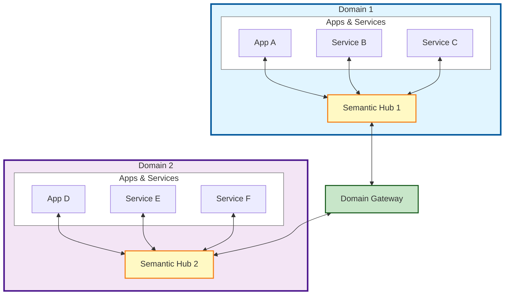

# Bounded Context

```mermaid
graph TB
    subgraph Domain1["Domain 1"]
        direction TB
        SH1["Semantic Hub 1"]
        
        subgraph Apps1["Apps & Services"]
            App1A["App A"]
            App1B["Service B"]
            App1C["Service C"]
        end
        
        App1A <--> SH1
        App1B <--> SH1
        App1C <--> SH1
    end
    
    subgraph Domain2["Domain 2"]
        direction TB
        SH2["Semantic Hub 2"]
        
        subgraph Apps2["Apps & Services"]
            App2A["App D"]
            App2B["Service E"]
            App2C["Service F"]
        end
        
        App2A <--> SH2
        App2B <--> SH2
        App2C <--> SH2
    end
    
    DG["Domain Gateway"]
    
    SH1 <--> DG
    DG <--> SH2
    
    style Domain1 fill:#e1f5ff,stroke:#01579b,stroke-width:3px
    style Domain2 fill:#f3e5f5,stroke:#4a148c,stroke-width:3px
    style SH1 fill:#fff9c4,stroke:#f57f17,stroke-width:2px
    style SH2 fill:#fff9c4,stroke:#f57f17,stroke-width:2px
    style DG fill:#c8e6c9,stroke:#1b5e20,stroke-width:2px
    style Apps1 fill:#ffffff,stroke:#757575,stroke-width:1px
    style Apps2 fill:#ffffff,stroke:#757575,stroke-width:1px
```
