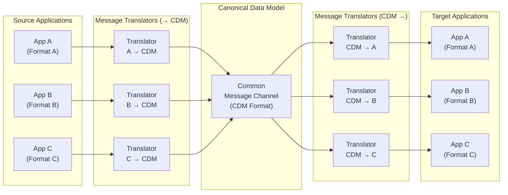

# Canonical Data Model

```mermaid
flowchart LR
    subgraph Apps["Source Applications"]
        A1["App A\n(Format A)"]
        A2["App B\n(Format B)"]
        A3["App C\n(Format C)"]
    end

    subgraph TranslateIn["Message Translators (→ CDM)"]
        T1["Translator\nA → CDM"]
        T2["Translator\nB → CDM"]
        T3["Translator\nC → CDM"]
    end

    subgraph CDM["Canonical Data Model"]
        CH["Common\nMessage Channel\n(CDM Format)"]
    end

    subgraph TranslateOut["Message Translators (CDM →)"]
        T4["Translator\nCDM → A"]
        T5["Translator\nCDM → B"]
        T6["Translator\nCDM → C"]
    end

    subgraph Consumers["Target Applications"]
        B1["App A\n(Format A)"]
        B2["App B\n(Format B)"]
        B3["App C\n(Format C)"]
    end

    A1 --> T1
    A2 --> T2
    A3 --> T3

    T1 --> CH
    T2 --> CH
    T3 --> CH

    CH --> T4
    CH --> T5
    CH --> T6

    T4 --> B1
    T5 --> B2
    T6 --> B3
```
