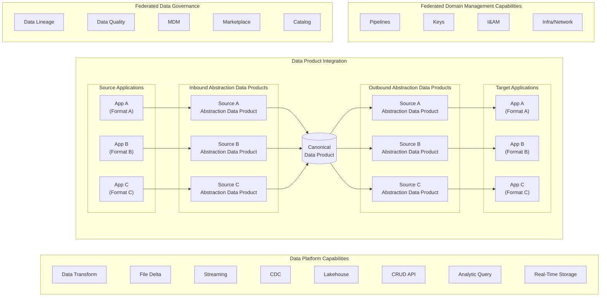

# Canonical Data Model

```mermaid
flowchart TB
    subgraph FDG["Federated Data Governance"]
        direction LR
        DL["Data Lineage"] ~~~ DQ["Data Quality"] ~~~ MDM["MDM"] ~~~ MKT["Marketplace"] ~~~ CAT["Catalog"]
    end

    subgraph FDM["Federated Domain Management Capabilities"]
        direction LR
        PIP["Pipelines"] ~~~ KEYS["Keys"] ~~~ IAM["I&AM"] ~~~ INFRA["Infra/Network"]
    end

    subgraph CORE["Data Product Integration"]
        direction LR
        subgraph SRC["Source Applications"]
            direction TB
            A1["App A\n(Format A)"]
            A2["App B\n(Format B)"]
            A3["App C\n(Format C)"]
        end

        subgraph SADP["Inbound Abstraction Data Products"]
            direction TB
            T1["Source A\nAbstraction Data Product"]
            T2["Source B\nAbstraction Data Product"]
            T3["Source C\nAbstraction Data Product"]
        end

        CDP[("Canonical\nData Product")]

        subgraph TADP["Outbound Abstraction Data Products"]
            direction TB
            T4["Source A\nAbstraction Data Product"]
            T5["Source B\nAbstraction Data Product"]
            T6["Source C\nAbstraction Data Product"]
        end

        subgraph TGT["Target Applications"]
            direction TB
            B1["App A\n(Format A)"]
            B2["App B\n(Format B)"]
            B3["App C\n(Format C)"]
        end

        A1 --> T1
        A2 --> T2
        A3 --> T3
        T1 & T2 & T3 --> CDP
        CDP --> T4 & T5 & T6
        T4 --> B1
        T5 --> B2
        T6 --> B3
    end

    subgraph DPC["Data Platform Capabilities"]
        direction LR
        DT["Data Transform"] ~~~ FD["File Delta"] ~~~ STR["Streaming"] ~~~ CDC["CDC"] ~~~ LH["Lakehouse"] ~~~ CRUD["CRUD API"] ~~~ AQ["Analytic Query"] ~~~ RTS["Real-Time Storage"]
    end

    FDG ~~~ CORE
    FDM ~~~ CORE
    CORE ~~~ DPC
```
