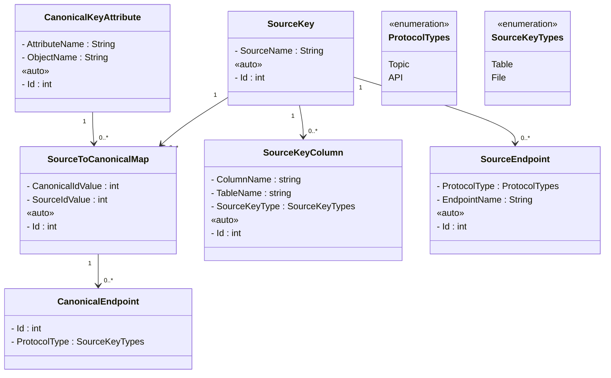

# Key Mapping

```mermaid
classDiagram
    class CanonicalKeyAttribute {
        - AttributeName : String
        - ObjectName : String
        «auto»
        - Id : int
    }

    class SourceToCanonicalMap {
        - CanonicalIdValue : int
        - SourceIdValue : int
        «auto»
        - Id : int
    }

    class SourceKey {
        - SourceName : String
        «auto»
        - Id : int
    }

    class SourceKeyColumn {
        - ColumnName : string
        - TableName : string
        - SourceKeyType : SourceKeyTypes
        «auto»
        - Id : int
    }

    class CanonicalEndpoint {
        - Id : int
        - ProtocolType : SourceKeyTypes
    }

    class SourceEndpoint {
        - ProtocolType : ProtocolTypes
        - EndpointName : String
        «auto»
        - Id : int
    }

    class ProtocolTypes {
        <<enumeration>>
        Topic
        API
    }

    class SourceKeyTypes {
        <<enumeration>>
        Table
        File
    }

    CanonicalKeyAttribute "1" --> "0..*" SourceToCanonicalMap
    SourceToCanonicalMap "1" --> "0..*" CanonicalEndpoint
    SourceKey "1" --> "0..*" SourceToCanonicalMap
    SourceKey "1" --> "0..*" SourceKeyColumn
    SourceKey "1" --> "0..*" SourceEndpoint
```
