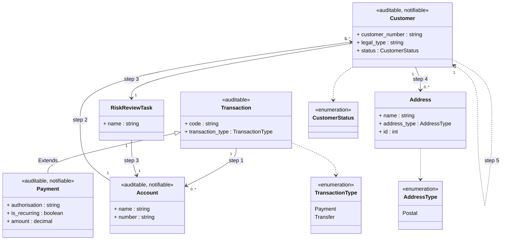

# Recursive Transversal

```mermaid
classDiagram
    class Customer {
        <<auditable, notifiable>>
        + customer_number : string
        + legal_type : string
        + status : CustomerStatus
    }

    class Account {
        <<auditable, notifiable>>
        + name : string
        + number : string
    }

    class RiskReviewTask {
        + name : string
    }

    class Transaction {
        <<auditable>>
        + code : string
        + transaction_type : TransactionType
    }

    class Payment {
        <<auditable, notifiable>>
        + authorisation : string
        + is_recurring : boolean
        + amount : decimal
    }

    class Address {
        + name : string
        + address_type : AddressType
        + id : int
    }

    class CustomerStatus {
        <<enumeration>>
    }

    class AddressType {
        <<enumeration>>
        Postal
    }

    class TransactionType {
        <<enumeration>>
        Payment
        Transfer
    }

    Transaction "1" --> "0..*" Account : step 1
    Account "1" --> "0..*" Customer : step 2
    Customer "1" --> "1" RiskReviewTask : step 3
    RiskReviewTask "1" --> "1" Account : step 3
    Customer "1" --> "0..*" Address : step 4
    Customer "1" ..> "1" Customer : step 5
    Transaction <|-- Payment : Extends
    Customer ..> CustomerStatus
    Address ..> AddressType
    Transaction ..> TransactionType
```
