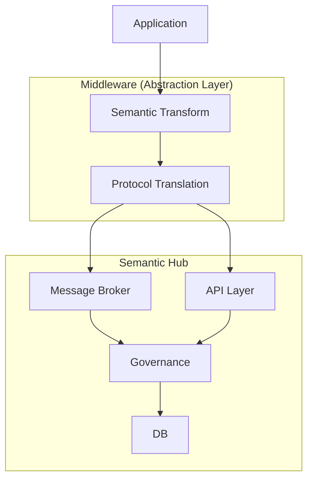

# Application Abstraction

```mermaid
graph TD
    App["Application"]
    
    subgraph Middleware["Middleware (Abstraction Layer)"]
        ST["Semantic Transform"]
        PT["Protocol Translation"]
    end
    
    subgraph SemHub["Semantic Hub"]
        MB["Message Broker"]
        API["API Layer"]
        Gov["Governance"]
        DB["DB"]
    end
    
    App --> ST
    ST --> PT
    PT --> MB
    PT --> API
    MB --> Gov
    API --> Gov
    Gov --> DB
```
